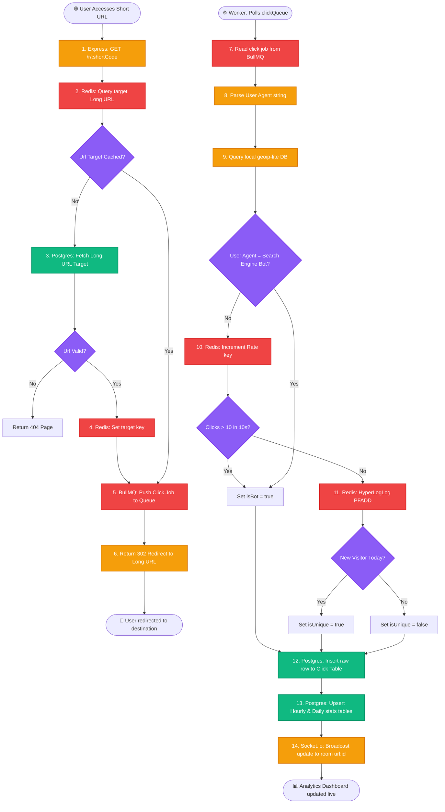
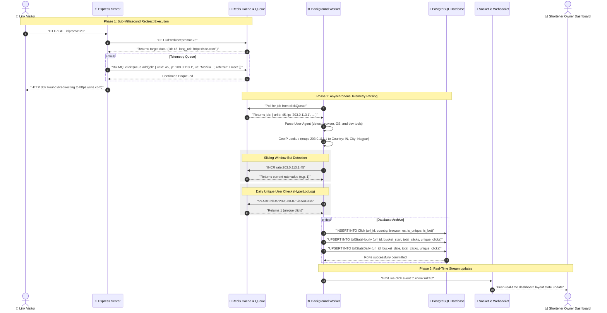

# 📊 SnapURL Real-Time Analytics & Telemetry Architecture

This document details the high-performance, asynchronous analytics processing engine implemented in SnapURL. It covers how link redirect telemetry is captured in sub-milliseconds and processed out-of-band using background workers, geographic maps, bot engines, unique visitor tracking, and pre-aggregated analytics tables.

---

## 🏗️ Architectural Overview

To prevent analytical write latency from stalling link redirection (which must happen in under 5ms), SnapURL decouples the **Redirect Engine** from the **Analytics Processing Engine**:

```
                       ┌─────────────────────────┐
                       │  👤 User Clicks Link    │
                       └────────────┬────────────┘
                                    │
                                    ▼
                       ┌─────────────────────────┐
                       │  ⚡ Express Redirector   │
                       └──────┬────────────┬─────┘
                              │            │
            [Cache Lookup]    │            │ [Enqueues job]
            (Latency < 1ms)   ▼            ▼ (Latency < 2ms)
                       ┌──────────┐    ┌─────────────┐
                       │  Redis   │    │   BullMQ    │
                       │ (Cache)  │    │  (Redis)    │
                       └──────────┘    └──────┬──────┘
                                              │ (Asynchronous processing)
                                              ▼
                                       ┌─────────────┐
                                       │ Analytics   │
                                       │   Worker    │
                                       └─┬───┬───┬───┘
               ┌─────────────────────────┘   │   └─────────────────────────┐
               │                             │                             │
               ▼                             ▼                             ▼
       ┌──────────────┐              ┌──────────────┐              ┌──────────────┐
       │   GeoIP /    │              │  HyperLogLog │              │  PostgreSQL  │
       │  UA Parser   │              │ (Unique check)│             │ (Aggregates) │
       └──────────────┘              └──────────────┘              └──────────────┘
```

---

## 🔄 End-to-End Analytics Workflow

### Phase 1: Redirect & Telemetry Capture (Fast Loop)
1. **User Request**: A visitor hits `/r/:shortCode`.
2. **Fast Cache Lookup**: Express checks Redis for the mapping. If cached, it retrieves the destination URL.
3. **Telemetry Extraction**: The server extracts headers: IP Address, User-Agent, Referrer, and checks for QR-code scanner parameters.
4. **Queue Telemetry**: Instead of inserting this click event directly into PostgreSQL (which blocks the thread), the backend calls `clickQueue.add()` using **BullMQ**.
5. **Redirect Response**: Express immediately returns a `302 Found` redirect. **Total server execution time: < 3 milliseconds.**

### Phase 2: Telemetry Processing Worker (Asynchronous Loop)
The independent **Worker Process** (`worker/index.js`) listens for jobs in the Redis-backed BullMQ queue:

1. **User-Agent & Device Parsing**:
   * Uses `ua-parser-js` to extract the visitor's Browser, Operating System, and Device Type (Desktop, Mobile, Tablet).
   * Identifies developers/API tools (e.g. Curl, Postman, Python requests) as distinct device classes.
2. **IP Geolocation (GeoIP)**:
   * Queries the local database file (`geoip-lite`) to map the IP address to its Country, State, City, Coordinates (Latitude/Longitude), and Timezone.
   * If running locally (using `127.0.0.1`), the worker calls public endpoints (`https://ipapi.co/json/`) or defaults to Nagpur, India, for testing.
3. **Double Bot Detection**:
   * **Signature Check**: Regular expression checks on the User-Agent signature to flag search engines (Googlebot, Bingbot, Yandex).
   * **Behavioral Check**: Evaluates sliding windows in Redis (`rate:<ip>:<urlId>`). If a single IP makes **more than 10 clicks in 10 seconds**, it is flagged as a spam bot.
4. **Unique Visitor Tracking (Redis HyperLogLog)**:
   * Generating a unique key using the browser cookie, session, or IP+UA fingerprint.
   * The worker uses the Redis **HyperLogLog (HLL)** algorithm (`PFADD hll:<urlId>:<dateBucket> <visitorId>`).
   * If Redis returns `1`, the click is registered as a **Unique Click**. HLL is an industry-standard probabilistic structure that allows counting millions of unique values using only 12KB of memory.
5. **Referrer Normalization**:
   * Inspects HTTP Referer header and maps complex tracker domains (e.g., `t.co`, `lm.facebook.com`) to clean workspace types: `Twitter/X`, `Facebook`, `LinkedIn`, `Direct`, etc.

### Phase 3: Aggregated Database Archiving
1. **Raw Log**: The click details are stored in the PostgreSQL `Click` table for auditing.
2. **Pre-aggregations**: To avoid running slow `COUNT(*)` queries on the dashboard, the worker upserts pre-aggregated counts into:
   * **`UrlStatsHourly`**: Captures totals inside a specific hour bucket.
   * **`UrlStatsDaily`**: Captures totals inside a specific day bucket.
3. **Live Streaming**: The worker emits a message via Socket.io to the room `url:${urlId}`, instantly updating active analytics charts on the user's dashboard.

---

## 📊 Pre-Aggregated Database Schema

Pre-aggregating stats inside hourly and daily tables ensures that loading a 30-day analytics chart requires reading **30 rows** instead of processing **millions of raw click records**.

```sql
-- Hourly pre-aggregates for dashboards
CREATE TABLE "UrlStatsHourly" (
    id BIGSERIAL PRIMARY KEY,
    url_id BIGINT REFERENCES "Url"(id) ON DELETE CASCADE,
    bucket_start TIMESTAMPTZ NOT NULL,
    total_clicks INT DEFAULT 0,
    unique_clicks INT DEFAULT 0,
    bot_clicks INT DEFAULT 0,
    top_country VARCHAR(100),
    top_referrer VARCHAR(100),
    top_device VARCHAR(100),
    UNIQUE(url_id, bucket_start)
);
```

---

## 🗄️ Redis Key Architecture for Telemetry

The analytics pipeline registers three types of keys in Redis during processing:

| Key Template | Redis Data Type | Purpose | TTL (Expiration) |
| :--- | :--- | :--- | :--- |
| `rate:<ip>:<urlId>` | String (Integer) | Tracking click bursts to detect bot spamming. | 10 seconds |
| `hll:<urlId>:<YYYY-MM-DD>` | HyperLogLog | Tracks unique visitors per URL for the day. | 48 hours |
| `url:redirect:<shortCode>` | String (JSON) | Caches redirect targets for lightning-fast routing. | Variable (e.g., 24h) |

---

## 📂 Codebase Telemetry File Map

*   **Redirection Controller**: [url.controller.js](file:///c:/Users/prash/OneDrive/Desktop/url_shortner/backend/src/controllers/url.controller.js) — Resolves routes, triggers redirects, and enqueues jobs to BullMQ.
*   **Queue Initializer**: `clickQueue.js` (Check inside `backend/src/queues/clickQueue.js` or `backend/src/analytics/queue.js`) — Defines connection hooks for BullMQ and Redis.
*   **Analytics Worker Processor**: [index.js](file:///c:/Users/prash/OneDrive/Desktop/url_shortner/backend/worker/index.js) — The core background worker parsing user-agents, resolving locations, executing rate-limits, and writing aggregates to SQL.
*   **Database Schema**: [schema.prisma](file:///c:/Users/prash/OneDrive/Desktop/url_shortner/backend/prisma/schema.prisma) — Models `Click`, `UrlStatsHourly`, and `UrlStatsDaily`.


# 🔄 SnapURL Analytics Telemetry Workflows (Diagrams Reference)

This file contains high-resolution **Mermaid diagrams** detailing the real-time click telemetry pipeline and background worker processing. Copy these directly into your project's main `README.md` or keep as a reference guide.

---

## 1. Analytics Architecture Flowchart

This flowchart shows the separate pipelines for the **Fast Redirect Loop** (user-facing, low latency) and the **Telemetry Processing Loop** (background task, out-of-band).



---

## 2. Interactive Telemetry Sequence Diagram

This sequence diagram traces the step-by-step metrics extraction, queue transition, worker resolution (GeoIP & Bot verification), SQL pre-aggregation, and WebSockets live streaming.



