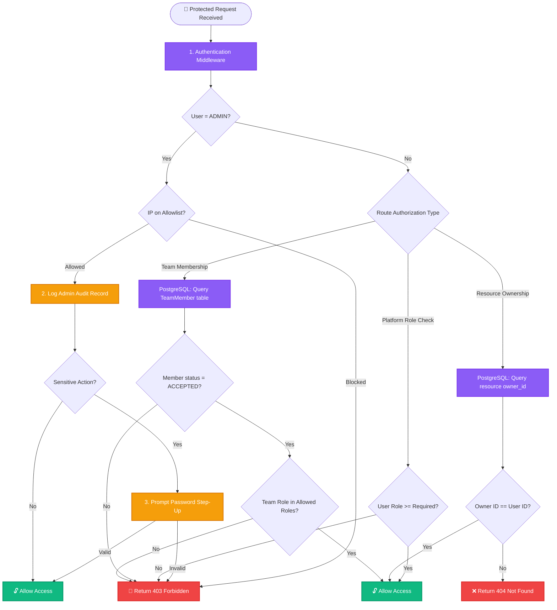

# 🔐 SnapURL Enterprise Authorization Architecture

This document outlines the **Role-Based Access Control (RBAC)** and **Relationship-Based Access Control (ReBAC)** authorization architecture implemented in SnapURL. It acts as an industry-standard blueprint showing how user permissions, workspace team roles, ownership boundaries, and admin controls are validated across the system.

---

## 🏛️ Architecture Design Patterns

SnapURL does not rely on a heavy, complex permission-matrix database structure. Instead, it implements a highly performant **decoupled authorization hybrid** that validates access using:
1. **Platform Role-Based Access Control (RBAC)**: Enforces global permissions based on user accounts (`USER` vs `ADMIN`).
2. **Attribute-Based / Resource Ownership (ABAC/Ownership)**: Validates if the authenticated user owns the resource they are trying to access.
3. **Relationship-Based Access Control (ReBAC / Team Workspaces)**: Restricts workspace access based on team membership and invitations (`OWNER`, `ADMIN`, `MEMBER`).
4. **Step-Up Authorization**: Enforces secondary verification (re-entering credentials) for high-sensitivity actions.

---

## 🔄 Authorization Decision Tree Flow

The flowchart below demonstrates the decision-making process when a request hits a protected resource.

> [!NOTE]
> **Privacy Security Design**: When a user requests a resource they do not own, the system intentionally returns a `404 Not Found` instead of `403 Forbidden`. This prevents attackers from scanning resource IDs to discover which records exist in the database (metadata leakage).

---

## 📊 Stage-by-Stage Authorization Matrix

Here is how data flows, validates, and stores across different authorization workflows.

### 1. Platform-Wide Role Access (RBAC)
*Enforces access to global panels (like the `/admin` console).*

* **Who sends what**: The client sends the Bearer JWT. The decoded payload contains the user's role: `{ id: "usr_1", role: "USER" }`.
* **What the middleware does**: The `authorize("ADMIN")` middleware checks the parsed role.
* **Storage/Fetching operations**: 
  * **Redis**: Reads account status (`status:<userId>`) to verify the user isn't banned.
* **Result**: If the role is `ADMIN`, access is granted. Otherwise, the system returns `403 Forbidden`.

### 2. Resource Ownership (URL & Custom Domain Actions)
*Ensures users cannot view, edit, or delete another user's shortened URLs.*

* **Who sends what**: The client requests `DELETE /api/urls/:id`.
* **What the middleware does**: The `requireOwnership("Url", getOwnerId)` middleware intercepts the request.
* **Storage/Fetching operations**:
  * **PostgreSQL**: Queries the database to fetch the `user_id` mapped to the Url ID.
* **Result**:
  * If `url.user_id === req.user.id` (or if the requester is an `ADMIN`), access is granted.
  * If they do not match, the database queries succeed, but the middleware intercepts and returns `404 Not Found`.

### 3. Team Workspace Collaborations (ReBAC)
*Governs access to team workspaces, link lists, and analytics within shared spaces.*

* **Who sends what**: Client requests resources for workspace `teamId` (e.g., `POST /api/teams/:teamId/invite`).
* **What the middleware does**: Enforces workspace boundary rules using the `requireTeamRole("OWNER", "ADMIN")` middleware.
* **Storage/Fetching operations**:
  * **PostgreSQL**: Queries the `TeamMember` join table where `team_id = teamId` and `user_id = req.user.id`.
* **Result**:
  * Checks if the membership status is `ACCEPTED`.
  * Verifies if the user's workspace role (`OWNER` or `ADMIN`) matches the path criteria. If verified, access is granted.

### 4. Admin Consolidation & Security Step-Up
*Hardens administrative actions (e.g., issuing refunds, changing plans, banning users).*

* **Who sends what**: Admin submits actions via the portal dashboard.
* **What the middleware does**:
  * **IP Check**: `adminIpAllowlistMiddleware` checks the request origin IP against allowlisted CIDRs.
  * **Step-Up Check**: `requireStepUpConfirmation` checks if `adminPassword` is present in the request body and compares it with the admin's password hash in the database.
* **Storage/Fetching operations**:
  * **PostgreSQL**: Writes an audit log record into `AdminAuditLog` table capturing admin ID, action type, target type, target ID, metadata, and origin IP.
* **Result**: If security parameters match, the admin task executes, and the audit log is stored permanently.

---

## 📂 Codebase Authorization File Map

The authorization engine is implemented in these key locations:

*   **Authorization Middleware Factory**: [auth.middleware.js](file:///c:/Users/prash/OneDrive/Desktop/url_shortner/backend/src/middlewares/auth.middleware.js) — Houses core logic for `authorize`, `requireOwnership`, `requireTeamRole`, `auditAdminAction`, and security IP restrictions.
*   **Database Definitions**: [schema.prisma](file:///c:/Users/prash/OneDrive/Desktop/url_shortner/backend/prisma/schema.prisma) — Models user roles (`enum Role`), team roles (`enum TeamRole`), and log tables (`model AdminAuditLog`).
*   **Admin Route Guard (React)**: [AdminRoute.jsx](file:///c:/Users/prash/OneDrive/Desktop/url_shortner/frontend/src/components/admin/AdminRoute.jsx) — Blocks unauthorized users from entering admin components in the browser.
*   **Endpoint Declarations**:
    *   **Admin Actions**: Check routes in `backend/src/routes/admin.routes.js` to see how `adminIpAllowlistMiddleware` and `auditAdminAction` are chained.
    *   **Team Workspaces**: Check `backend/src/routes/team.routes.js` to see how `requireTeamRole` gates member invitations and workspace edits.
