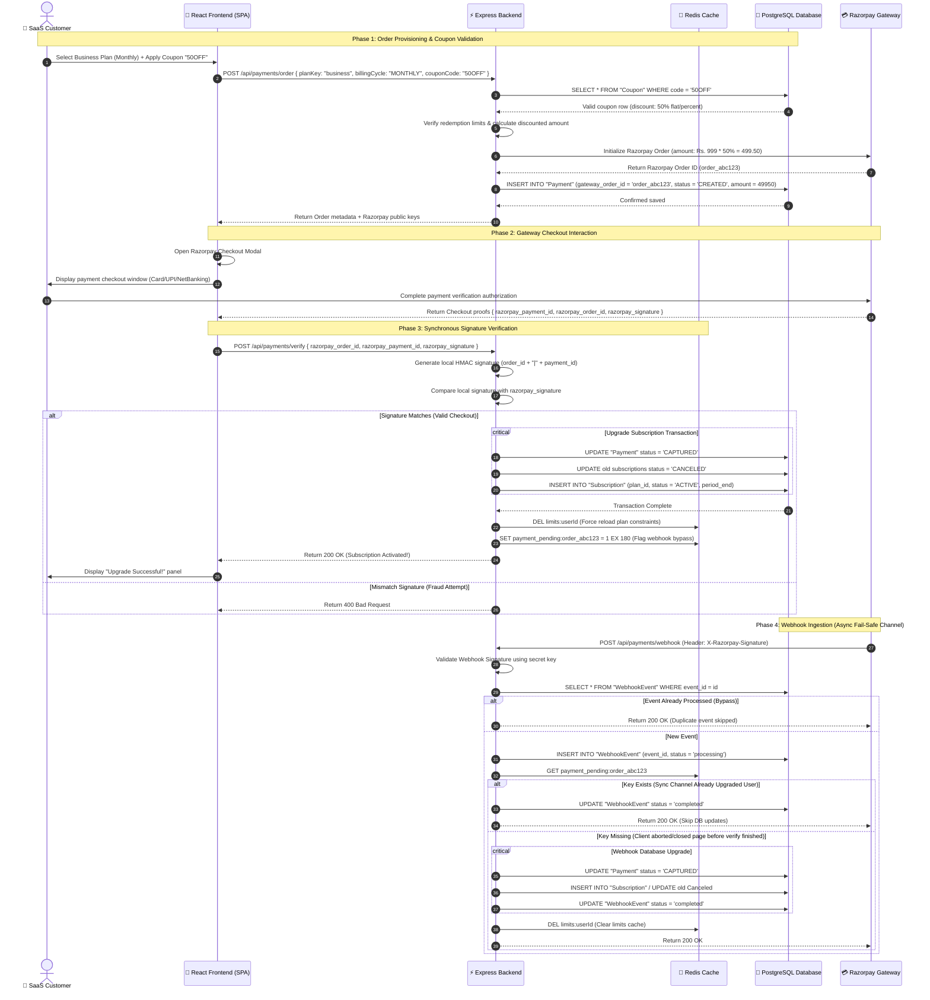

# 💳 SnapURL Billing & Subscription Architecture (Razorpay Integration)

This document outlines the system design, transactional data flows, security checks, and webhook processing mechanisms implemented for the billing and SaaS subscription engine in SnapURL.

---

## 🏗️ Architectural Overview

SnapURL implements a **dual-channel confirmation model** to guarantee subscription activation. This ensures that users are upgraded even if they close their browser mid-checkout:
1. **Primary Sync Channel (Client-Side Verification)**: Once checkout is complete, the React frontend submits the Razorpay signatures. The backend verifies this using local HMAC keys and upgrades the user instantly.
2. **Secondary Async Channel (Webhooks)**: Razorpay asynchronously pushes webhook events (e.g. `payment.captured`). The backend catches these, verifies signatures, and applies updates if the client-side call failed (ensures idempotency and resilience).

```
                      ┌──────────────────────┐
                      │  👤 Client Browser   │
                      └──────┬────────────┬──┘
                             │            │
            (Initiate Order) │            │ (Checkout Complete)
                             ▼            ▼
                      ┌──────────┐    ┌─────────────┐
                      │ Backend  │◄───┤  Razorpay   │
                      │   API    │    │   Gateway   │
                      └────┬─────┘    └──────┬──────┘
                           │                 │ (Asynchronous Webhook)
     (Updates status &     │                 │
      clears Redis cache)  ▼                 ▼
                      ┌──────────┐    ┌─────────────┐
                      │ Database │◄───┤   Webhook   │
                      │ (Prisma) │    │  Controller │
                      └──────────┘    └─────────────┘
```

---

## 🔄 Subscription Lifecycle Sequence Flow

The following sequence diagram tracks the entire transactional lifecycle of a user upgrading their plan.



---

## 📊 Stage-by-Stage Billing Data Matrix

Here is who is sending, receiving, storing, and removing data during subscription upgrades.

| Action | Sender | Description | Receiver | Data Transferred | Database / Cache Actions |
| :--- | :--- | :--- | :--- | :--- | :--- |
| **Order Create** | React Client | User requests plan upgrade checkout. | Express API | `{ planKey, billingCycle, couponCode }` | `SELECT` plan details; `SELECT` and validate discount Coupon codes. |
| **Provison Order** | Express API | Inits order in gateway. | Razorpay Gateway | `{ amount: value, currency: "INR" }` | None |
| **Save Order** | Express API | Stores transaction record. | PostgreSQL | Order ID, cost details | `INSERT INTO "Payment"` (status: `CREATED`). |
| **Checkout Response** | Razorpay Gateway | Sends payment proofs to page. | React Client | `{ paymentId, orderId, signature }` | None |
| **Verify Payment** | React Client | Submits proofs for verify check. | Express API | `{ razorpay_order_id, razorpay_payment_id, razorpay_signature }` | None |
| **Upgrade Status** | Express API | Activates subscription. | PostgreSQL | Subscription dates, payment status | `UPDATE "Payment"` to `CAPTURED`; `UPDATE` old subs to `CANCELED`; `INSERT` new active `Subscription`. |
| **Cache Reset** | Express API | Resets user plan limits. | Redis Cache | Delete plan limit keys | `DEL limits:userId`; `SET payment_pending:orderId = 1` (Expires in 3m). |
| **Webhook Notify** | Razorpay Gateway | Asynchronous event push. | Express API | Webhook payload body & headers | `INSERT INTO "WebhookEvent"` (tracks event deduplication). |

---

## 🗄️ Database Schemas & Storage Layout

### PostgreSQL Schemas
*   **Payment**: Stores transactional invoices and records.
    *   `gateway_order_id` (Unique index): Identifies transactions in checkouts.
    *   `status`: enum (`CREATED`, `AUTHORIZED`, `CAPTURED`, `FAILED`, `REFUNDED`).
*   **Subscription**: Maps features and plan rights to users.
    *   `status`: enum (`ACTIVE`, `PAST_DUE`, `CANCELED`, `EXPIRED`).
    *   `current_period_end`: Expiration timestamp.
*   **WebhookEvent**: Double-processing (idempotency) guard.
    *   `event_id` (Primary Key): Matches Razorpay webhook event ID.
    *   `processed`: Boolean status.

---

## 📂 Codebase Billing File Mapping

*   **Payment Controller**: [payments.controller.js](file:///c:/Users/prash/OneDrive/Desktop/url_shortner/backend/src/controllers/payments.controller.js) — Houses endpoints for order creations, checkout verification checks, and webhook ingestion.
*   **Subscription Controller**: [subscription.controller.js](file:///c:/Users/prash/OneDrive/Desktop/url_shortner/backend/src/controllers/subscription.controller.js) — Fetches active subscription properties for users.
*   **Limit Enforcement Service**: `planLimitService.js` (Check inside `backend/src/services/planLimitService.js`) — Reads and caches active plan limit properties in Redis.
*   **Models**: [schema.prisma](file:///c:/Users/prash/OneDrive/Desktop/url_shortner/backend/prisma/schema.prisma) — Models payment tables (`Payment`, `Subscription`, `WebhookEvent`, `Plan`, `PlanLimit`).
