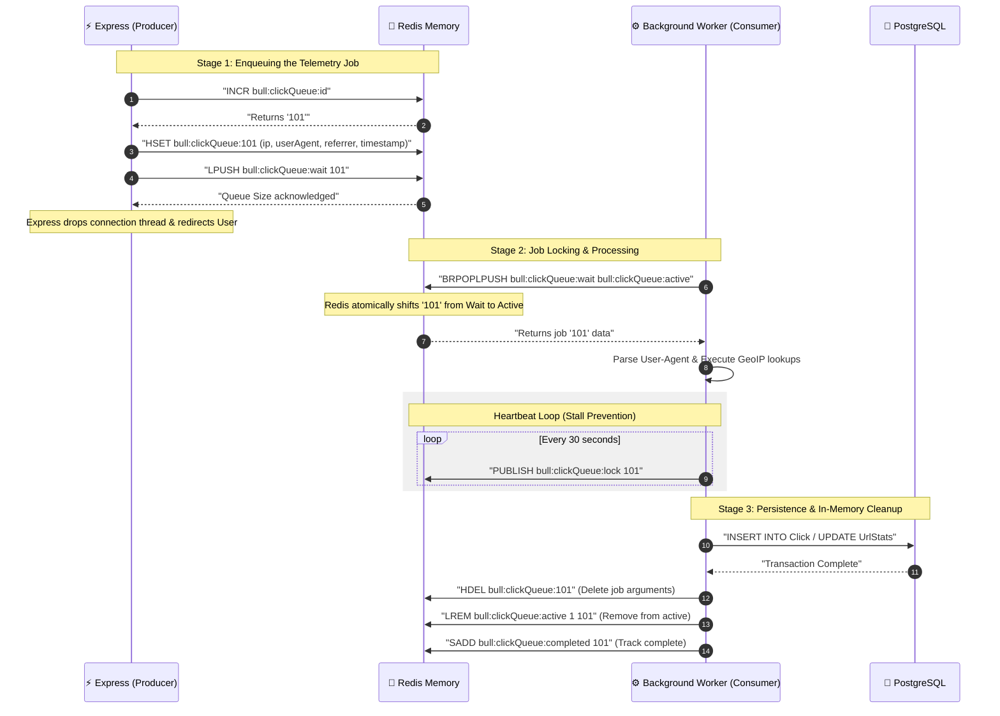

# ⚙️ SnapURL Queue-Worker Bridge Architecture

This document explains the technical details of the **Queue-Worker Bridge** (powered by **BullMQ** on top of **Redis**) in SnapURL. It shows how the Express API (Producer) hands off jobs to Redis, and how the Worker Process (Consumer) pulls, locks, processes, and completes those jobs asynchronously.

---

## 1. Visual Queue-Worker Pipeline

This diagram shows how jobs move through Redis memory states from the moment a user clicks a link to the moment stats are archived.

```
       1. Click Event
 ┌──────────────────────┐
 │  👤 Visitor Browser  │
 └──────────┬───────────┘
            │ HTTP GET /r/code
            ▼
 ┌──────────────────────┐
 │ ⚡ Express Redirector│
 └──────────┬───────────┘
            │ 2. `clickQueue.add()`
            ▼
┌────────────────────────────────────────────────────────┐
│                   🛑 REDIS DATABASE                    │
│                                                        │
│   a. [ bull:clickQueue:wait ] (Redis List)             │
│      ┌─────────┐   ┌─────────┐   ┌─────────┐           │
│      │ Job #03 │   │ Job #02 │   │ Job #01 │           │
│      └─────────┘   └─────────┘   └─────────┘           │
│                                                        │
│   b. [ bull:clickQueue:active ] (Redis List)           │
│      ┌─────────┐  (BRPOPLPUSH)                         │
│      │ Job #01 │ ◄──────────────────┐                  │
│      └─────────┘                    │                  │
└─────────────────────────────────────┼──────────────────┘
                                      │ 3. Fetch & Lock
                                      │    (Atomic Move)
                                      │
                           ┌──────────┴──────────┐
                           │ ⚙️ Background Worker │
                           └──────────┬──────────┘
                                      │
                                      ├─► a. Parse User-Agent
                                      ├─► b. GeoIP Location
                                      ├─► c. Redis HLL / Unique check
                                      │
                                      ▼ 4. Batch SQL Write
                           ┌─────────────────────┐
                           │   🐘 PostgreSQL     │
                           └─────────────────────┘
```

---

## 2. Redis Data Structures Under the Hood

BullMQ handles job queues using native Redis commands. Here is exactly where tasks sit in Redis memory:

1. **`bull:clickQueue:id` (String)**: An autoincrementing counter used to generate unique job IDs (e.g., `1`, `2`, `3`).
2. **`bull:clickQueue:wait` (List)**: A Redis List holding job IDs waiting to be processed. Jobs are appended via `RPUSH` and popped via `LPOP` (FIFO queue).
3. **`bull:clickQueue:active` (List)**: A list of job IDs currently being processed by workers.
4. **`bull:clickQueue:stalled` (Set)**: Tracks active jobs that haven't sent a heartbeat. If a worker crashes, other workers look here to reclaim and restart the job.
5. **`bull:clickQueue:completed` / `failed` (Set)**: Holds processed job IDs for history tracking.

---

## 3. Step-by-Step Transition Lifecycle

| Stage | Process | Component | Redis Commands Run | Description |
| :--- | :--- | :--- | :--- | :--- |
| **1. Enqueue** | **Express API** | Producer | `INCR bull:clickQueue:id`<br>`HSET bull:clickQueue:jobId` (stores job arguments)<br>`LPUSH bull:clickQueue:wait jobId` | Express packs the click details (IP, UA, Referrer) into a hash and pushes the ID onto the `wait` list. |
| **2. Redirect** | **Express API** | Producer | None | **Express releases the request thread immediately** and returns HTTP 302 to the user. Total block time: **< 2ms**. |
| **3. Poll & Lock** | **Background Worker** | Consumer | `BRPOPLPUSH wait active` | The worker blocks waiting for jobs. When a job is pushed, Redis **atomically moves** the job ID from the `wait` list to the `active` list in `< 0.1ms`. This locks the job so no other worker picks it up. |
| **4. Process** | **Background Worker** | Consumer | `PFADD hll:urlId:date visitorId`<br>`INCR rate:ip:urlId` | The worker reads the job arguments from Redis memory, parses the User-Agent, runs GeoIP lookups, and runs bot rate limit checks. |
| **5. SQL Write** | **Background Worker** | Consumer | None | The worker writes the structured telemetry data into the PostgreSQL transactional tables (`Click` and `UrlStatsHourly`). |
| **6. Cleanup** | **Background Worker** | Consumer | `LREM bull:clickQueue:active 1 jobId`<br>`SADD bull:clickQueue:completed jobId` | Once the SQL write succeeds, the worker removes the job ID from the `active` list and marks it complete. |

---

## 4. Under-the-Hood Sequence Details

The sequence diagram below visualizes the command transitions, heartbeats, and locks.


