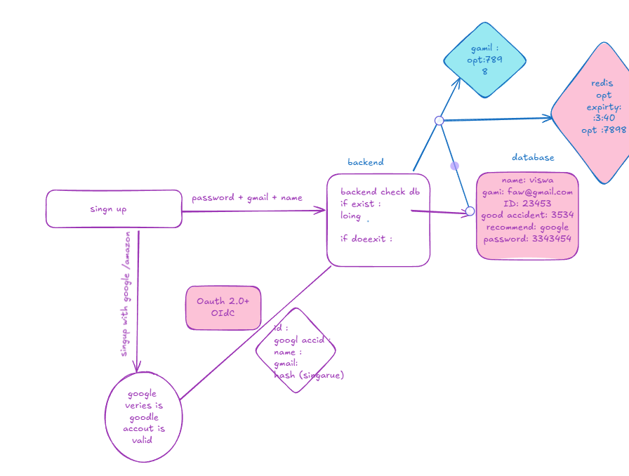

### frontend Archetecture:

frontend/
│
├── public/
│   ├── favicon.ico
│   ├── robots.txt
│   └── images/
│
├── src/
│
│   ├── assets/
│   │   ├── images/
│   │   ├── icons/
│   │   ├── fonts/
│   │   └── styles/
│   │
│   ├── components/
│   │   ├── Button/
│   │   ├── Input/
│   │   ├── Modal/
│   │   ├── Navbar/
│   │   ├── Footer/
│   │   ├── Card/
│   │   ├── Loader/
│   │   └── ProtectedRoute/
│   │
│   ├── pages/
│   │   ├── Home/
│   │   ├── Login/
│   │   ├── Register/
│   │   ├── Dashboard/
│   │   ├── Profile/
│   │   ├── Settings/
│   │   ├── Products/
│   │   ├── ProductDetails/
│   │   ├── Cart/
│   │   ├── Orders/
│   │   ├── Checkout/
│   │   ├── Admin/
│   │   └── NotFound/
│   │
│   ├── layouts/
│   │   ├── MainLayout.jsx
│   │   ├── DashboardLayout.jsx
│   │   └── AuthLayout.jsx
│   │
│   ├── routes/
│   │   ├── AppRoutes.jsx
│   │   ├── PrivateRoutes.jsx
│   │   └── PublicRoutes.jsx
│   │
│   ├── hooks/
│   │   ├── useAuth.js
│   │   ├── useDebounce.js
│   │   ├── useFetch.js
│   │   ├── useTheme.js
│   │   └── useLocalStorage.js
│   │
│   ├── context/
│   │   ├── AuthContext.jsx
│   │   ├── ThemeContext.jsx
│   │   └── UserContext.jsx
│   │
│   ├── store/
│   │   ├── index.js
│   │   ├── authSlice.js
│   │   ├── cartSlice.js
│   │   ├── productSlice.js
│   │   └── userSlice.js
│   │
│   ├── services/
│   │   ├── api.js
│   │   ├── authApi.js
│   │   ├── userApi.js
│   │   ├── productApi.js
│   │   └── orderApi.js
│   │
│   ├── utils/
│   │   ├── constants.js
│   │   ├── validators.js
│   │   ├── formatter.js
│   │   ├── helpers.js
│   │   └── storage.js
│   │
│   ├── config/
│   │   ├── axios.js
│   │   └── env.js
│   │
│   ├── types/
│   │   └── (TypeScript interfaces)
│   │
│   ├── App.jsx
│   ├── main.jsx
│   └── index.css
│
├── .env
├── package.json
├── vite.config.js
└── README.md

### react start workflow:

npm run dev

↓

Vite Starts

↓

Reads vite.config.js

↓

Starts Development Server

↓

Loads main.jsx

↓

React Starts

### autentication info :

// final backend architerucre :

backend/src
│
├── config/
│     db.js
│
├── controllers/
│     analytics.controller.js
│     url.controller.js
│
├── middlewares/
│     analytics.middleware.js
│     error.middleware.js
│
├── repositories/
│     url.repository.js
│
│     analytics/
│         click.repository.js
│         overview.repository.js
│         timeline.repository.js
│         browser.repository.js
│         device.repository.js
│         os.repository.js
│         country.repository.js
│         referrer.repository.js
│         visitor.repository.js
│         topUrls.repository.js
│
├── services/
│     url.service.js
│
│     analytics/
│         click.service.js
│         overview.service.js
│         timeline.service.js
│         browser.service.js
│         device.service.js
│         os.service.js
│         country.service.js
│         referrer.service.js
│         visitor.service.js
│         topUrls.service.js
│
├── routes/
│     analytics.routes.js
│     url.routes.js
│
└── utils/