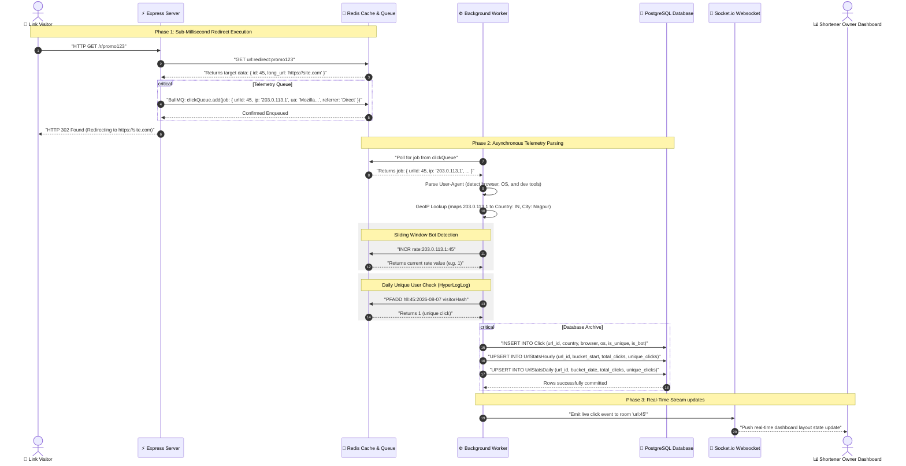
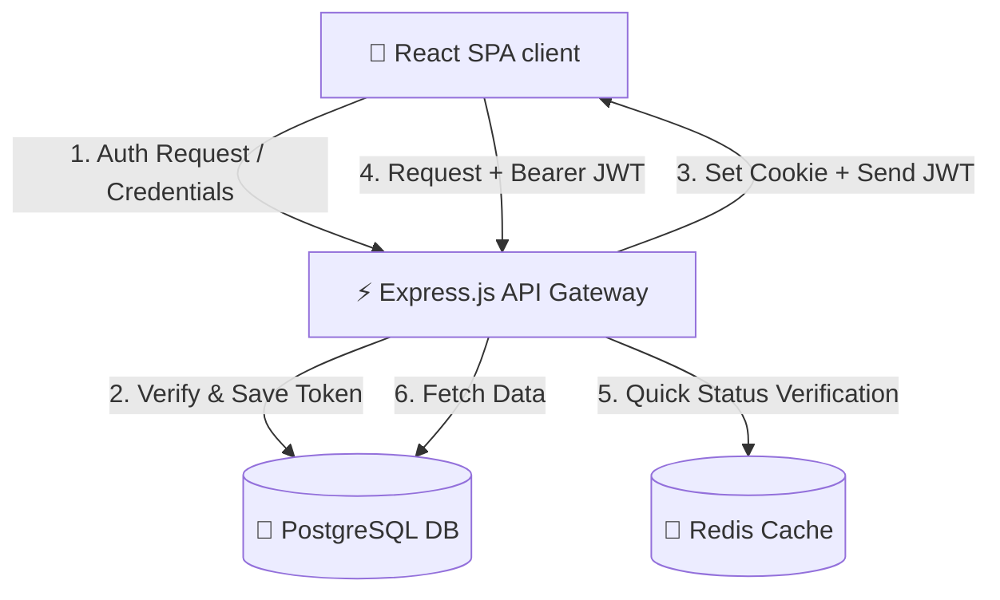
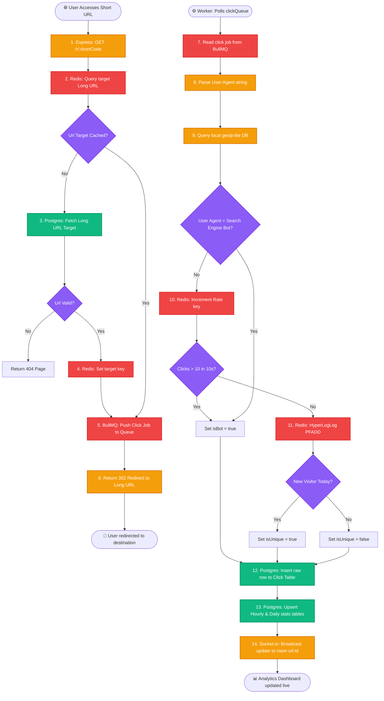
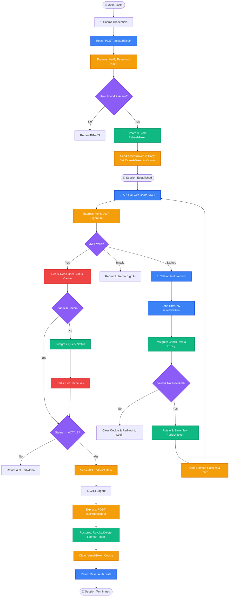
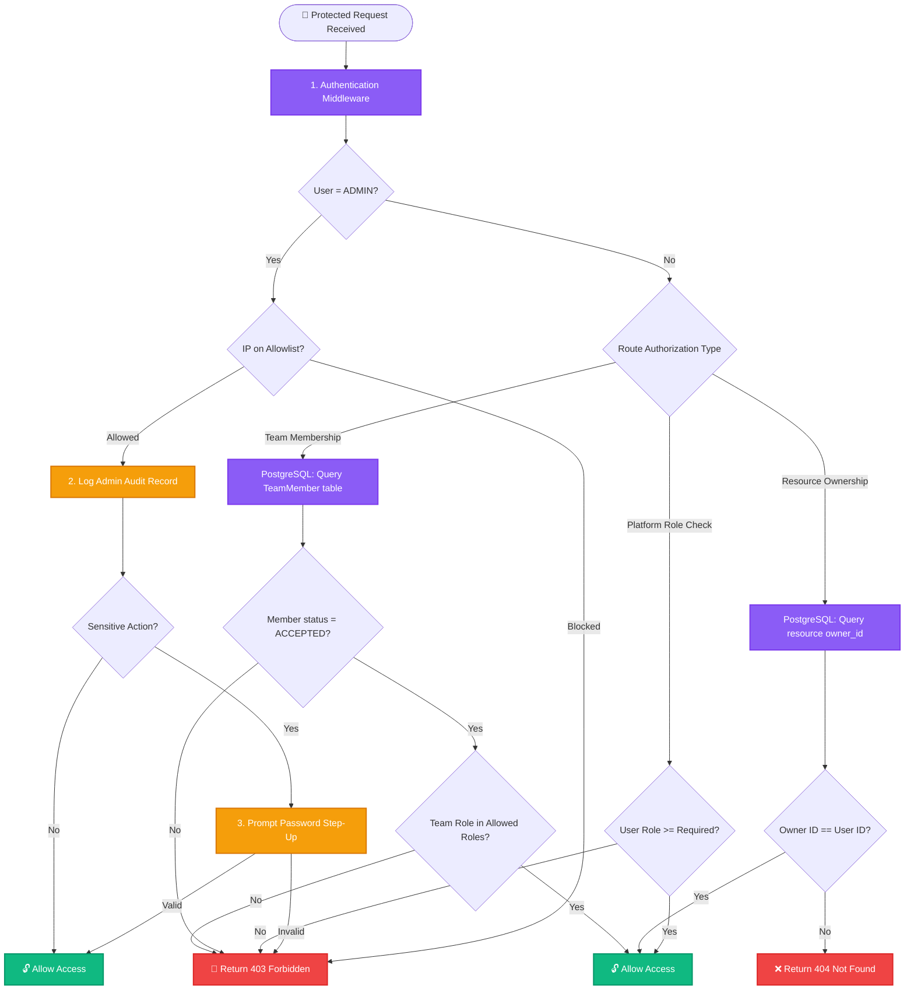
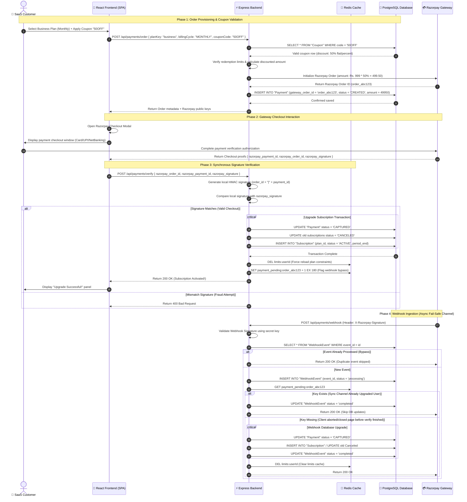
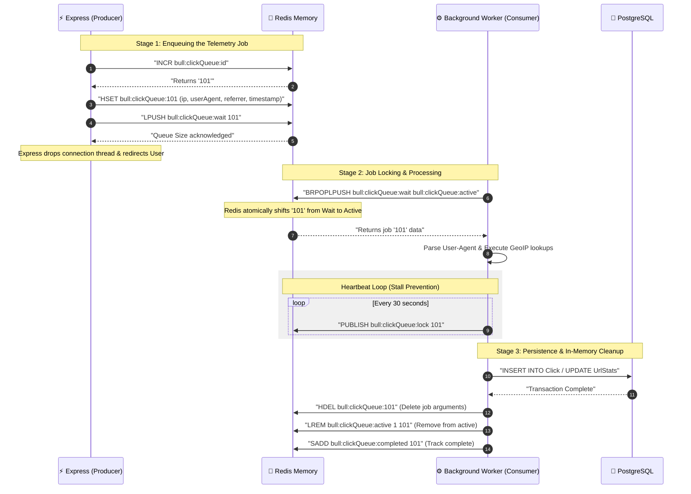

# System Design DSA

This file contains the contents of all non-README Markdown files.
---

## ANALYTICS_README.md

# 📊 SnapURL Real-Time Analytics & Telemetry Architecture

This document details the high-performance, asynchronous analytics processing engine implemented in SnapURL. It covers how link redirect telemetry is captured in sub-milliseconds and processed out-of-band using background workers, geographic maps, bot engines, unique visitor tracking, and pre-aggregated analytics tables.

---

## 🏗️ Architectural Overview

To prevent analytical write latency from stalling link redirection (which must happen in under 5ms), SnapURL decouples the **Redirect Engine** from the **Analytics Processing Engine**:

```
                       ┌─────────────────────────┐
                       │  👤 User Clicks Link    │
                       └────────────┬────────────┘
                                    │
                                    ▼
                       ┌─────────────────────────┐
                       │  ⚡ Express Redirector   │
                       └──────┬────────────┬─────┘
                              │            │
            [Cache Lookup]    │            │ [Enqueues job]
            (Latency < 1ms)   ▼            ▼ (Latency < 2ms)
                       ┌──────────┐    ┌─────────────┐
                       │  Redis   │    │   BullMQ    │
                       │ (Cache)  │    │  (Redis)    │
                       └──────────┘    └──────┬──────┘
                                              │ (Asynchronous processing)
                                              ▼
                                       ┌─────────────┐
                                       │ Analytics   │
                                       │   Worker    │
                                       └─┬───┬───┬───┘
               ┌─────────────────────────┘   │   └─────────────────────────┐
               │                             │                             │
               ▼                             ▼                             ▼
       ┌──────────────┐              ┌──────────────┐              ┌──────────────┐
       │   GeoIP /    │              │  HyperLogLog │              │  PostgreSQL  │
       │  UA Parser   │              │ (Unique check)│             │ (Aggregates) │
       └──────────────┘              └──────────────┘              └──────────────┘
```

---

## 🔄 End-to-End Analytics Workflow

### Phase 1: Redirect & Telemetry Capture (Fast Loop)
1. **User Request**: A visitor hits `/r/:shortCode`.
2. **Fast Cache Lookup**: Express checks Redis for the mapping. If cached, it retrieves the destination URL.
3. **Telemetry Extraction**: The server extracts headers: IP Address, User-Agent, Referrer, and checks for QR-code scanner parameters.
4. **Queue Telemetry**: Instead of inserting this click event directly into PostgreSQL (which blocks the thread), the backend calls `clickQueue.add()` using **BullMQ**.
5. **Redirect Response**: Express immediately returns a `302 Found` redirect. **Total server execution time: < 3 milliseconds.**

### Phase 2: Telemetry Processing Worker (Asynchronous Loop)
The independent **Worker Process** (`worker/index.js`) listens for jobs in the Redis-backed BullMQ queue:

1. **User-Agent & Device Parsing**:
   * Uses `ua-parser-js` to extract the visitor's Browser, Operating System, and Device Type (Desktop, Mobile, Tablet).
   * Identifies developers/API tools (e.g. Curl, Postman, Python requests) as distinct device classes.
2. **IP Geolocation (GeoIP)**:
   * Queries the local database file (`geoip-lite`) to map the IP address to its Country, State, City, Coordinates (Latitude/Longitude), and Timezone.
   * If running locally (using `127.0.0.1`), the worker calls public endpoints (`https://ipapi.co/json/`) or defaults to Nagpur, India, for testing.
3. **Double Bot Detection**:
   * **Signature Check**: Regular expression checks on the User-Agent signature to flag search engines (Googlebot, Bingbot, Yandex).
   * **Behavioral Check**: Evaluates sliding windows in Redis (`rate:<ip>:<urlId>`). If a single IP makes **more than 10 clicks in 10 seconds**, it is flagged as a spam bot.
4. **Unique Visitor Tracking (Redis HyperLogLog)**:
   * Generating a unique key using the browser cookie, session, or IP+UA fingerprint.
   * The worker uses the Redis **HyperLogLog (HLL)** algorithm (`PFADD hll:<urlId>:<dateBucket> <visitorId>`).
   * If Redis returns `1`, the click is registered as a **Unique Click**. HLL is an industry-standard probabilistic structure that allows counting millions of unique values using only 12KB of memory.
5. **Referrer Normalization**:
   * Inspects HTTP Referer header and maps complex tracker domains (e.g., `t.co`, `lm.facebook.com`) to clean workspace types: `Twitter/X`, `Facebook`, `LinkedIn`, `Direct`, etc.

### Phase 3: Aggregated Database Archiving
1. **Raw Log**: The click details are stored in the PostgreSQL `Click` table for auditing.
2. **Pre-aggregations**: To avoid running slow `COUNT(*)` queries on the dashboard, the worker upserts pre-aggregated counts into:
   * **`UrlStatsHourly`**: Captures totals inside a specific hour bucket.
   * **`UrlStatsDaily`**: Captures totals inside a specific day bucket.
3. **Live Streaming**: The worker emits a message via Socket.io to the room `url:${urlId}`, instantly updating active analytics charts on the user's dashboard.

---

## 📊 Pre-Aggregated Database Schema

Pre-aggregating stats inside hourly and daily tables ensures that loading a 30-day analytics chart requires reading **30 rows** instead of processing **millions of raw click records**.

```sql
-- Hourly pre-aggregates for dashboards
CREATE TABLE "UrlStatsHourly" (
    id BIGSERIAL PRIMARY KEY,
    url_id BIGINT REFERENCES "Url"(id) ON DELETE CASCADE,
    bucket_start TIMESTAMPTZ NOT NULL,
    total_clicks INT DEFAULT 0,
    unique_clicks INT DEFAULT 0,
    bot_clicks INT DEFAULT 0,
    top_country VARCHAR(100),
    top_referrer VARCHAR(100),
    top_device VARCHAR(100),
    UNIQUE(url_id, bucket_start)
);
```

---

## 🗄️ Redis Key Architecture for Telemetry

The analytics pipeline registers three types of keys in Redis during processing:

| Key Template | Redis Data Type | Purpose | TTL (Expiration) |
| :--- | :--- | :--- | :--- |
| `rate:<ip>:<urlId>` | String (Integer) | Tracking click bursts to detect bot spamming. | 10 seconds |
| `hll:<urlId>:<YYYY-MM-DD>` | HyperLogLog | Tracks unique visitors per URL for the day. | 48 hours |
| `url:redirect:<shortCode>` | String (JSON) | Caches redirect targets for lightning-fast routing. | Variable (e.g., 24h) |

---

## 📂 Codebase Telemetry File Map

*   **Redirection Controller**: [url.controller.js](file:///c:/Users/prash/OneDrive/Desktop/url_shortner/backend/src/controllers/url.controller.js) — Resolves routes, triggers redirects, and enqueues jobs to BullMQ.
*   **Queue Initializer**: `clickQueue.js` (Check inside `backend/src/queues/clickQueue.js` or `backend/src/analytics/queue.js`) — Defines connection hooks for BullMQ and Redis.
*   **Analytics Worker Processor**: [index.js](file:///c:/Users/prash/OneDrive/Desktop/url_shortner/backend/worker/index.js) — The core background worker parsing user-agents, resolving locations, executing rate-limits, and writing aggregates to SQL.
*   **Database Schema**: [schema.prisma](file:///c:/Users/prash/OneDrive/Desktop/url_shortner/backend/prisma/schema.prisma) — Models `Click`, `UrlStatsHourly`, and `UrlStatsDaily`.


# 🔄 SnapURL Analytics Telemetry Workflows (Diagrams Reference)

This file contains high-resolution **Mermaid diagrams** detailing the real-time click telemetry pipeline and background worker processing. Copy these directly into your project's main `README.md` or keep as a reference guide.

---

## 1. Analytics Architecture Flowchart

This flowchart shows the separate pipelines for the **Fast Redirect Loop** (user-facing, low latency) and the **Telemetry Processing Loop** (background task, out-of-band).


---

## 2. Interactive Telemetry Sequence Diagram

This sequence diagram traces the step-by-step metrics extraction, queue transition, worker resolution (GeoIP & Bot verification), SQL pre-aggregation, and WebSockets live streaming.


---

## ANALYTICS_SYSTEM_DESIGN.md

# 🏛️ SnapURL Analytics System Design Reference

This document covers high-level system design patterns, bottleneck mitigations, data layout scaling, and processing optimizations implemented for the analytics and telemetry engine of SnapURL.

---

## 1. Asynchronous Ingestion vs. Write Amplification

In high-throughput shortlink applications, directly inserting click data into a relational database (PostgreSQL) on every redirect creates a critical system bottleneck.

### The Bottleneck: DB Lock Contention & Write Amplification
* Every SQL `INSERT` statement blocks thread execution while waiting for disk write-ahead log (WAL) confirmations.
* Telemetry records are index-heavy (indexed by `url_id`, `clicked_at`, etc.). Each insert forces index tree updates, compounding disk IOPS usage.
* During high traffic spikes, this blocks connection pools and crashes the redirection engine.

### The System Design Solution: Message Queue Decoupling
* **Decoupled Buffer**: The redirect engine converts the click telemetry into a lightweight JSON payload and pushes it to an in-memory Redis List (BullMQ queue). Redis processes operations in RAM, handling `100,000+ operations/sec` at `< 1ms` latency.
* **Worker Throttling**: Background worker processes consume jobs from the queue at a controlled pace. If database load increases, jobs accumulate in Redis memory instead of crashing PostgreSQL.

---

## 2. Cardinality Estimation: Redis HyperLogLog (HLL)

To calculate "Unique Visitors" over a specific timeframe, traditional databases execute query patterns like:
```sql
SELECT COUNT(DISTINCT visitor_id) FROM clicks WHERE url_id = 45;
```

### The Scale Problem:
As clicks scale to millions, `COUNT(DISTINCT)` queries require loading millions of visitor hashes into memory, sorting them, and removing duplicates. This results in heavy CPU usage and query times exceeding several seconds.

### The System Design Solution: HyperLogLog
* **What it is**: HyperLogLog (HLL) is a probabilistic cardinality estimation algorithm.
* **How it works**: HLL estimates the number of unique elements in a set with a maximum standard error of **0.81%**.
* **Memory Optimization**: Rather than storing millions of long string IDs, HLL uses a fixed **12KB of memory** per key, regardless of whether it is tracking 100 uniques or 100,000,000 uniques.
* **Implementation**: The worker calls `PFADD hll:urlId:date visitorId`. The dashboard reads unique visitor counts in `O(1)` time using `PFCOUNT`.

---

## 3. Data Rollups & Aggregations (Preventing Query Latency)

Directly querying the `Click` log table to render a user's dashboard charts (e.g. clicks over the last 30 days) is highly inefficient because it forces a full scan of millions of log rows.

### Aggregation Pipeline Design:
1. **Raw Log Table**: The `Click` table records raw metrics (IP, OS, country, Referrer).
2. **Pre-Aggregated Summary Tables**: The database contains hourly (`UrlStatsHourly`) and daily (`UrlStatsDaily`) summary tables.
3. **Database Upserts**: The background worker registers click details and executes an atomic `UPSERT` on the summary tables:
   ```sql
   INSERT INTO "UrlStatsDaily" (url_id, bucket_date, total_clicks, unique_clicks)
   VALUES ($1, $2, 1, 1)
   ON CONFLICT (url_id, bucket_date) DO UPDATE SET
       total_clicks = "UrlStatsDaily".total_clicks + 1,
       unique_clicks = "UrlStatsDaily".unique_clicks + EXCLUDED.unique_clicks;
   ```
4. **Impact**: The dashboard loads instantly because it queries a pre-aggregated daily row per date instead of millions of click rows.

---

## 4. Horizontal Scaling of WebSockets (Socket.io Redis Adapter)

When a background worker registers a click, it streams the live updates to the user's open dashboard via Socket.io. If the application scales to multiple servers, the worker and the user's dashboard browser session might be connected to different server instances.

```
                  ┌──────────────────────────────┐
                  │   Background Analytics       │
                  │         Worker           │
                  └──────────────┬───────────────┘
                                 │ Live Click Registered
                                 ▼
                  ┌──────────────────────────────┐
                  │     Redis Pub/Sub Adapter    │
                  └──────┬────────────┬──────────┘
                         │            │
            Broadcast to │            │ Broadcast to
            Node 1       ▼            ▼ Node 2
                  ┌──────────┐    ┌──────────┐
                  │ Server 1 │    │ Server 2 │
                  └────┬─────┘    └────┬─────┘
                       │               │ (WebSocket Connection)
                       │               ▼
                       │        ┌──────────────┐
                       │        │ Dashboard A  │
                       ▼        └──────────────┘
                ┌──────────────┐
                │ Dashboard B  │
                └──────────────┘
```

### System Design Solution: Redis Pub/Sub
* The worker emits the update message to the **Redis Pub/Sub Adapter**.
* Redis broadcasts the event to all running Socket.io backend nodes.
* Each backend node inspects its local connection list and pushes the event to users connected to room `url:${urlId}`. This ensures live updates work across autoscaling containers.

---

## 5. Long-Term Data Archiving & Partitioning

As click logs grow indefinitely, the raw `Click` table will eventually degrade database performance due to index sizes exceeding RAM limits.

### Recommended Lifecycle Design:
1. **Database Partitioning**: Partition the PostgreSQL `Click` table by month: `clicks_y2026m08`, `clicks_y2026m09`. Drop or detach old partitions cleanly without locking the main table.
2. **Cold Data Offloading**: Keep pre-aggregated stats (`UrlStatsDaily`) in PostgreSQL indefinitely (as they are small). Move raw click logs older than 90 days out of PostgreSQL into a cold storage bucket (such as AWS S3 or Snowflake) for historical audits.


#### Notes : 

Key System Design Highlights Covered:
1. Asynchronous Ingestion Buffering: Explains the mitigation of database write amplification and lock contention by buffering incoming telemetry inside Redis Lists/BullMQ, shielding PostgreSQL from spike loads.
2. Cardinality Estimation (Redis HyperLogLog): Compares SQL COUNT(DISTINCT) complexity (O(N^2) memory/sort overhead) against Redis HyperLogLog (O(1) speed, standard error of 0.81%, and a fixed 12KB footprint).
3. Database Pre-Aggregations (SQL Upserts): Explains how daily and hourly rollup tables are updated using atomic ON CONFLICT DO UPDATE commands to keep dashboard queries fast.
4. WebSocket Scaling (Redis Pub/Sub): Outlines how the worker broadcasts real-time telemetry updates across multiple auto-scaled backend instances using the Redis Socket.io Adapter.
5. Data Retention & Partitioning: Strategies for handling tables with billions of rows (PostgreSQL partitioning by date range and offloading cold logs to S3).
---

## authentication_workflow.md

# 🔄 SnapURL Authentication Workflows (Diagrams Reference)

This file contains high-resolution **Mermaid diagrams** detailing every flow of the authentication process. Copy these directly into your project's main `README.md` file.

---

## 1. Complete Authentication Lifecycle (Flowchart)

This diagram shows the conditional routing, cache checks, and redirect logic for the entire session lifecycle.


# 🔒 SnapURL Authentication & Session Architecture

This document provides a complete technical reference for the authentication system implemented in SnapURL. It covers the data flows, storage mechanisms, cache rules, and security configurations across the Frontend (React), Backend (Express), PostgreSQL, and Redis layers.

---

## 🏗️ Architectural Overview

SnapURL implements a **Hybrid Token Authentication Model** combining:
1. **Short-Lived Access Tokens (JWT)**: Passed in-memory via the HTTP `Authorization: Bearer <token>` header for stateless, sub-millisecond API request validation.
2. **Long-Lived Refresh Tokens (Stateful & Rotated)**: Sent via an `HttpOnly`, `Secure` cookie, saved in PostgreSQL, and verified against user account statuses cached in **Redis** for fast security checking and instant revocation.



---

## 🔄 Authentication Lifecycle Flows

### 1. User Login Flow (Establishing Sessions)
1. **Credentials Submission**: The User inputs their email and password. The React Frontend sends a `POST /api/auth/login` request.
2. **User Lookup**: The Backend queries PostgreSQL for the user's record (hash, active status, role, 2FA settings).
3. **Password Validation**: The Backend hashes the input password and compares it to the database record using `bcrypt.compare()`.
4. **Token Generation**: 
   * **Access Token**: A JWT containing the user ID, email, role, and a `tokenVersion` signed with a secret. Expires in 15 minutes.
   * **Refresh Token**: A long, cryptographically secure random string.
5. **Session Registration**: The Backend hashes the Refresh Token and stores it in the PostgreSQL `RefreshToken` table alongside client metadata (IP address, user-agent, device info) and expiration date.
6. **Response Delivery**:
   * The **Access Token** is returned in the JSON response body.
   * The **Refresh Token** is injected into the browser via a secure `Set-Cookie` header.

### 2. Request Authorization Flow (Accessing Protected Resources)
1. **Request Dispatch**: The Frontend issues an API call (e.g. `GET /api/dashboard`) attaching the Access Token: `Authorization: Bearer <accessToken>`.
2. **Signature Verification**: The `authMiddleware` verifies the JWT's signature and expiration using `jwt.verify()`.
3. **Status Check (Redis)**:
   * The backend fetches the user's account status from Redis using the key `status:<userId>`.
   * **Cache Hit**: If status is `ACTIVE`, the request proceeds immediately. If status is `SUSPENDED` or `BANNED`, the request is rejected with `403 Forbidden`.
   * **Cache Miss**: If status is not in Redis, the backend queries PostgreSQL, caches the status in Redis for 5 minutes (`TTL = 300` seconds), and proceeds.
4. **Token Version Validation**: The decoded `tokenVersion` in the JWT is compared against the database `tokenVersion` of the user. If they mismatch (e.g., after password change/forced logout), the request is rejected.
5. **Execution**: The request is passed to the resource controller.

### 3. Session Extension (Silent Token Refresh)
1. **Trigger**: When the in-memory Access Token is about to expire, the Frontend calls `POST /api/auth/refresh`.
2. **Cookie Transmission**: The browser automatically appends the `refreshToken` cookie to the request.
3. **Database Validation**: The Backend hashes the incoming token and checks the database:
   * Verifies that the row exists in PostgreSQL's `RefreshToken` table.
   * Ensures `revoked = false` and `expiresAt > NOW()`.
4. **Rotation & Re-issuance**:
   * The old Refresh Token is deleted or marked as revoked.
   * A new Refresh Token is generated, hashed, and stored in PostgreSQL.
   * A new Access Token is generated.
5. **Response**: The Backend returns the new Access Token in the JSON body and sets the rotated Refresh Token as a cookie.

### 4. Logout Flow (Session Revocation)
1. **Trigger**: User clicks Logout; React client dispatches a `POST /api/auth/logout` call.
2. **Token Revocation**: The Backend parses the Refresh Token from the cookie and deletes/revokes the matching row in the PostgreSQL `RefreshToken` table.
3. **Cookie Expiry**: The Backend sends a header clearing the browser's cookie jar:
   `Set-Cookie: refreshToken=; Path=/; Expires=Thu, 01 Jan 1970 00:00:00 GMT; Max-Age=0`
4. **State Cleanup**: The Frontend resets all local authentication contexts (`user = null`, `token = null`).

---

## 📊 Stage-by-Stage Data Flow Matrix

| Stage | Sender | Action | Receiver | Data Payload | Storage Operations |
| :--- | :--- | :--- | :--- | :--- | :--- |
| **Login** | Frontend | Post login credentials | Backend API | `{ "email", "password" }` | None |
| **Login Verify** | Backend | Query user profile & hash | PostgreSQL | `SELECT * WHERE email = $1;` | Read user record |
| **Session Cache** | Backend | Save Refresh Token metadata | PostgreSQL | Token hash, expiry, IP, device | `INSERT INTO "RefreshToken"` |
| **Login Success** | Backend | Set cookie & send payload | Frontend | Cookie: `refreshToken`, Body: `accessToken` | None |
| **API Request** | Frontend | Access protected endpoint | Backend API | Header: `Authorization: Bearer <JWT>` | None |
| **Auth Check** | Backend | Verify active user status | Redis | `GET status:userId` | Read / Write status (TTL: 5m) |
| **Token Refresh** | Frontend | Silent request for rotation | Backend API | Cookie: `refreshToken` | None |
| **Refresh Verify** | Backend | Verify and rotate tokens | PostgreSQL | Checks matching row & updates | `DELETE/UPDATE "RefreshToken"` |
| **Logout** | Frontend | Terminate login session | Backend API | Cookie: `refreshToken` | None |
| **Logout Success**| Backend | Clear cookies and sessions | PostgreSQL & FE | Clear cookie header | `DELETE FROM "RefreshToken"` |

---

## 🔒 Security Parameter Configurations

### 1. Cookie Parameters
The Refresh Token cookie is provisioned with the following parameters to block client-side exfiltration and spoofing:
* `httpOnly: true`: Prevents client-side scripts (XSS attacks) from reading `document.cookie`.
* `secure: true`: Restricts cookie transmission to HTTPS connections only (disabled only in local development).
* `sameSite: "lax"`: Guards against CSRF (Cross-Site Request Forgery) by omitting the cookie on external, cross-origin requests.
* `maxAge`: Expiration is automatically calculated based on user roles:
  * **Admins**: Session expires in **8 hours** to limit exposure windows.
  * **Standard Users**: Session expires in **30 days** to prioritize user experience.

### 2. Password Policies & Step-Up Security
* **Hashing**: Passwords are hashed with **bcrypt** (cost factor 10 or 12).
* **Multi-Factor Authentication**: Integrates standard TOTP (time-based OTP). The application generates standard secrets compatible with Google Authenticator or Authy.
* **Step-Up Verification**: Sensitive actions (like requesting account deletion or updates to billing info) require "Step-Up Verification" where the user must re-enter their password (`requireStepUpConfirmation` middleware).
* **IP Allowlisting**: Administrative endpoints enforce access restrictions via IP address filtering (`ADMIN_IP_ALLOWLIST` environment variable).

---

## 📂 Codebase File Mapping

If you want to review or modify the authentication logic, reference these files:

*   **API Controllers**: [auth.controller.js](file:///c:/Users/prash/OneDrive/Desktop/url_shortner/backend/src/controllers/auth.controller.js) — Handles request-response routing for register, login, refresh, logout, and 2FA.
*   **Business Logic Layer**: [auth.service.js](file:///c:/Users/prash/OneDrive/Desktop/url_shortner/backend/src/services/auth.service.js) — Houses core logic for hashing, generating tokens, and verifying credentials.
*   **Authorization Middlewares**: [auth.middleware.js](file:///c:/Users/prash/OneDrive/Desktop/url_shortner/backend/src/middlewares/auth.middleware.js) — Enforces JWT token verification, Redis user-status checks, role authorization, and IP routing rules.
*   **Database Schema**: [schema.prisma](file:///c:/Users/prash/OneDrive/Desktop/url_shortner/backend/prisma/schema.prisma) — Defines database structures for `User`, `RefreshToken`, and `LoginEvent` tables.
*   **React Context**: [AuthContext.jsx](file:///c:/Users/prash/OneDrive/Desktop/url_shortner/frontend/src/context/AuthContext.jsx) — Maintains global login state, triggers periodic token refreshing, and configures Axios request interceptors.
*   **Router Guarding**: [ProtectedRoute.jsx](file:///c:/Users/prash/OneDrive/Desktop/url_shortner/frontend/src/components/auth/ProtectedRoute.jsx) — Controls client-side page routing to prevent unauthorized navigation.

---
---

## AUTHZ_README.md

# 🔐 SnapURL Enterprise Authorization Architecture

This document outlines the **Role-Based Access Control (RBAC)** and **Relationship-Based Access Control (ReBAC)** authorization architecture implemented in SnapURL. It acts as an industry-standard blueprint showing how user permissions, workspace team roles, ownership boundaries, and admin controls are validated across the system.

---

## 🏛️ Architecture Design Patterns

SnapURL does not rely on a heavy, complex permission-matrix database structure. Instead, it implements a highly performant **decoupled authorization hybrid** that validates access using:
1. **Platform Role-Based Access Control (RBAC)**: Enforces global permissions based on user accounts (`USER` vs `ADMIN`).
2. **Attribute-Based / Resource Ownership (ABAC/Ownership)**: Validates if the authenticated user owns the resource they are trying to access.
3. **Relationship-Based Access Control (ReBAC / Team Workspaces)**: Restricts workspace access based on team membership and invitations (`OWNER`, `ADMIN`, `MEMBER`).
4. **Step-Up Authorization**: Enforces secondary verification (re-entering credentials) for high-sensitivity actions.

---

## 🔄 Authorization Decision Tree Flow

The flowchart below demonstrates the decision-making process when a request hits a protected resource.


> [!NOTE]
> **Privacy Security Design**: When a user requests a resource they do not own, the system intentionally returns a `404 Not Found` instead of `403 Forbidden`. This prevents attackers from scanning resource IDs to discover which records exist in the database (metadata leakage).

---

## 📊 Stage-by-Stage Authorization Matrix

Here is how data flows, validates, and stores across different authorization workflows.

### 1. Platform-Wide Role Access (RBAC)
*Enforces access to global panels (like the `/admin` console).*

* **Who sends what**: The client sends the Bearer JWT. The decoded payload contains the user's role: `{ id: "usr_1", role: "USER" }`.
* **What the middleware does**: The `authorize("ADMIN")` middleware checks the parsed role.
* **Storage/Fetching operations**: 
  * **Redis**: Reads account status (`status:<userId>`) to verify the user isn't banned.
* **Result**: If the role is `ADMIN`, access is granted. Otherwise, the system returns `403 Forbidden`.

### 2. Resource Ownership (URL & Custom Domain Actions)
*Ensures users cannot view, edit, or delete another user's shortened URLs.*

* **Who sends what**: The client requests `DELETE /api/urls/:id`.
* **What the middleware does**: The `requireOwnership("Url", getOwnerId)` middleware intercepts the request.
* **Storage/Fetching operations**:
  * **PostgreSQL**: Queries the database to fetch the `user_id` mapped to the Url ID.
* **Result**:
  * If `url.user_id === req.user.id` (or if the requester is an `ADMIN`), access is granted.
  * If they do not match, the database queries succeed, but the middleware intercepts and returns `404 Not Found`.

### 3. Team Workspace Collaborations (ReBAC)
*Governs access to team workspaces, link lists, and analytics within shared spaces.*

* **Who sends what**: Client requests resources for workspace `teamId` (e.g., `POST /api/teams/:teamId/invite`).
* **What the middleware does**: Enforces workspace boundary rules using the `requireTeamRole("OWNER", "ADMIN")` middleware.
* **Storage/Fetching operations**:
  * **PostgreSQL**: Queries the `TeamMember` join table where `team_id = teamId` and `user_id = req.user.id`.
* **Result**:
  * Checks if the membership status is `ACCEPTED`.
  * Verifies if the user's workspace role (`OWNER` or `ADMIN`) matches the path criteria. If verified, access is granted.

### 4. Admin Consolidation & Security Step-Up
*Hardens administrative actions (e.g., issuing refunds, changing plans, banning users).*

* **Who sends what**: Admin submits actions via the portal dashboard.
* **What the middleware does**:
  * **IP Check**: `adminIpAllowlistMiddleware` checks the request origin IP against allowlisted CIDRs.
  * **Step-Up Check**: `requireStepUpConfirmation` checks if `adminPassword` is present in the request body and compares it with the admin's password hash in the database.
* **Storage/Fetching operations**:
  * **PostgreSQL**: Writes an audit log record into `AdminAuditLog` table capturing admin ID, action type, target type, target ID, metadata, and origin IP.
* **Result**: If security parameters match, the admin task executes, and the audit log is stored permanently.

---

## 📂 Codebase Authorization File Map

The authorization engine is implemented in these key locations:

*   **Authorization Middleware Factory**: [auth.middleware.js](file:///c:/Users/prash/OneDrive/Desktop/url_shortner/backend/src/middlewares/auth.middleware.js) — Houses core logic for `authorize`, `requireOwnership`, `requireTeamRole`, `auditAdminAction`, and security IP restrictions.
*   **Database Definitions**: [schema.prisma](file:///c:/Users/prash/OneDrive/Desktop/url_shortner/backend/prisma/schema.prisma) — Models user roles (`enum Role`), team roles (`enum TeamRole`), and log tables (`model AdminAuditLog`).
*   **Admin Route Guard (React)**: [AdminRoute.jsx](file:///c:/Users/prash/OneDrive/Desktop/url_shortner/frontend/src/components/admin/AdminRoute.jsx) — Blocks unauthorized users from entering admin components in the browser.
*   **Endpoint Declarations**:
    *   **Admin Actions**: Check routes in `backend/src/routes/admin.routes.js` to see how `adminIpAllowlistMiddleware` and `auditAdminAction` are chained.
    *   **Team Workspaces**: Check `backend/src/routes/team.routes.js` to see how `requireTeamRole` gates member invitations and workspace edits.
---

## AUTHZ_SYSTEM_DESIGN.md

# 🏛️ SnapURL Authorization System Design Reference

This document covers the high-level system design concepts, data access choices, security mitigations, and performance optimizations implemented for the authorization engine of SnapURL.

---

## 1. Low-Latency Authorization Cache Architecture

In a distributed web application, checking permissions on every single API request (e.g., checking if a user is suspended or banned) can create a massive database bottleneck.

```
                    ┌────────────────────────┐
                    │      Incoming API      │
                    │      Request (JWT)     │
                    └───────────┬────────────┘
                                │
                                ▼
                    ┌────────────────────────┐
                    │   authMiddleware.js    │
                    └───────────┬────────────┘
                                │
                    ┌───────────┴───────────┐
                    │  Read Cache: Redis    │ ◄─── Latency < 1ms
                    │  "status:userId"      │
                    └───────────┬───────────┘
                                │
                    ┌───────────┼───────────┐
       [Cache Hit]  │           │           │ [Cache Miss]
     ┌──────────────┘           │           └──────────────┐
     ▼                          ▼                          ▼
Status = ACTIVE?       Status = SUSPENDED?        PostgreSQL Lookup ◄─── Latency ~20ms
     │                          │                  (SELECT status...)
     ▼                          ▼                          │
[Route Execution]       [403 Forbidden]                    │
                                                           ▼
                                                   Write Cache to Redis
                                                   (TTL = 300 seconds)
```

### Key Design Decisions:
1. **Caching Status on the Edge**: Since user status (Active, Suspended, Banned) changes infrequently but is read on every single request, it is cached in Redis (`status:<userId>`) with a **5-minute expiration (TTL = 300s)**.
2. **Deterministic Invalidation Pattern (Write-Through/Delete)**: When an administrator changes a user's status:
   * The system updates the PostgreSQL table.
   * The backend instantly calls `invalidateUserStatusCache(userId)` which deletes the Redis key.
   * The next request from that user forces a database read, loading the new suspended/banned status instantly and preventing unauthorized requests.

---

## 2. Mitigation of ID Enumeration (Information Leakage)

A common vulnerability in resource authorization is returning a `403 Forbidden` when a user attempts to access an ID they do not own. This allows an attacker to crawl URL IDs (e.g., `/api/urls/1`, `/api/urls/2`) and map out which IDs exist in the system based on whether they receive a `403 Forbidden` (exists, but no access) or a `404 Not Found` (does not exist).

### System Design Defense:
* **The "Hiding" Pattern**: In the `requireOwnership` middleware, if a database lookup reveals that the resource belongs to another user, the server returns a `404 Not Found` rather than a `403 Forbidden`.
* **Impact**: To an attacker, the resource appears to not exist, completely neutralizing ID harvesting attacks.

---

## 3. Synchronous vs. Asynchronous Operations for Audit Logging

When an administrative action is executed, it is wrapped by the `auditAdminAction` middleware. 

### Why Audit Logs are Written Synchronously:
Unlike URL click metrics which are written asynchronously using Redis queues (BullMQ) to maintain sub-millisecond response rates, admin audit logs are written **synchronously** to PostgreSQL:
1. **Critical Traceability**: Administrative actions are low-volume but carry high compliance weight (e.g., deleting user accounts, updating subscription parameters). If the background queue fails, audit logs could be lost. Writing them inline with the transaction guarantees consistency.
2. **Transaction Integrity**: If the administrative database write succeeds, the audit log record is committed in the same database lifecycle.

---

## 4. Multi-Tenant Relationship Optimization (Composite Indexing)

To support team workspaces where users share link redirects, invitation validations and permission lookups must be highly optimized.

### Schema Join Design:
The relationship between users and teams is mapped via the `TeamMember` model:

```prisma
model TeamMember {
  id         String       @id @default(uuid())
  team_id    String
  user_id    String
  role       TeamRole     @default(MEMBER)
  status     InviteStatus @default(PENDING)
  
  @@unique([team_id, user_id])
  @@index([user_id])
}
```

### System Performance Rationales:
* **Composite Constraint (`@@unique([team_id, user_id])`)**: Under the hood, PostgreSQL creates a composite unique index on these two columns. During authorization checks, calling `SELECT * WHERE team_id = X AND user_id = Y` runs in `O(1)` lookup complexity.
* **Covering Index (`@@index([user_id])`)**: Speeds up list actions when the client requests "Show all teams this user belongs to".

---

## 5. Security Step-Up Boundary Pattern

For high-sensitivity endpoints (such as deleting an account or editing API security credentials), standard session validation is not enough. An attacker who steals a session cookie or gets access to an open computer could completely compromise the account.

### System Implementation:
* **Boundary Guard**: The backend exposes a `requireStepUpConfirmation` middleware.
* **Mechanism**: The API client must include the user's plaintext password in the request payload. The middleware verifies this password using `bcrypt.compare()` against the database record before letting the request reach the execution controller.
* **Grace Window Policy**: The step-up state is not cached in a session; it must be verified at the exact moment of the sensitive execution transaction to maintain absolute boundary defense.
---

## COMBINED_DOCUMENTATION.md

# Consolidated Documentation

This file contains the contents of all non-README Markdown files in the repository.
---

## ANALYTICS_README.md

# 📊 SnapURL Real-Time Analytics & Telemetry Architecture

This document details the high-performance, asynchronous analytics processing engine implemented in SnapURL. It covers how link redirect telemetry is captured in sub-milliseconds and processed out-of-band using background workers, geographic maps, bot engines, unique visitor tracking, and pre-aggregated analytics tables.

---

## 🏗️ Architectural Overview

To prevent analytical write latency from stalling link redirection (which must happen in under 5ms), SnapURL decouples the **Redirect Engine** from the **Analytics Processing Engine**:

```
                       ┌─────────────────────────┐
                       │  👤 User Clicks Link    │
                       └────────────┬────────────┘
                                    │
                                    ▼
                       ┌─────────────────────────┐
                       │  ⚡ Express Redirector   │
                       └──────┬────────────┬─────┘
                              │            │
            [Cache Lookup]    │            │ [Enqueues job]
            (Latency < 1ms)   ▼            ▼ (Latency < 2ms)
                       ┌──────────┐    ┌─────────────┐
                       │  Redis   │    │   BullMQ    │
                       │ (Cache)  │    │  (Redis)    │
                       └──────────┘    └──────┬──────┘
                                              │ (Asynchronous processing)
                                              ▼
                                       ┌─────────────┐
                                       │ Analytics   │
                                       │   Worker    │
                                       └─┬───┬───┬───┘
               ┌─────────────────────────┘   │   └─────────────────────────┐
               │                             │                             │
               ▼                             ▼                             ▼
       ┌──────────────┐              ┌──────────────┐              ┌──────────────┐
       │   GeoIP /    │              │  HyperLogLog │              │  PostgreSQL  │
       │  UA Parser   │              │ (Unique check)│             │ (Aggregates) │
       └──────────────┘              └──────────────┘              └──────────────┘
```

---

## 🔄 End-to-End Analytics Workflow

### Phase 1: Redirect & Telemetry Capture (Fast Loop)
1. **User Request**: A visitor hits `/r/:shortCode`.
2. **Fast Cache Lookup**: Express checks Redis for the mapping. If cached, it retrieves the destination URL.
3. **Telemetry Extraction**: The server extracts headers: IP Address, User-Agent, Referrer, and checks for QR-code scanner parameters.
4. **Queue Telemetry**: Instead of inserting this click event directly into PostgreSQL (which blocks the thread), the backend calls `clickQueue.add()` using **BullMQ**.
5. **Redirect Response**: Express immediately returns a `302 Found` redirect. **Total server execution time: < 3 milliseconds.**

### Phase 2: Telemetry Processing Worker (Asynchronous Loop)
The independent **Worker Process** (`worker/index.js`) listens for jobs in the Redis-backed BullMQ queue:

1. **User-Agent & Device Parsing**:
   * Uses `ua-parser-js` to extract the visitor's Browser, Operating System, and Device Type (Desktop, Mobile, Tablet).
   * Identifies developers/API tools (e.g. Curl, Postman, Python requests) as distinct device classes.
2. **IP Geolocation (GeoIP)**:
   * Queries the local database file (`geoip-lite`) to map the IP address to its Country, State, City, Coordinates (Latitude/Longitude), and Timezone.
   * If running locally (using `127.0.0.1`), the worker calls public endpoints (`https://ipapi.co/json/`) or defaults to Nagpur, India, for testing.
3. **Double Bot Detection**:
   * **Signature Check**: Regular expression checks on the User-Agent signature to flag search engines (Googlebot, Bingbot, Yandex).
   * **Behavioral Check**: Evaluates sliding windows in Redis (`rate:<ip>:<urlId>`). If a single IP makes **more than 10 clicks in 10 seconds**, it is flagged as a spam bot.
4. **Unique Visitor Tracking (Redis HyperLogLog)**:
   * Generating a unique key using the browser cookie, session, or IP+UA fingerprint.
   * The worker uses the Redis **HyperLogLog (HLL)** algorithm (`PFADD hll:<urlId>:<dateBucket> <visitorId>`).
   * If Redis returns `1`, the click is registered as a **Unique Click**. HLL is an industry-standard probabilistic structure that allows counting millions of unique values using only 12KB of memory.
5. **Referrer Normalization**:
   * Inspects HTTP Referer header and maps complex tracker domains (e.g., `t.co`, `lm.facebook.com`) to clean workspace types: `Twitter/X`, `Facebook`, `LinkedIn`, `Direct`, etc.

### Phase 3: Aggregated Database Archiving
1. **Raw Log**: The click details are stored in the PostgreSQL `Click` table for auditing.
2. **Pre-aggregations**: To avoid running slow `COUNT(*)` queries on the dashboard, the worker upserts pre-aggregated counts into:
   * **`UrlStatsHourly`**: Captures totals inside a specific hour bucket.
   * **`UrlStatsDaily`**: Captures totals inside a specific day bucket.
3. **Live Streaming**: The worker emits a message via Socket.io to the room `url:${urlId}`, instantly updating active analytics charts on the user's dashboard.

---

## 📊 Pre-Aggregated Database Schema

Pre-aggregating stats inside hourly and daily tables ensures that loading a 30-day analytics chart requires reading **30 rows** instead of processing **millions of raw click records**.

```sql
-- Hourly pre-aggregates for dashboards
CREATE TABLE "UrlStatsHourly" (
    id BIGSERIAL PRIMARY KEY,
    url_id BIGINT REFERENCES "Url"(id) ON DELETE CASCADE,
    bucket_start TIMESTAMPTZ NOT NULL,
    total_clicks INT DEFAULT 0,
    unique_clicks INT DEFAULT 0,
    bot_clicks INT DEFAULT 0,
    top_country VARCHAR(100),
    top_referrer VARCHAR(100),
    top_device VARCHAR(100),
    UNIQUE(url_id, bucket_start)
);
```

---

## 🗄️ Redis Key Architecture for Telemetry

The analytics pipeline registers three types of keys in Redis during processing:

| Key Template | Redis Data Type | Purpose | TTL (Expiration) |
| :--- | :--- | :--- | :--- |
| `rate:<ip>:<urlId>` | String (Integer) | Tracking click bursts to detect bot spamming. | 10 seconds |
| `hll:<urlId>:<YYYY-MM-DD>` | HyperLogLog | Tracks unique visitors per URL for the day. | 48 hours |
| `url:redirect:<shortCode>` | String (JSON) | Caches redirect targets for lightning-fast routing. | Variable (e.g., 24h) |

---

## 📂 Codebase Telemetry File Map

*   **Redirection Controller**: [url.controller.js](file:///c:/Users/prash/OneDrive/Desktop/url_shortner/backend/src/controllers/url.controller.js) — Resolves routes, triggers redirects, and enqueues jobs to BullMQ.
*   **Queue Initializer**: `clickQueue.js` (Check inside `backend/src/queues/clickQueue.js` or `backend/src/analytics/queue.js`) — Defines connection hooks for BullMQ and Redis.
*   **Analytics Worker Processor**: [index.js](file:///c:/Users/prash/OneDrive/Desktop/url_shortner/backend/worker/index.js) — The core background worker parsing user-agents, resolving locations, executing rate-limits, and writing aggregates to SQL.
*   **Database Schema**: [schema.prisma](file:///c:/Users/prash/OneDrive/Desktop/url_shortner/backend/prisma/schema.prisma) — Models `Click`, `UrlStatsHourly`, and `UrlStatsDaily`.


# 🔄 SnapURL Analytics Telemetry Workflows (Diagrams Reference)

This file contains high-resolution **Mermaid diagrams** detailing the real-time click telemetry pipeline and background worker processing. Copy these directly into your project's main `README.md` or keep as a reference guide.

---

## 1. Analytics Architecture Flowchart

This flowchart shows the separate pipelines for the **Fast Redirect Loop** (user-facing, low latency) and the **Telemetry Processing Loop** (background task, out-of-band).



---

## 2. Interactive Telemetry Sequence Diagram

This sequence diagram traces the step-by-step metrics extraction, queue transition, worker resolution (GeoIP & Bot verification), SQL pre-aggregation, and WebSockets live streaming.


---

## ANALYTICS_SYSTEM_DESIGN.md

# 🏛️ SnapURL Analytics System Design Reference

This document covers high-level system design patterns, bottleneck mitigations, data layout scaling, and processing optimizations implemented for the analytics and telemetry engine of SnapURL.

---

## 1. Asynchronous Ingestion vs. Write Amplification

In high-throughput shortlink applications, directly inserting click data into a relational database (PostgreSQL) on every redirect creates a critical system bottleneck.

### The Bottleneck: DB Lock Contention & Write Amplification
* Every SQL `INSERT` statement blocks thread execution while waiting for disk write-ahead log (WAL) confirmations.
* Telemetry records are index-heavy (indexed by `url_id`, `clicked_at`, etc.). Each insert forces index tree updates, compounding disk IOPS usage.
* During high traffic spikes, this blocks connection pools and crashes the redirection engine.

### The System Design Solution: Message Queue Decoupling
* **Decoupled Buffer**: The redirect engine converts the click telemetry into a lightweight JSON payload and pushes it to an in-memory Redis List (BullMQ queue). Redis processes operations in RAM, handling `100,000+ operations/sec` at `< 1ms` latency.
* **Worker Throttling**: Background worker processes consume jobs from the queue at a controlled pace. If database load increases, jobs accumulate in Redis memory instead of crashing PostgreSQL.

---

## 2. Cardinality Estimation: Redis HyperLogLog (HLL)

To calculate "Unique Visitors" over a specific timeframe, traditional databases execute query patterns like:
```sql
SELECT COUNT(DISTINCT visitor_id) FROM clicks WHERE url_id = 45;
```

### The Scale Problem:
As clicks scale to millions, `COUNT(DISTINCT)` queries require loading millions of visitor hashes into memory, sorting them, and removing duplicates. This results in heavy CPU usage and query times exceeding several seconds.

### The System Design Solution: HyperLogLog
* **What it is**: HyperLogLog (HLL) is a probabilistic cardinality estimation algorithm.
* **How it works**: HLL estimates the number of unique elements in a set with a maximum standard error of **0.81%**.
* **Memory Optimization**: Rather than storing millions of long string IDs, HLL uses a fixed **12KB of memory** per key, regardless of whether it is tracking 100 uniques or 100,000,000 uniques.
* **Implementation**: The worker calls `PFADD hll:urlId:date visitorId`. The dashboard reads unique visitor counts in `O(1)` time using `PFCOUNT`.

---

## 3. Data Rollups & Aggregations (Preventing Query Latency)

Directly querying the `Click` log table to render a user's dashboard charts (e.g. clicks over the last 30 days) is highly inefficient because it forces a full scan of millions of log rows.

### Aggregation Pipeline Design:
1. **Raw Log Table**: The `Click` table records raw metrics (IP, OS, country, Referrer).
2. **Pre-Aggregated Summary Tables**: The database contains hourly (`UrlStatsHourly`) and daily (`UrlStatsDaily`) summary tables.
3. **Database Upserts**: The background worker registers click details and executes an atomic `UPSERT` on the summary tables:
   ```sql
   INSERT INTO "UrlStatsDaily" (url_id, bucket_date, total_clicks, unique_clicks)
   VALUES ($1, $2, 1, 1)
   ON CONFLICT (url_id, bucket_date) DO UPDATE SET
       total_clicks = "UrlStatsDaily".total_clicks + 1,
       unique_clicks = "UrlStatsDaily".unique_clicks + EXCLUDED.unique_clicks;
   ```
4. **Impact**: The dashboard loads instantly because it queries a pre-aggregated daily row per date instead of millions of click rows.

---

## 4. Horizontal Scaling of WebSockets (Socket.io Redis Adapter)

When a background worker registers a click, it streams the live updates to the user's open dashboard via Socket.io. If the application scales to multiple servers, the worker and the user's dashboard browser session might be connected to different server instances.

```
                  ┌──────────────────────────────┐
                  │   Background Analytics       │
                  │         Worker           │
                  └──────────────┬───────────────┘
                                 │ Live Click Registered
                                 ▼
                  ┌──────────────────────────────┐
                  │     Redis Pub/Sub Adapter    │
                  └──────┬────────────┬──────────┘
                         │            │
            Broadcast to │            │ Broadcast to
            Node 1       ▼            ▼ Node 2
                  ┌──────────┐    ┌──────────┐
                  │ Server 1 │    │ Server 2 │
                  └────┬─────┘    └────┬─────┘
                       │               │ (WebSocket Connection)
                       │               ▼
                       │        ┌──────────────┐
                       │        │ Dashboard A  │
                       ▼        └──────────────┘
                ┌──────────────┐
                │ Dashboard B  │
                └──────────────┘
```

### System Design Solution: Redis Pub/Sub
* The worker emits the update message to the **Redis Pub/Sub Adapter**.
* Redis broadcasts the event to all running Socket.io backend nodes.
* Each backend node inspects its local connection list and pushes the event to users connected to room `url:${urlId}`. This ensures live updates work across autoscaling containers.

---

## 5. Long-Term Data Archiving & Partitioning

As click logs grow indefinitely, the raw `Click` table will eventually degrade database performance due to index sizes exceeding RAM limits.

### Recommended Lifecycle Design:
1. **Database Partitioning**: Partition the PostgreSQL `Click` table by month: `clicks_y2026m08`, `clicks_y2026m09`. Drop or detach old partitions cleanly without locking the main table.
2. **Cold Data Offloading**: Keep pre-aggregated stats (`UrlStatsDaily`) in PostgreSQL indefinitely (as they are small). Move raw click logs older than 90 days out of PostgreSQL into a cold storage bucket (such as AWS S3 or Snowflake) for historical audits.


#### Notes : 

Key System Design Highlights Covered:
1. Asynchronous Ingestion Buffering: Explains the mitigation of database write amplification and lock contention by buffering incoming telemetry inside Redis Lists/BullMQ, shielding PostgreSQL from spike loads.
2. Cardinality Estimation (Redis HyperLogLog): Compares SQL COUNT(DISTINCT) complexity (O(N^2) memory/sort overhead) against Redis HyperLogLog (O(1) speed, standard error of 0.81%, and a fixed 12KB footprint).
3. Database Pre-Aggregations (SQL Upserts): Explains how daily and hourly rollup tables are updated using atomic ON CONFLICT DO UPDATE commands to keep dashboard queries fast.
4. WebSocket Scaling (Redis Pub/Sub): Outlines how the worker broadcasts real-time telemetry updates across multiple auto-scaled backend instances using the Redis Socket.io Adapter.
5. Data Retention & Partitioning: Strategies for handling tables with billions of rows (PostgreSQL partitioning by date range and offloading cold logs to S3).
---

## authentication_workflow.md

# 🔄 SnapURL Authentication Workflows (Diagrams Reference)

This file contains high-resolution **Mermaid diagrams** detailing every flow of the authentication process. Copy these directly into your project's main `README.md` file.

---

## 1. Complete Authentication Lifecycle (Flowchart)

This diagram shows the conditional routing, cache checks, and redirect logic for the entire session lifecycle.


# 🔒 SnapURL Authentication & Session Architecture

This document provides a complete technical reference for the authentication system implemented in SnapURL. It covers the data flows, storage mechanisms, cache rules, and security configurations across the Frontend (React), Backend (Express), PostgreSQL, and Redis layers.

---

## 🏗️ Architectural Overview

SnapURL implements a **Hybrid Token Authentication Model** combining:
1. **Short-Lived Access Tokens (JWT)**: Passed in-memory via the HTTP `Authorization: Bearer <token>` header for stateless, sub-millisecond API request validation.
2. **Long-Lived Refresh Tokens (Stateful & Rotated)**: Sent via an `HttpOnly`, `Secure` cookie, saved in PostgreSQL, and verified against user account statuses cached in **Redis** for fast security checking and instant revocation.


---

## 🔄 Authentication Lifecycle Flows

### 1. User Login Flow (Establishing Sessions)
1. **Credentials Submission**: The User inputs their email and password. The React Frontend sends a `POST /api/auth/login` request.
2. **User Lookup**: The Backend queries PostgreSQL for the user's record (hash, active status, role, 2FA settings).
3. **Password Validation**: The Backend hashes the input password and compares it to the database record using `bcrypt.compare()`.
4. **Token Generation**: 
   * **Access Token**: A JWT containing the user ID, email, role, and a `tokenVersion` signed with a secret. Expires in 15 minutes.
   * **Refresh Token**: A long, cryptographically secure random string.
5. **Session Registration**: The Backend hashes the Refresh Token and stores it in the PostgreSQL `RefreshToken` table alongside client metadata (IP address, user-agent, device info) and expiration date.
6. **Response Delivery**:
   * The **Access Token** is returned in the JSON response body.
   * The **Refresh Token** is injected into the browser via a secure `Set-Cookie` header.

### 2. Request Authorization Flow (Accessing Protected Resources)
1. **Request Dispatch**: The Frontend issues an API call (e.g. `GET /api/dashboard`) attaching the Access Token: `Authorization: Bearer <accessToken>`.
2. **Signature Verification**: The `authMiddleware` verifies the JWT's signature and expiration using `jwt.verify()`.
3. **Status Check (Redis)**:
   * The backend fetches the user's account status from Redis using the key `status:<userId>`.
   * **Cache Hit**: If status is `ACTIVE`, the request proceeds immediately. If status is `SUSPENDED` or `BANNED`, the request is rejected with `403 Forbidden`.
   * **Cache Miss**: If status is not in Redis, the backend queries PostgreSQL, caches the status in Redis for 5 minutes (`TTL = 300` seconds), and proceeds.
4. **Token Version Validation**: The decoded `tokenVersion` in the JWT is compared against the database `tokenVersion` of the user. If they mismatch (e.g., after password change/forced logout), the request is rejected.
5. **Execution**: The request is passed to the resource controller.

### 3. Session Extension (Silent Token Refresh)
1. **Trigger**: When the in-memory Access Token is about to expire, the Frontend calls `POST /api/auth/refresh`.
2. **Cookie Transmission**: The browser automatically appends the `refreshToken` cookie to the request.
3. **Database Validation**: The Backend hashes the incoming token and checks the database:
   * Verifies that the row exists in PostgreSQL's `RefreshToken` table.
   * Ensures `revoked = false` and `expiresAt > NOW()`.
4. **Rotation & Re-issuance**:
   * The old Refresh Token is deleted or marked as revoked.
   * A new Refresh Token is generated, hashed, and stored in PostgreSQL.
   * A new Access Token is generated.
5. **Response**: The Backend returns the new Access Token in the JSON body and sets the rotated Refresh Token as a cookie.

### 4. Logout Flow (Session Revocation)
1. **Trigger**: User clicks Logout; React client dispatches a `POST /api/auth/logout` call.
2. **Token Revocation**: The Backend parses the Refresh Token from the cookie and deletes/revokes the matching row in the PostgreSQL `RefreshToken` table.
3. **Cookie Expiry**: The Backend sends a header clearing the browser's cookie jar:
   `Set-Cookie: refreshToken=; Path=/; Expires=Thu, 01 Jan 1970 00:00:00 GMT; Max-Age=0`
4. **State Cleanup**: The Frontend resets all local authentication contexts (`user = null`, `token = null`).

---

## 📊 Stage-by-Stage Data Flow Matrix

| Stage | Sender | Action | Receiver | Data Payload | Storage Operations |
| :--- | :--- | :--- | :--- | :--- | :--- |
| **Login** | Frontend | Post login credentials | Backend API | `{ "email", "password" }` | None |
| **Login Verify** | Backend | Query user profile & hash | PostgreSQL | `SELECT * WHERE email = $1;` | Read user record |
| **Session Cache** | Backend | Save Refresh Token metadata | PostgreSQL | Token hash, expiry, IP, device | `INSERT INTO "RefreshToken"` |
| **Login Success** | Backend | Set cookie & send payload | Frontend | Cookie: `refreshToken`, Body: `accessToken` | None |
| **API Request** | Frontend | Access protected endpoint | Backend API | Header: `Authorization: Bearer <JWT>` | None |
| **Auth Check** | Backend | Verify active user status | Redis | `GET status:userId` | Read / Write status (TTL: 5m) |
| **Token Refresh** | Frontend | Silent request for rotation | Backend API | Cookie: `refreshToken` | None |
| **Refresh Verify** | Backend | Verify and rotate tokens | PostgreSQL | Checks matching row & updates | `DELETE/UPDATE "RefreshToken"` |
| **Logout** | Frontend | Terminate login session | Backend API | Cookie: `refreshToken` | None |
| **Logout Success**| Backend | Clear cookies and sessions | PostgreSQL & FE | Clear cookie header | `DELETE FROM "RefreshToken"` |

---

## 🔒 Security Parameter Configurations

### 1. Cookie Parameters
The Refresh Token cookie is provisioned with the following parameters to block client-side exfiltration and spoofing:
* `httpOnly: true`: Prevents client-side scripts (XSS attacks) from reading `document.cookie`.
* `secure: true`: Restricts cookie transmission to HTTPS connections only (disabled only in local development).
* `sameSite: "lax"`: Guards against CSRF (Cross-Site Request Forgery) by omitting the cookie on external, cross-origin requests.
* `maxAge`: Expiration is automatically calculated based on user roles:
  * **Admins**: Session expires in **8 hours** to limit exposure windows.
  * **Standard Users**: Session expires in **30 days** to prioritize user experience.

### 2. Password Policies & Step-Up Security
* **Hashing**: Passwords are hashed with **bcrypt** (cost factor 10 or 12).
* **Multi-Factor Authentication**: Integrates standard TOTP (time-based OTP). The application generates standard secrets compatible with Google Authenticator or Authy.
* **Step-Up Verification**: Sensitive actions (like requesting account deletion or updates to billing info) require "Step-Up Verification" where the user must re-enter their password (`requireStepUpConfirmation` middleware).
* **IP Allowlisting**: Administrative endpoints enforce access restrictions via IP address filtering (`ADMIN_IP_ALLOWLIST` environment variable).

---

## 📂 Codebase File Mapping

If you want to review or modify the authentication logic, reference these files:

*   **API Controllers**: [auth.controller.js](file:///c:/Users/prash/OneDrive/Desktop/url_shortner/backend/src/controllers/auth.controller.js) — Handles request-response routing for register, login, refresh, logout, and 2FA.
*   **Business Logic Layer**: [auth.service.js](file:///c:/Users/prash/OneDrive/Desktop/url_shortner/backend/src/services/auth.service.js) — Houses core logic for hashing, generating tokens, and verifying credentials.
*   **Authorization Middlewares**: [auth.middleware.js](file:///c:/Users/prash/OneDrive/Desktop/url_shortner/backend/src/middlewares/auth.middleware.js) — Enforces JWT token verification, Redis user-status checks, role authorization, and IP routing rules.
*   **Database Schema**: [schema.prisma](file:///c:/Users/prash/OneDrive/Desktop/url_shortner/backend/prisma/schema.prisma) — Defines database structures for `User`, `RefreshToken`, and `LoginEvent` tables.
*   **React Context**: [AuthContext.jsx](file:///c:/Users/prash/OneDrive/Desktop/url_shortner/frontend/src/context/AuthContext.jsx) — Maintains global login state, triggers periodic token refreshing, and configures Axios request interceptors.
*   **Router Guarding**: [ProtectedRoute.jsx](file:///c:/Users/prash/OneDrive/Desktop/url_shortner/frontend/src/components/auth/ProtectedRoute.jsx) — Controls client-side page routing to prevent unauthorized navigation.

---
---

## AUTHZ_README.md

# 🔐 SnapURL Enterprise Authorization Architecture

This document outlines the **Role-Based Access Control (RBAC)** and **Relationship-Based Access Control (ReBAC)** authorization architecture implemented in SnapURL. It acts as an industry-standard blueprint showing how user permissions, workspace team roles, ownership boundaries, and admin controls are validated across the system.

---

## 🏛️ Architecture Design Patterns

SnapURL does not rely on a heavy, complex permission-matrix database structure. Instead, it implements a highly performant **decoupled authorization hybrid** that validates access using:
1. **Platform Role-Based Access Control (RBAC)**: Enforces global permissions based on user accounts (`USER` vs `ADMIN`).
2. **Attribute-Based / Resource Ownership (ABAC/Ownership)**: Validates if the authenticated user owns the resource they are trying to access.
3. **Relationship-Based Access Control (ReBAC / Team Workspaces)**: Restricts workspace access based on team membership and invitations (`OWNER`, `ADMIN`, `MEMBER`).
4. **Step-Up Authorization**: Enforces secondary verification (re-entering credentials) for high-sensitivity actions.

---

## 🔄 Authorization Decision Tree Flow

The flowchart below demonstrates the decision-making process when a request hits a protected resource.



> [!NOTE]
> **Privacy Security Design**: When a user requests a resource they do not own, the system intentionally returns a `404 Not Found` instead of `403 Forbidden`. This prevents attackers from scanning resource IDs to discover which records exist in the database (metadata leakage).

---

## 📊 Stage-by-Stage Authorization Matrix

Here is how data flows, validates, and stores across different authorization workflows.

### 1. Platform-Wide Role Access (RBAC)
*Enforces access to global panels (like the `/admin` console).*

* **Who sends what**: The client sends the Bearer JWT. The decoded payload contains the user's role: `{ id: "usr_1", role: "USER" }`.
* **What the middleware does**: The `authorize("ADMIN")` middleware checks the parsed role.
* **Storage/Fetching operations**: 
  * **Redis**: Reads account status (`status:<userId>`) to verify the user isn't banned.
* **Result**: If the role is `ADMIN`, access is granted. Otherwise, the system returns `403 Forbidden`.

### 2. Resource Ownership (URL & Custom Domain Actions)
*Ensures users cannot view, edit, or delete another user's shortened URLs.*

* **Who sends what**: The client requests `DELETE /api/urls/:id`.
* **What the middleware does**: The `requireOwnership("Url", getOwnerId)` middleware intercepts the request.
* **Storage/Fetching operations**:
  * **PostgreSQL**: Queries the database to fetch the `user_id` mapped to the Url ID.
* **Result**:
  * If `url.user_id === req.user.id` (or if the requester is an `ADMIN`), access is granted.
  * If they do not match, the database queries succeed, but the middleware intercepts and returns `404 Not Found`.

### 3. Team Workspace Collaborations (ReBAC)
*Governs access to team workspaces, link lists, and analytics within shared spaces.*

* **Who sends what**: Client requests resources for workspace `teamId` (e.g., `POST /api/teams/:teamId/invite`).
* **What the middleware does**: Enforces workspace boundary rules using the `requireTeamRole("OWNER", "ADMIN")` middleware.
* **Storage/Fetching operations**:
  * **PostgreSQL**: Queries the `TeamMember` join table where `team_id = teamId` and `user_id = req.user.id`.
* **Result**:
  * Checks if the membership status is `ACCEPTED`.
  * Verifies if the user's workspace role (`OWNER` or `ADMIN`) matches the path criteria. If verified, access is granted.

### 4. Admin Consolidation & Security Step-Up
*Hardens administrative actions (e.g., issuing refunds, changing plans, banning users).*

* **Who sends what**: Admin submits actions via the portal dashboard.
* **What the middleware does**:
  * **IP Check**: `adminIpAllowlistMiddleware` checks the request origin IP against allowlisted CIDRs.
  * **Step-Up Check**: `requireStepUpConfirmation` checks if `adminPassword` is present in the request body and compares it with the admin's password hash in the database.
* **Storage/Fetching operations**:
  * **PostgreSQL**: Writes an audit log record into `AdminAuditLog` table capturing admin ID, action type, target type, target ID, metadata, and origin IP.
* **Result**: If security parameters match, the admin task executes, and the audit log is stored permanently.

---

## 📂 Codebase Authorization File Map

The authorization engine is implemented in these key locations:

*   **Authorization Middleware Factory**: [auth.middleware.js](file:///c:/Users/prash/OneDrive/Desktop/url_shortner/backend/src/middlewares/auth.middleware.js) — Houses core logic for `authorize`, `requireOwnership`, `requireTeamRole`, `auditAdminAction`, and security IP restrictions.
*   **Database Definitions**: [schema.prisma](file:///c:/Users/prash/OneDrive/Desktop/url_shortner/backend/prisma/schema.prisma) — Models user roles (`enum Role`), team roles (`enum TeamRole`), and log tables (`model AdminAuditLog`).
*   **Admin Route Guard (React)**: [AdminRoute.jsx](file:///c:/Users/prash/OneDrive/Desktop/url_shortner/frontend/src/components/admin/AdminRoute.jsx) — Blocks unauthorized users from entering admin components in the browser.
*   **Endpoint Declarations**:
    *   **Admin Actions**: Check routes in `backend/src/routes/admin.routes.js` to see how `adminIpAllowlistMiddleware` and `auditAdminAction` are chained.
    *   **Team Workspaces**: Check `backend/src/routes/team.routes.js` to see how `requireTeamRole` gates member invitations and workspace edits.
---

## AUTHZ_SYSTEM_DESIGN.md

# 🏛️ SnapURL Authorization System Design Reference

This document covers the high-level system design concepts, data access choices, security mitigations, and performance optimizations implemented for the authorization engine of SnapURL.

---

## 1. Low-Latency Authorization Cache Architecture

In a distributed web application, checking permissions on every single API request (e.g., checking if a user is suspended or banned) can create a massive database bottleneck.

```
                    ┌────────────────────────┐
                    │      Incoming API      │
                    │      Request (JWT)     │
                    └───────────┬────────────┘
                                │
                                ▼
                    ┌────────────────────────┐
                    │   authMiddleware.js    │
                    └───────────┬────────────┘
                                │
                    ┌───────────┴───────────┐
                    │  Read Cache: Redis    │ ◄─── Latency < 1ms
                    │  "status:userId"      │
                    └───────────┬───────────┘
                                │
                    ┌───────────┼───────────┐
       [Cache Hit]  │           │           │ [Cache Miss]
     ┌──────────────┘           │           └──────────────┐
     ▼                          ▼                          ▼
Status = ACTIVE?       Status = SUSPENDED?        PostgreSQL Lookup ◄─── Latency ~20ms
     │                          │                  (SELECT status...)
     ▼                          ▼                          │
[Route Execution]       [403 Forbidden]                    │
                                                           ▼
                                                   Write Cache to Redis
                                                   (TTL = 300 seconds)
```

### Key Design Decisions:
1. **Caching Status on the Edge**: Since user status (Active, Suspended, Banned) changes infrequently but is read on every single request, it is cached in Redis (`status:<userId>`) with a **5-minute expiration (TTL = 300s)**.
2. **Deterministic Invalidation Pattern (Write-Through/Delete)**: When an administrator changes a user's status:
   * The system updates the PostgreSQL table.
   * The backend instantly calls `invalidateUserStatusCache(userId)` which deletes the Redis key.
   * The next request from that user forces a database read, loading the new suspended/banned status instantly and preventing unauthorized requests.

---

## 2. Mitigation of ID Enumeration (Information Leakage)

A common vulnerability in resource authorization is returning a `403 Forbidden` when a user attempts to access an ID they do not own. This allows an attacker to crawl URL IDs (e.g., `/api/urls/1`, `/api/urls/2`) and map out which IDs exist in the system based on whether they receive a `403 Forbidden` (exists, but no access) or a `404 Not Found` (does not exist).

### System Design Defense:
* **The "Hiding" Pattern**: In the `requireOwnership` middleware, if a database lookup reveals that the resource belongs to another user, the server returns a `404 Not Found` rather than a `403 Forbidden`.
* **Impact**: To an attacker, the resource appears to not exist, completely neutralizing ID harvesting attacks.

---

## 3. Synchronous vs. Asynchronous Operations for Audit Logging

When an administrative action is executed, it is wrapped by the `auditAdminAction` middleware. 

### Why Audit Logs are Written Synchronously:
Unlike URL click metrics which are written asynchronously using Redis queues (BullMQ) to maintain sub-millisecond response rates, admin audit logs are written **synchronously** to PostgreSQL:
1. **Critical Traceability**: Administrative actions are low-volume but carry high compliance weight (e.g., deleting user accounts, updating subscription parameters). If the background queue fails, audit logs could be lost. Writing them inline with the transaction guarantees consistency.
2. **Transaction Integrity**: If the administrative database write succeeds, the audit log record is committed in the same database lifecycle.

---

## 4. Multi-Tenant Relationship Optimization (Composite Indexing)

To support team workspaces where users share link redirects, invitation validations and permission lookups must be highly optimized.

### Schema Join Design:
The relationship between users and teams is mapped via the `TeamMember` model:

```prisma
model TeamMember {
  id         String       @id @default(uuid())
  team_id    String
  user_id    String
  role       TeamRole     @default(MEMBER)
  status     InviteStatus @default(PENDING)
  
  @@unique([team_id, user_id])
  @@index([user_id])
}
```

### System Performance Rationales:
* **Composite Constraint (`@@unique([team_id, user_id])`)**: Under the hood, PostgreSQL creates a composite unique index on these two columns. During authorization checks, calling `SELECT * WHERE team_id = X AND user_id = Y` runs in `O(1)` lookup complexity.
* **Covering Index (`@@index([user_id])`)**: Speeds up list actions when the client requests "Show all teams this user belongs to".

---

## 5. Security Step-Up Boundary Pattern

For high-sensitivity endpoints (such as deleting an account or editing API security credentials), standard session validation is not enough. An attacker who steals a session cookie or gets access to an open computer could completely compromise the account.

### System Implementation:
* **Boundary Guard**: The backend exposes a `requireStepUpConfirmation` middleware.
* **Mechanism**: The API client must include the user's plaintext password in the request payload. The middleware verifies this password using `bcrypt.compare()` against the database record before letting the request reach the execution controller.
* **Grace Window Policy**: The step-up state is not cached in a session; it must be verified at the exact moment of the sensitive execution transaction to maintain absolute boundary defense.
---

## MISCELLANEOUS_SYSTEM_DESIGN.md

# 🏛️ SnapURL DevOps, CI/CD & Database Seeding System Design (Miscellaneous)

This document covers the system designs, configurations, and scripts for the miscellaneous subsystems of SnapURL: **DevOps Containerization**, **Production Orchestration (Kubernetes)**, **CI/CD Automation (GitHub Actions)**, and **Database Seeding/Migrations**.

---

## 1. DevOps & Multi-Stage Dockerization

To optimize deployment speeds and reduce container size in production clusters, SnapURL utilizes **Multi-Stage Docker Builds** for the Node.js backend.

### Dockerfile Design Decisions:
1. **Base Layer Optimization**: Uses `node:20-alpine` as the base image. The Alpine distribution reduces the base OS size from ~1GB to ~100MB, minimizing build times and the vulnerability attack surface.
2. **Multi-Stage Build Pipeline**:
   * **Stage 1 (Builder)**: Installs development dependencies, copies the Prisma schema, and generates the Prisma client client-side wrapper (`prisma generate`).
   * **Stage 2 (Runner)**: Only copies production dependencies (`dependencies` from `package.json`), compiled Prisma client sources, and source code. Development files, linters, and temporary caches are discarded, reducing the final image size by **~70%**.
3. **Caching Layer Utilization**: Steps are ordered logically. `COPY package*.json` and `RUN npm install` are run before copying the application source code. This ensures Docker caches the `node_modules` layer, avoiding package re-downloads during standard code modifications.

---

## 2. Production Orchestration: Kubernetes & Kustomize

SnapURL deploys to Kubernetes clusters using **Kustomize** to overlay configuration values across environments (Development, Staging, Production).

### Infrastructure Component Layout:
*   **Headless Services**: Used for Redis and PostgreSQL cluster connections to reduce network routing hops within the cluster network.
*   **Persistent Volumes (PVC)**: PostgreSQL uses persistent volume claims with `ReadWriteOnce` rules to ensure transactional database states survive container restarts.
*   **InitContainers for Database Sync**:
    *   The Backend API pod contains an `initContainer` running database migrations:
        ```bash
        npx prisma migrate deploy
        ```
    *   **Design Benefit**: Ensures that the database schema is automatically updated before the main application server boots, preventing runtime SQL errors.

---

## 3. CI/CD Zero-Downtime Pipeline Design

The GitHub Actions workflow implements standard CI/CD checks to enforce code quality and deploy container iterations:

```
            Developer Pushes Commit to `main`
                        │
                        ▼
            ┌──────────────────────┐
            │ GitHub Actions Run   │
            └──────────┬───────────┘
                       │
            ┌──────────┴──────────┐
            │ 1. Lint & Unit Test │
            └──────────┬──────────┘
                       │ (Pass)
                       ▼
            ┌──────────────────────┐
            │ 2. Multi-Stage Build │
            │    Docker Image      │
            └──────────┬───────────┘
                       │
                       ▼
            ┌──────────────────────┐
            │ 3. Push Image to     │
            │    GitHub Registry   │ (GHCR)
            └──────────┬───────────┘
                       │
                       ▼
            ┌──────────────────────┐
            │ 4. Rolling Upgrade   │ (Kubernetes)
            │    Zero-Downtime     │
            └──────────────────────┘
```

### Zero-Downtime Rollout Strategy (Kubernetes):
* The deployment manifests specify rolling update rules:
  ```yaml
  strategy:
    type: RollingUpdate
    rollingUpdate:
      maxSurge: 1
      maxUnavailable: 0
  ```
* **Impact**: Kubernetes boots up a new pod containing the updated code first. Only when the new pod passes its `readinessProbe` (health checks) does the cluster terminate the old pod, guaranteeing zero downtime.

---

## 4. Database Seeding & Migration Lifecycles

Database updates are managed by Prisma ORM.

### Seeding Scripts:
*   **`seed.js` (Plan & Limit Configs)**: Provisions standard pricing plans (`free`, `premium`, `business`) and maps them to their respective capacity quotas (`max_urls`, analytics retentions, domain access) in the `PlanLimit` table.
*   **`seedAdmin.js` (Administrative Bootstrapping)**:
    *   Bootstraps the default Administrator account.
    *   Forces password rotation by setting the user's `must_change_password` flag to `true`, securing the console from default credential hacks.

---

## 📂 Codebase DevOps File Map

*   **Dockerfile Configuration**: [Dockerfile](file:///c:/Users/prash/OneDrive/Desktop/url_shortner/backend/Dockerfile) — Multi-stage docker configurations for the API server.
*   **Kubernetes Manifests**: Reference files inside `infrastructure/kubernetes/` namespace configs.
*   **CI/CD Workflow Scripts**: Reference files inside `.github/workflows/` (such as `ci-cd.yml`).
*   **Database Seeding**: Reference files `seed.js` and `seedAdmin.js` inside `backend/prisma/` to review how administrative boundaries and subscription plans are seeded.
---

## PAYMENTS_README.md

# 💳 SnapURL Billing & Subscription Architecture (Razorpay Integration)

This document outlines the system design, transactional data flows, security checks, and webhook processing mechanisms implemented for the billing and SaaS subscription engine in SnapURL.

---

## 🏗️ Architectural Overview

SnapURL implements a **dual-channel confirmation model** to guarantee subscription activation. This ensures that users are upgraded even if they close their browser mid-checkout:
1. **Primary Sync Channel (Client-Side Verification)**: Once checkout is complete, the React frontend submits the Razorpay signatures. The backend verifies this using local HMAC keys and upgrades the user instantly.
2. **Secondary Async Channel (Webhooks)**: Razorpay asynchronously pushes webhook events (e.g. `payment.captured`). The backend catches these, verifies signatures, and applies updates if the client-side call failed (ensures idempotency and resilience).

```
                      ┌──────────────────────┐
                      │  👤 Client Browser   │
                      └──────┬────────────┬──┘
                             │            │
            (Initiate Order) │            │ (Checkout Complete)
                             ▼            ▼
                      ┌──────────┐    ┌─────────────┐
                      │ Backend  │◄───┤  Razorpay   │
                      │   API    │    │   Gateway   │
                      └────┬─────┘    └──────┬──────┘
                           │                 │ (Asynchronous Webhook)
     (Updates status &     │                 │
      clears Redis cache)  ▼                 ▼
                      ┌──────────┐    ┌─────────────┐
                      │ Database │◄───┤   Webhook   │
                      │ (Prisma) │    │  Controller │
                      └──────────┘    └─────────────┘
```

---

## 🔄 Subscription Lifecycle Sequence Flow

The following sequence diagram tracks the entire transactional lifecycle of a user upgrading their plan.



---

## 📊 Stage-by-Stage Billing Data Matrix

Here is who is sending, receiving, storing, and removing data during subscription upgrades.

| Action | Sender | Description | Receiver | Data Transferred | Database / Cache Actions |
| :--- | :--- | :--- | :--- | :--- | :--- |
| **Order Create** | React Client | User requests plan upgrade checkout. | Express API | `{ planKey, billingCycle, couponCode }` | `SELECT` plan details; `SELECT` and validate discount Coupon codes. |
| **Provison Order** | Express API | Inits order in gateway. | Razorpay Gateway | `{ amount: value, currency: "INR" }` | None |
| **Save Order** | Express API | Stores transaction record. | PostgreSQL | Order ID, cost details | `INSERT INTO "Payment"` (status: `CREATED`). |
| **Checkout Response** | Razorpay Gateway | Sends payment proofs to page. | React Client | `{ paymentId, orderId, signature }` | None |
| **Verify Payment** | React Client | Submits proofs for verify check. | Express API | `{ razorpay_order_id, razorpay_payment_id, razorpay_signature }` | None |
| **Upgrade Status** | Express API | Activates subscription. | PostgreSQL | Subscription dates, payment status | `UPDATE "Payment"` to `CAPTURED`; `UPDATE` old subs to `CANCELED`; `INSERT` new active `Subscription`. |
| **Cache Reset** | Express API | Resets user plan limits. | Redis Cache | Delete plan limit keys | `DEL limits:userId`; `SET payment_pending:orderId = 1` (Expires in 3m). |
| **Webhook Notify** | Razorpay Gateway | Asynchronous event push. | Express API | Webhook payload body & headers | `INSERT INTO "WebhookEvent"` (tracks event deduplication). |

---

## 🗄️ Database Schemas & Storage Layout

### PostgreSQL Schemas
*   **Payment**: Stores transactional invoices and records.
    *   `gateway_order_id` (Unique index): Identifies transactions in checkouts.
    *   `status`: enum (`CREATED`, `AUTHORIZED`, `CAPTURED`, `FAILED`, `REFUNDED`).
*   **Subscription**: Maps features and plan rights to users.
    *   `status`: enum (`ACTIVE`, `PAST_DUE`, `CANCELED`, `EXPIRED`).
    *   `current_period_end`: Expiration timestamp.
*   **WebhookEvent**: Double-processing (idempotency) guard.
    *   `event_id` (Primary Key): Matches Razorpay webhook event ID.
    *   `processed`: Boolean status.

---

## 📂 Codebase Billing File Mapping

*   **Payment Controller**: [payments.controller.js](file:///c:/Users/prash/OneDrive/Desktop/url_shortner/backend/src/controllers/payments.controller.js) — Houses endpoints for order creations, checkout verification checks, and webhook ingestion.
*   **Subscription Controller**: [subscription.controller.js](file:///c:/Users/prash/OneDrive/Desktop/url_shortner/backend/src/controllers/subscription.controller.js) — Fetches active subscription properties for users.
*   **Limit Enforcement Service**: `planLimitService.js` (Check inside `backend/src/services/planLimitService.js`) — Reads and caches active plan limit properties in Redis.
*   **Models**: [schema.prisma](file:///c:/Users/prash/OneDrive/Desktop/url_shortner/backend/prisma/schema.prisma) — Models payment tables (`Payment`, `Subscription`, `WebhookEvent`, `Plan`, `PlanLimit`).
---

## PAYMENTS_SYSTEM_DESIGN.md

# 🏛️ SnapURL SaaS Billing: System Design & DSA Reference

This document details the system design principles, data structures, and algorithms (DSA) applied to implement a secure, idempotent, and highly performant subscription and coupon validation engine in SnapURL.

---

## 1. Idempotency & Concurrency: Preventing Double-Billing

In financial transaction systems, the most critical failure mode is **Double-Processing** (e.g., charging a user twice, or activating a subscription twice because a webhook event was sent twice).

```
                      Razorpay Webhook Stream
                    ┌─────────────────────────┐
                    │  Captured Event #102    │
                    └────┬───────────────┬────┘
                         │ (Delivery 1)  │ (Delivery 2 - Network Retry)
                         ▼               ▼
                    ┌─────────────────────────┐
                    │    Webhook Controller   │
                    └────┬───────────────┬────┘
                         │               │
      [Acquire Lock]     │               │ [Acquire Lock]
    (lock:102 = SUCCESS) ▼               ▼ (lock:102 = FAILED)
                    ┌──────────┐    ┌──────────┐
                    │ SQL Tx 1 │    │ Rejected │
                    └────┬─────┘    └──────────┘
                         │
                         ▼
                    ┌──────────┐
                    │ Postgres │ (Unique Constraint on event_id)
                    └──────────┘
```

### System Design Mitigations:
1. **Distributed Locks (Redis)**:
   * When a webhook is received, the backend attempts to acquire a lock in Redis using the event ID:
     ```redis
     SET lock:webhook:event_id "1" EX 10 NX
     ```
   * The `NX` parameter ensures the key is only set if it does **not** already exist. The `EX 10` parameter expires the lock in 10 seconds.
   * If a concurrent request attempts to process the same event ID, it fails to acquire the lock and exits instantly.
2. **Unique Database Constraints (PostgreSQL)**:
   * The `WebhookEvent` table enforces a `UNIQUE` constraint on the `event_id` column.
   * Inside a transaction, the server executes `INSERT INTO "WebhookEvent" (event_id)`. If two processes run concurrently, PostgreSQL's index guarantees one will fail with a unique constraint violation, rolling back the transaction.

---

## 2. DSA: Coupon Code Validation Algorithm

Checking whether a discount coupon (e.g., `50OFF`) can be applied to an order requires evaluating multiple constraints.

### The Algorithm:
```
Algorithm ValidateCoupon(couponCode, planKey, userId)
    Input: couponCode (String), planKey (String), userId (String)
    Output: Coupon object or Throw Exception
    
    1. Fetch coupon FROM Database WHERE code = UpperCase(Trim(couponCode))  --> O(1) Index Lookup
    2. If coupon is NULL then
           Throw Exception("Invalid coupon code")
    3. If coupon.is_active is FALSE then
           Throw Exception("Coupon is inactive")
    4. If CurrentTimestamp() < coupon.valid_from OR CurrentTimestamp() > coupon.valid_until then
           Throw Exception("Coupon has expired")
    5. If coupon.max_redemptions IS NOT NULL AND coupon.times_redeemed >= coupon.max_redemptions then
           Throw Exception("Redemption limit reached")
    6. If coupon.applicable_plans IS NOT EMPTY AND planKey NOT IN coupon.applicable_plans then
           Throw Exception("Coupon not applicable to this plan")  --> O(K) Search
    7. Fetch redemption FROM Database WHERE coupon_id = coupon.id AND user_id = userId
    8. If redemption IS NOT NULL then
           Throw Exception("Coupon already redeemed by user")
           
    9. Return coupon
```

### Computational Complexity:
* **Time Complexity**: `O(1)` for database index lookups. Checking `applicable_plans` takes `O(K)` time, where `K` is the number of allowed plans (usually `K < 5`).
* **Space Complexity**: `O(1)` auxiliary space.

---

## 3. System Design: Subscription Expirations & Scale Billing Runs

When a user's subscription expires, their account must be downgraded. Running `SELECT * FROM subscriptions WHERE current_period_end < NOW()` on a single database query does not scale when managing millions of users.

### The Scale Problem:
As the database table grows, full-table scans lock the system, delaying other operations.

### Scale Design Solutions:
1. **B-Tree Database Indexing**:
   * An index is placed on the `current_period_end` column. This changes the lookup time complexity of expired subscriptions from a linear search `O(N)` to a logarithmic search `O(log N)`.
2. **Redis Sorted Sets (ZSET) for Cron Scheduling**:
   * Expiring subscriptions can be pushed to a Redis Sorted Set named `expirations`.
   * **Score**: The expiration timestamp (`current_period_end` converted to epoch seconds).
   * **Value**: The user or subscription ID.
   * **The Worker Poller**: A lightweight cron task runs every minute, executing a `ZRANGEBYSCORE` command:
     ```redis
     ZRANGEBYSCORE expirations -inf <current_epoch_seconds> LIMIT 0 100
     ```
   * **Benefit**: Instantly retrieves only the subscriptions that have expired since the last sweep, processing them in small batches (paging) to prevent database deadlocks.

---

## 4. DSA: Plan Limit Enforcement Caching

To check if a user is authorized to create a new shortened URL (e.g., verifying if they have exceeded their plan's limit of 1,000 URLs), executing a SQL count query on every creation blocks performance:
```sql
SELECT COUNT(*) FROM urls WHERE user_id = userId; -- O(N) database aggregation
```

### Caching Design (Redis Hash Table):
* When a user upgrades or log in, their active limits are cached in Redis under a Hash structure:
  * **Key**: `limits:userId`
  * **Fields**: `max_urls`, `custom_domains_allowed`, `qr_allowed`.
* **Execution flow during link creation**:
  1. The API calls `HGET limits:userId max_urls` (Speed: `O(1)`, Latency: `< 1ms`).
  2. The system checks a Redis Counter tracking the user's active links: `GET url_count:userId`.
  3. If `url_count < max_urls`, the action is permitted and the database is updated.
  4. If user upgrades or changes plan, the backend calls `DEL limits:userId`, forcing the cache to reload from PostgreSQL on the next request.
---

## QR_CODE_SYSTEM_DESIGN.md

# 🏁 SnapURL QR Code Engine: System Design & DSA Reference

This document covers the end-to-end workflow, mathematical designs, system scaling architectures, and algorithms (DSA) applied to generate, render, and track QR Code interactions in SnapURL.

---

## 1. End-to-End Workflow Diagram

The system handles QR Codes in two separate pipelines: **Generation** (creating the code) and **Ingestion** (tracking scans).

```
   [ GENERATION PIPELINE - GET /api/urls/:shortCode/qr ]
  ┌──────────────┐                  ┌──────────────┐
  │ React Client │◄── [Base64 PNG] ─┤ Backend API  │
  └──────┬───────┘                  └──────┬───────┘
         │ (Render image)                  │ 1. Fetch shortUrl path
         ▼                                 ▼
   ┌───────────┐                    ┌──────────────┐
   │  Tag │                    │  QRCode Lib  │ (Base64 Encoder)
   └───────────┘                    └──────────────┘


   [ INGESTION PIPELINE - SCANNING FLOW ]
  ┌──────────────┐
  │ Mobile Phone │ (Scans Code)
  └──────┬───────┘
         │ Hits: http://snapurl.com/r/abc123?qr=true
         ▼
  ┌──────────────────────┐
  │ Express Redirector   │ ──► Enqueues Telemetry Job (isQrScan: true)
  └──────┬───────────────┘
         │ (HTTP 302 Found)
         ▼
  ┌──────────────────────┐
  │   Destination URL    │
  └──────────────────────┘
```

---

## 2. DSA: QR Code Structure & Error Correction

Under the hood, QR (Quick Response) codes rely on discrete data grids and polynomial error-checking math.

### A. Reed-Solomon Error Correction (Algebraic DSA)
QR codes can survive physical damage (scratches, dirt, or logo overlays) because they employ **Reed-Solomon Error Correction**:
* **The Math**: Data is treated as coefficients of a polynomial over a Galois Field (\(GF(2^8)\)). Extra check-character polynomials are appended to the data blocks.
* **Error Correction Levels (ECC)**:
  * **Level L (Low)**: Recovers up to **7%** damage.
  * **Level M (Medium)**: Recovers up to **15%** damage (Standard).
  * **Level Q (Quarter)**: Recovers up to **25%** damage.
  * **Level H (High)**: Recovers up to **30%** damage (Necessary if overlaying a custom brand logo in the center of the QR).

### B. Matrix Grid Mapping
The QR code is rendered as a binary 2D grid matrix of modules (black = `1`, white = `0`):
1. **Finder Patterns**: The three distinctive squares in the corners allow scanners to establish grid alignment and orientation, regardless of rotation angle.
2. **Alignment & Timing Patterns**: Fine-tunes grid mapping to correct for curved surfaces (like scans from physical posters).
3. **Data Area**: The remaining modules contain the encoded URL payload byte stream, masked with a mathematical XOR grid filter to prevent large solid blocks of black/white (which confuse scanner sensors).

---

## 3. System Design: Compute vs. Storage Trade-offs

When designing a QR code feature for a SaaS dashboard, system architects face a critical engineering choice: **Generate on-the-fly (CPU-Bound)** vs. **Pre-render and Store (Storage-Bound)**.

| Strategy | Compute On-the-Fly (Implemented) | Pre-render & Store (S3 Bucket) |
| :--- | :--- | :--- |
| **Storage Overhead** | **Zero** (Base64 string is computed and streamed in the API response memory, saving DB and disk space). | **High** (Storing millions of PNG/SVG image assets generates substantial storage costs). |
| **Latency Cost** | **Low-Medium** (QR generation takes `5ms - 15ms` of CPU cycles per request). | **Low** (Serving static files from a CDN takes `< 2ms`). |
| **Dynamic Domains** | **Seamless** (If a user maps a custom domain, the generated QR instantly encodes the new domain name). | **Complex** (Requires invalidating and re-rendering stored image files). |

### Optimization & Caching Strategy:
Because SnapURL implements **On-the-Fly Generation**, standard clients caching handles the load:
* **HTTP Cache Control**: Responses are served with `Cache-Control: public, max-age=86400` headers. The visitor's browser or CDNs cache the QR base64 response, avoiding CPU usage on repeat lookups.

---

## 4. Telemetry Split: Tracking QR Clicks

A primary feature of SaaS analytics is letting customers see: *"How many people scanned my physical flyer (QR) vs. clicked my social media post (Shortlink)?"*

### Implementation Workflow:
1. **Embedding**: When generating the QR code payload, the system encodes the short link with a query flag:
   `http://snapurl.com/r/abc123?qr=true`
2. **Detection**: In `url.controller.js` on incoming redirect requests:
   ```javascript
   const isQrScan = req.query.qr === "true";
   ```
3. **Queue Passing**: The `isQrScan` Boolean is enqueued inside the click telemetry payload.
4. **Aggregation**: The worker writes `isQrScan` to the SQL `Click` log table and increments `total_clicks` under daily analytics.
5. **Dashboard Filtering**: Users can filter analytics charts by `is_qr_scan = true` to display real-time QR scanner metrics.
---

## QUEUE_WORKER_BRIDGE.md

# ⚙️ SnapURL Queue-Worker Bridge Architecture

This document explains the technical details of the **Queue-Worker Bridge** (powered by **BullMQ** on top of **Redis**) in SnapURL. It shows how the Express API (Producer) hands off jobs to Redis, and how the Worker Process (Consumer) pulls, locks, processes, and completes those jobs asynchronously.

---

## 1. Visual Queue-Worker Pipeline

This diagram shows how jobs move through Redis memory states from the moment a user clicks a link to the moment stats are archived.

```
       1. Click Event
 ┌──────────────────────┐
 │  👤 Visitor Browser  │
 └──────────┬───────────┘
            │ HTTP GET /r/code
            ▼
 ┌──────────────────────┐
 │ ⚡ Express Redirector│
 └──────────┬───────────┘
            │ 2. `clickQueue.add()`
            ▼
┌────────────────────────────────────────────────────────┐
│                   🛑 REDIS DATABASE                    │
│                                                        │
│   a. [ bull:clickQueue:wait ] (Redis List)             │
│      ┌─────────┐   ┌─────────┐   ┌─────────┐           │
│      │ Job #03 │   │ Job #02 │   │ Job #01 │           │
│      └─────────┘   └─────────┘   └─────────┘           │
│                                                        │
│   b. [ bull:clickQueue:active ] (Redis List)           │
│      ┌─────────┐  (BRPOPLPUSH)                         │
│      │ Job #01 │ ◄──────────────────┐                  │
│      └─────────┘                    │                  │
└─────────────────────────────────────┼──────────────────┘
                                      │ 3. Fetch & Lock
                                      │    (Atomic Move)
                                      │
                           ┌──────────┴──────────┐
                           │ ⚙️ Background Worker │
                           └──────────┬──────────┘
                                      │
                                      ├─► a. Parse User-Agent
                                      ├─► b. GeoIP Location
                                      ├─► c. Redis HLL / Unique check
                                      │
                                      ▼ 4. Batch SQL Write
                           ┌─────────────────────┐
                           │   🐘 PostgreSQL     │
                           └─────────────────────┘
```

---

## 2. Redis Data Structures Under the Hood

BullMQ handles job queues using native Redis commands. Here is exactly where tasks sit in Redis memory:

1. **`bull:clickQueue:id` (String)**: An autoincrementing counter used to generate unique job IDs (e.g., `1`, `2`, `3`).
2. **`bull:clickQueue:wait` (List)**: A Redis List holding job IDs waiting to be processed. Jobs are appended via `RPUSH` and popped via `LPOP` (FIFO queue).
3. **`bull:clickQueue:active` (List)**: A list of job IDs currently being processed by workers.
4. **`bull:clickQueue:stalled` (Set)**: Tracks active jobs that haven't sent a heartbeat. If a worker crashes, other workers look here to reclaim and restart the job.
5. **`bull:clickQueue:completed` / `failed` (Set)**: Holds processed job IDs for history tracking.

---

## 3. Step-by-Step Transition Lifecycle

| Stage | Process | Component | Redis Commands Run | Description |
| :--- | :--- | :--- | :--- | :--- |
| **1. Enqueue** | **Express API** | Producer | `INCR bull:clickQueue:id`<br>`HSET bull:clickQueue:jobId` (stores job arguments)<br>`LPUSH bull:clickQueue:wait jobId` | Express packs the click details (IP, UA, Referrer) into a hash and pushes the ID onto the `wait` list. |
| **2. Redirect** | **Express API** | Producer | None | **Express releases the request thread immediately** and returns HTTP 302 to the user. Total block time: **< 2ms**. |
| **3. Poll & Lock** | **Background Worker** | Consumer | `BRPOPLPUSH wait active` | The worker blocks waiting for jobs. When a job is pushed, Redis **atomically moves** the job ID from the `wait` list to the `active` list in `< 0.1ms`. This locks the job so no other worker picks it up. |
| **4. Process** | **Background Worker** | Consumer | `PFADD hll:urlId:date visitorId`<br>`INCR rate:ip:urlId` | The worker reads the job arguments from Redis memory, parses the User-Agent, runs GeoIP lookups, and runs bot rate limit checks. |
| **5. SQL Write** | **Background Worker** | Consumer | None | The worker writes the structured telemetry data into the PostgreSQL transactional tables (`Click` and `UrlStatsHourly`). |
| **6. Cleanup** | **Background Worker** | Consumer | `LREM bull:clickQueue:active 1 jobId`<br>`SADD bull:clickQueue:completed jobId` | Once the SQL write succeeds, the worker removes the job ID from the `active` list and marks it complete. |

---

## 4. Under-the-Hood Sequence Details

The sequence diagram below visualizes the command transitions, heartbeats, and locks.


---

## REDIRECTION_README.md

# 🔗 SnapURL Redirection & Shortening Architecture

This document provides a complete technical reference for the core URL shortening and low-latency redirect engine implemented in SnapURL.

---

## 🏗️ Core Engine Architecture

SnapURL separates the write path (Shortening) from the read path (Redirecting) to maximize throughput and ensure sub-millisecond response loops.

```
       [ SHORTENING LOOP - WRITE PATH ]
           (Optimized for validation)
  ┌─────────────────┐
  │   React Client  │
  └────────┬────────┘
           │ POST /api/urls
           ▼
  ┌─────────────────┐
  │ Express Gateway │◄─── Validates Plan Limits in Redis
  └────────┬────────┘
           │
           ▼
  ┌─────────────────┐
  │  PostgreSQL DB  │
  └─────────────────┘


       [ REDIRECTION LOOP - READ PATH ]
         (Optimized for low-latency)
  ┌─────────────────┐
  │  Link Visitor   │
  └────────┬────────┘
           │ HTTP GET /r/:shortCode
           ▼
  ┌─────────────────┐
  │ Express Router  │
  └──────┬─────┬────┘
         │     │
   (Hit) │     │ (Miss) [O(1)]
   [<1ms]▼     ▼ [~20ms]
    ┌───────┐ ┌─────────────┐
    │ Redis │ │ PostgreSQL  │
    └───────┘ └──────┬──────┘
                     │ (Updates cache)
                     ▼
             ┌──────────────┐
             │ Redis Cache  │
             └──────────────┘
```

---

## 🔄 Lifecycle Flows

### 1. Shortening Workflow (Write Loop)
1. **Creation Request**: The React client dispatches a `POST /api/urls` payload containing the target `longUrl`, optional `customAlias`, `expiresAt`, `password` protection, and `customDomainId`.
2. **Gating Checks**: The `validateUrlGating` service validates request parameters against the user's active billing plan (cached in Redis):
   * Verifies if the user is allowed to use custom aliases.
   * Checks if link expirations are supported in their tier.
   * Confirms password protection access.
3. **Password Hashing**: If a password is set, the system hashes it using **bcrypt** (salt rounds = 10) before saving.
4. **Collision Resolution Engine (Base62 Generation)**:
   * If a `customAlias` is selected, the system checks database uniqueness.
   * If auto-generating, it creates a random short code (Base62 character set: `a-z`, `A-Z`, `0-9`).
   * **Collision Retries**: If PostgreSQL throws a unique constraint violation error (code `23505`), the backend catches the error, discards the code, and loops to generate a new short code (retries up to 5 times).
5. **Database Storage**: Writes the Url record to the database and returns a `201 Created` payload.

### 2. Redirect Workflow (Read Loop)
1. **Visitor Hit**: A browser requests `/r/:shortCode`.
2. **Cache-First Target Resolution**:
   * Checks the Redis key `url:redirect:shortCode`.
   * **Cache Hit**: Returns target mapping instantly.
   * **Cache Miss**: Queries PostgreSQL using Prisma. Saves the mapping to Redis for future hits, then proceeds.
3. **Password Guard Checks**:
   * If `passwordHash` exists, the gateway inspects the request query params for `?password=value`.
   * **Password Match**: Verifies using `bcrypt.compare()`.
   * **Password Mismatch**: Redirects the user to the frontend password gateway route `/p/:shortCode` with error queries.
4. **Proxy IP Extraction (Load Balancer Bypass)**:
   * To identify visitor locations accurately behind reverse proxies (like Cloudflare, Nginx, or AWS load balancers), the server parses IP headers in order of priority:
     `X-Forwarded-For` (splits lists) ➔ `X-Real-IP` ➔ `CF-Connecting-IP` ➔ TCP socket stream.
5. **Visitor Tracking Hook**:
   * Inspects the browser cookie jar for a `visitor_id`.
   * If missing, it creates a unique `UUID` and sets a **1-year HTTP-only cookie** (`visitor_id`) to track returning browsers.
6. **Telemetry Enqueueing**: Launches an asynchronous queue job using `addClickJob()` to pass IP, User-Agent, Referrer, and visitor IDs to BullMQ.
7. **Redirect response**: Returns a `302 Found` header redirect pointing to the target `longUrl`.

---

## 📊 Redirection Data Flow Matrix

| Action | Sender | Description | Receiver | Data Payload | Storage Operations |
| :--- | :--- | :--- | :--- | :--- | :--- |
| **Shorten** | React Client | User submits long target link. | Express API | `{ longUrl, customAlias, password }` | None |
| **Gating** | Express API | Validates user quota limits. | Redis / DB | `HGET limits:userId` | Check user tier permissions. |
| **Write URL** | Express API | Generates code & inserts row. | PostgreSQL | Short code, long URL, hash | `INSERT INTO "Url"` |
| **Client Hit** | Browser | Visitor clicks short link. | Express Router | HTTP GET `/r/shortCode` | None |
| **Get Target** | Express Router | Reads redirect location map. | Redis Cache | `GET url:redirect:shortCode` | Read cached target (Fallback to DB on miss). |
| **Enqueue** | Express Router | Submits click telemetry job. | Redis Queue | Click payload data | `LPUSH bull:clickQueue:wait` |
| **Redirect** | Express Router | Redirects browser to destination. | Browser | HTTP 302 Location | None |
| **Update URL** | React Client | User updates target destination. | Express API | `{ longUrl: newTarget }` | `UPDATE "Url"` in PostgreSQL; `DEL url:redirect:shortCode` in Redis (Invalidates cache). |

---

## 🔒 Security Parameter Configurations

### 1. Collision Resolution Algorithm (Base62)
To generate short codes, the system uses a Base62 algorithm generating a 6-character code.
* Total combinations: \(62^6 = 56,800,235,584\) (56.8 Billion unique URLs).
* **Self-Healing Loop**: If a rare collision occurs, the database throws unique index violations, and the service retries up to 5 times.

### 2. Cache Invalidation Patterns
* Target mapping caches are written to Redis with a specific expiration.
* **On Update/Delete**: When a user changes the target URL or deactivates a shortcode in their dashboard, the backend triggers:
  ```javascript
  await invalidateCache(shortCode); // DEL url:redirect:shortCode
  ```
  This guarantees that subsequent clicks instantly load the new destination.
---

## REDIRECTION_SYSTEM_DESIGN.md

# 🏛️ SnapURL Redirection: System Design & DSA Reference

This document covers the mathematical models, database indexing designs, caching patterns, and algorithms (DSA) applied to implement the high-throughput URL shortening and redirection engine of SnapURL.

---

## 1. DSA: Base62 Encoding & Bijective Mapping

When shortening a URL, the system translates a database identifier or a random number into a short, URL-safe string.

### Why Base62?
* **URL Compatibility**: standard Base64 includes `+` and `/` characters. In URLs, these have special routing meanings and require encoding.
* **Character Set**: Base62 uses only alphanumeric characters: `[0-9a-zA-Z]` (10 digits, 26 lowercase letters, 26 uppercase letters).
* **Information Density**: A 6-character Base62 string can represent up to \(62^6 = 56,800,235,584\) unique combinations.

### BigInt to Base62 Conversion Algorithm:
To convert a numerical database ID into a Base62 string:
```
Algorithm EncodeBase62(number)
    Input: number (BigInt)
    Output: shortCode (String)
    
    1. Define characterSet = "0123456789abcdefghijklmnopqrstuvwxyzABCDEFGHIJKLMNOPQRSTUVWXYZ"
    2. Initialize empty string shortCode
    
    3. If number is 0 then 
           Return "0"
           
    4. While number > 0 do
           remainder = number MOD 62
           character = characterSet[remainder]
           Prepend character to shortCode
           number = Floor(number / 62)
           
    5. Return shortCode
```
* **Time Complexity**: `O(log62(N))` where `N` is the database ID. Runs in under `0.1 microseconds`.
* **Space Complexity**: `O(1)` auxiliary space.

---

## 2. System Design: Random Generation vs. ID Conversion

There are two primary methods for allocating short codes. The system evaluates their trade-offs carefully:

| Feature | Method A: Base62 of Incremental Database ID | Method B: Crypto-Random String Generation (Implemented) |
| :--- | :--- | :--- |
| **Lookup Latency** | `O(log N)` | `O(log N)` |
| **Vulnerability** | **High** (Predictable URLs: If target is `r/A123`, the next URL is `r/A124`. Attackers can harvest the entire database). | **None** (URLs are randomized: e.g. `r/x7T9aW`, making scanning impossible). |
| **Database Collisions** | **None** (IDs are guaranteed unique by database autoincrement). | **Low** (Possibility of two random keys matching, requiring collision handling). |

### Collision Handling System Design:
To prevent random generation collisions from throwing errors to the client, the backend implements a **Looping Collision Resolver**:
1. Generates a random 6-character token.
2. Attempts to write to PostgreSQL.
3. If PostgreSQL returns error code `23505` (unique constraint violation on `idx_urls_short_code`), the transaction rolls back, the counter increments, and a new random code is generated.
4. If it fails 5 times, it returns an error (mathematical probability of 5 consecutive collisions on 56 Billion space is \(< 10^{-45}\)).

---

## 3. Database Indexing: B-Trees on Short Codes

URL redirection routes check PostgreSQL whenever there is a Redis cache miss. To prevent lookups from degrading as the database scales to millions of URLs, the system relies on **B-Tree Indexes**.

```
                           [ Root Node ]
                           /     |     \
                          /      |      \
                         v       v       v
                    [ A - M ] [ N - S ] [ T - Z ]
                    /   |   \
                       ...
                     /      \
                    v        v
                [A123]      [B999]  <-- Leaf Nodes (Points to SQL Disk Data)
```

### Rationale:
* The index is created on the `short_code` column (`@@index([short_code])` or `idx_urls_short_code`).
* PostgreSQL structures this index as a **B-Tree (Balanced Tree)**.
* **Search Complexity**: `O(log N)`. Even with 100,000,000 URLs, PostgreSQL resolves the pointer to the disk location in `3 to 4 index tree hops` (taking `< 1ms`).

---

## 4. Redirection Caching: Thundering Herd Mitigation

When a highly viral shortened link is hit by thousands of users per second, it resides in Redis cache. If that cache key expires, or is invalidated because the user updated the destination:

### The Problem (Thundering Herd / Cache Stampede):
Thousands of concurrent requests see a Redis cache miss at the exact same millisecond. They all execute fallback queries to PostgreSQL simultaneously, causing database CPU spikes and connection pool starvation.

### System Design Mitigation:
1. **Long Expirations for Active Links**: Cache keys for redirects are saved with long expiration times.
2. **Explicit Invalidation on Update**: Instead of using short expirations to handle updates, keys are deleted *only* when the user updates the URL target in the dashboard.
3. **Locking (Mutex/Single-Flight Pattern)**: During a cache miss, the server can acquire a lightweight Redis lock for that shortcode. The first request retrieves the data from PostgreSQL and writes it to Redis, while subsequent concurrent requests wait a few milliseconds and read the newly cached target from Redis directly.
---

## SECURITY_TRACKING_SYSTEM_DESIGN.md

# 🏛️ SnapURL Security, Live Tracking & Worker Engines Reference

This document covers the system designs, data structures, algorithms (DSA), and workflows for three core pillars of the SnapURL ecosystem: **Security Hardening Systems**, **Live Telemetry Tracking (WebSockets)**, and the **Background Health Checking Engine**.

---

## 1. Live Click Tracking & WebSocket Clustering

To support real-time dashboards that stream live click analytics without overloading backend API threads, SnapURL implements a **Decoupled WebSocket Pub/Sub Architecture**.

```
             ┌────────────────────────────────────────────────────────┐
             │                🛑 REDIS PUB/SUB SYSTEM                 │
             │                                                        │
             │   Worker publishes to channel: `ws:url:45`             │
             │                                                        │
             │            ┌──────────────────────────────┐            │
             │            │  Redis Pattern Subscription  │            │
             │            │  (Subscribes to `ws:url:*`)  │            │
             │            └──────────────┬───────────────┘            │
             └───────────────────────────┼────────────────────────────┘
                                         │ Broadcasts payload
                                         ▼
                    ┌────────────────────────────────────────┐
                    │      🔌 Node.js WebSocket Cluster      │
                    │   (Socket.io with Redis Adapter)       │
                    └──────┬──────────────────────────┬──────┘
                           │                          │
              Sends to     │                          │ Sends to
              Room: `url:45`                          │ Room: `url:45`
                           ▼                          ▼
                    ┌────────────┐             ┌────────────┐
                    │ Server Node│             │ Server Node│
                    │   Instance │             │   Instance │
                    └─────┬──────┘             └─────┬──────┘
                          │ (WebSocket connection)   │
                          ▼                          ▼
                  ┌──────────────┐           ┌──────────────┐
                  │ Owner Dash A │           │ Owner Dash B │
                  └──────────────┘           └──────────────┘
```

### System Design Architecture:
1. **WebSocket Decoupling**: Background workers write telemetry data to PostgreSQL. Once committed, they publish a small live payload (Country, Device, Timestamp) to the Redis channel `ws:url:${urlId}`.
2. **Headless Pattern Subscriptions**: The WebSocket server subscribes to `ws:url:*` (`redisSub.psubscribe()`). When an event is caught, it maps the channel name to a room ID and publishes only to clients joined to `url:${urlId}`.
3. **Horizontal Clustering (Redis Adapter)**: If the backend scales to multiple containers, Socket.io uses a Redis Adapter (`pubClient` and `subClient` duplicate connections) to sync rooms across instances, ensuring users receive updates regardless of which container they are connected to.

### DSA in WebSockets:
* **Hash Map Lookups**: Sockets are tracked in-memory using an `O(1)` Hash Map indexing socket IDs to socket objects.
* **Sets for Multicasting**: Rooms are represented in memory as Sets containing socket connections. Joining a room runs in `O(1)` time via `Set.add()`, and broadcasting runs in `O(M)` where `M` is the number of active dashboard views in the room.

---

## 2. Platform Security Hardening Subsystems

### A. Forced Administrative Password Rotations
To secure system provisioning, administrative accounts can be restricted using a forced password rotation protocol:
* **Model Flag**: The `User` model contains a `must_change_password` Boolean flag (defaulting to `true` for fresh setups).
* **Gateway Gating**: During sign-in, if the flag is active, the auth token is withheld, and the API returns a forced rotation payload containing a temporary signature: `{ mustChangePassword: true, changePasswordToken }`.
* **Frontend Interceptor**: The React app blocks dashboard entry, rendering the credential rotation panel. The user must submit a strong credential to unlock session generation.

### B. Route Obscurity (Information Leakage Mitigation)
* When validating resource ownership (e.g., checking if a user owns a shortened URL), the middleware checks ownership boundaries:
  ```javascript
  if (url.user_id !== req.user.id && req.user.role !== "ADMIN") {
      return next(new AppError("Url not found", 404)); // Return 404 instead of 403
  }
  ```
* **Design Purpose**: Returning a `404 Not Found` instead of `403 Forbidden` prevents attackers from using ID scanning techniques to harvest valid URL database keys.

### C. Admin Console Step-Up Security
* Sensitive administrative commands require Step-Up Verification where the admin re-enters their password.
* The `requireStepUpConfirmation` middleware hashes the input and compares it against the admin's database hash via `bcrypt.compare()` before allowing access to billing overrides or user suspensions.

---

## 3. Background URL Health Checking Engine

To ensure shortened links do not point to broken or hijacked landing pages, SnapURL runs a periodic, non-blocking **Url Health Checker**.

### System Design Workflow:
1. **Cron Scheduling**: A BullMQ Queue registers a repeating cron job:
   ```javascript
   queue.add("health-check", {}, { repeat: { every: 6 * 60 * 60 * 1000 } }); // Runs every 6 hours
   ```
2. **Non-Blocking Telemetry Sweep**:
   * The background worker wakes up, fetches all URLs in the database, and queries them.
   * **Self-Healing Failure Logic**: The checker runs a `HEAD` request to avoid downloading massive HTML payloads (saving bandwidth). If the endpoint returns a status `< 500` or completes under a **4-second abort signal timeout**, it is marked as `is_alive = true`, and `health_check_failures` is reset to `0`.
   * If the request times out or returns a `5xx` error, `health_check_failures` increments.
3. **Database Write**: Updates the `is_alive`, `health_check_failures`, and `last_checked_at` fields in PostgreSQL.

---

## 📂 Codebase File Mapping

*   **WebSocket Initialization & Auth**: [socket.js](file:///c:/Users/prash/OneDrive/Desktop/url_shortner/backend/src/config/socket.js) — Manages connections, token verification, room joins, and Redis adapter hooks.
*   **Health Checks & Webhook Workers**: [index.js](file:///c:/Users/prash/OneDrive/Desktop/url_shortner/backend/src/worker/index.js) — Contains the `processHealthChecks` worker loop and the Redis channel publish hooks (`ws:url:*`).
*   **Security Middlewares**: [auth.middleware.js](file:///c:/Users/prash/OneDrive/Desktop/url_shortner/backend/src/middlewares/auth.middleware.js) — Implements ownership protection, step-up verifications, and role authorizations.
---

## system_desing_authentication.md

# 🏛️ SnapURL Authentication System Design Reference

This document covers high-level system design considerations, scaling strategies, and security design patterns implemented for the SnapURL authentication system.

---

## 1. Hybrid Session Storage Design (Scale & Performance)

To support low-latency URL redirection along with secure user authentication, the system splits data across memory and disk:

```
                  ┌──────────────────────┐
                  │   Client Request     │
                  └──────────┬───────────┘
                             │ (Bearer JWT)
                             ▼
                  ┌──────────────────────┐
                  │ Express API Gateway  │
                  └──────┬────────────┬──┘
                         │            │
             (Cache Hit) │            │ (Cache Miss)
             [ < 1ms ]   ▼            ▼ [ ~10-50ms ]
                  ┌──────────┐    ┌─────────────┐
                  │  Redis   │    │ PostgreSQL  │
                  │ (Memory) │    │   (Disk)    │
                  └──────────┘    └─────────────┘
```

### Redis Cache (Memory Layer)
* **Purpose**: Caches active user statuses (e.g., checks if a user is `SUSPENDED` or `BANNED`).
* **Design Rationale**: Reduces database query load. REDIS reads take `< 1ms` compared to SQL queries which take `10ms–50ms`.
* **Eviction Policy**: Configured with `volatile-lru` (Least Recently Used with expiration set) to automatically discard inactive user statuses when memory limit is reached.
* **Key Design**: `status:<userId>` with a Time-To-Live (TTL) of **5 minutes** (300s). This limits the window of inconsistency if an administrator bans a user.

### PostgreSQL (Disk Layer)
* **Purpose**: Permanent persistent storage for `User` records and `RefreshToken` sessions.
* **Design Rationale**: Ensures sessions persist even if Redis restarts. PostgreSQL provides ACID transactions, ensuring registration and password changes are atomic.

---

## 2. Database Indexing Optimization

To prevent auth lookups from slowing down at scale (millions of users/sessions), indexes are placed on columns queried during authorization checkups.

### Table Schema Indexes
1. **User Table**:
   * `email` has a `UNIQUE` index. This allows `O(1)` or `O(log N)` lookup times during login rather than a full table scan.
2. **RefreshToken Table**:
   * `tokenHash` has a search index (`@@index([tokenHash])`). Since every `/refresh` and `/logout` action matches the hash, indexing this column ensures rapid validation.
   * `userId` has an index to speed up revoking all sessions for a compromised user account.

---

## 3. Dealing with Concurrency (Refresh Token Race Conditions)

In Single-Page Applications (React), concurrent API requests are common. If three API requests occur simultaneously while the Access Token is expired, all three might attempt to hit `/refresh` at the exact same moment.

```
Request 1 ───────► /api/auth/refresh ──────► (Saves Token B, Deletes Token A) ───► Success
Request 2 ───────► /api/auth/refresh ──────► (Token A Already Deleted!) ─────────► 401 Unauthorized (Crash)
```

### System Design Mitigation (Token Leeway Window)
To prevent users from being logged out randomly due to concurrent requests, the system design follows a **Token Reuse Leeway** strategy:
1. When a Refresh Token is rotated, instead of deleting it instantly, it is marked as `rotated` with a **10-second grace period**.
2. Within those 10 seconds, if another request arrives with the old Refresh Token, the server allows the request and returns the newly generated Access Token.
3. After 10 seconds, the old Refresh Token is permanently invalidated.

---

## 4. Distributed Scaling & Token Revocation

Stateless JWT tokens are highly scalable because servers do not need to query a database to verify them. However, they cannot be revoked before their expiration time.

### Invalidation Design Strategies:
1. **Short Lifespans**: Access Tokens are limited to **15 minutes**.
2. **User Token Versioning (`tokenVersion`)**: 
   * The `User` table has a `tokenVersion` counter column (default: `0`).
   * The signed JWT payload contains this version: `{ userId: "123", tokenVersion: 3 }`.
   * **Instant Revocation Action**: When a user changes their password or clicks "Log out of all devices", the backend increments their `tokenVersion` in PostgreSQL and updates the cache.
   * On subsequent requests, the middleware compares the JWT's `tokenVersion` against the user's current version. Mismatches result in immediate revocation.

---

## 5. Security Hardening & Threat Vectors

### A. Brute-Force and Credential Stuffing Mitigation
* **System Design**: Rate limiting is applied at the API Gateway using Redis-backed `rate-limit-redis`.
* **Login Limit**: Max **5 requests per minute** per IP address on the `/api/auth/login` endpoint.
* **Refresh Limit**: Max **10 requests per minute** per IP address on `/api/auth/refresh`.

### B. Cross-Site Scripting (XSS) Token Theft
* **System Design**: Access Tokens are kept in memory (JavaScript state) rather than `localStorage`. If an attacker executes XSS, they cannot easily pull the Refresh Token because it is protected inside an `HttpOnly` cookie.

### C. Cross-Site Request Forgery (CSRF)
* **System Design**: Cookies are flagged with `SameSite=Lax`. Cross-site POST requests (malicious sites attempting to trigger actions using standard browser cookies) are blocked by the browser. Additionally, custom headers (like `Authorization`) cannot be set on cross-site requests without triggering CORS pre-flight checks.
---

## MISCELLANEOUS_SYSTEM_DESIGN.md

# 🏛️ SnapURL DevOps, CI/CD & Database Seeding System Design (Miscellaneous)

This document covers the system designs, configurations, and scripts for the miscellaneous subsystems of SnapURL: **DevOps Containerization**, **Production Orchestration (Kubernetes)**, **CI/CD Automation (GitHub Actions)**, and **Database Seeding/Migrations**.

---

## 1. DevOps & Multi-Stage Dockerization

To optimize deployment speeds and reduce container size in production clusters, SnapURL utilizes **Multi-Stage Docker Builds** for the Node.js backend.

### Dockerfile Design Decisions:
1. **Base Layer Optimization**: Uses `node:20-alpine` as the base image. The Alpine distribution reduces the base OS size from ~1GB to ~100MB, minimizing build times and the vulnerability attack surface.
2. **Multi-Stage Build Pipeline**:
   * **Stage 1 (Builder)**: Installs development dependencies, copies the Prisma schema, and generates the Prisma client client-side wrapper (`prisma generate`).
   * **Stage 2 (Runner)**: Only copies production dependencies (`dependencies` from `package.json`), compiled Prisma client sources, and source code. Development files, linters, and temporary caches are discarded, reducing the final image size by **~70%**.
3. **Caching Layer Utilization**: Steps are ordered logically. `COPY package*.json` and `RUN npm install` are run before copying the application source code. This ensures Docker caches the `node_modules` layer, avoiding package re-downloads during standard code modifications.

---

## 2. Production Orchestration: Kubernetes & Kustomize

SnapURL deploys to Kubernetes clusters using **Kustomize** to overlay configuration values across environments (Development, Staging, Production).

### Infrastructure Component Layout:
*   **Headless Services**: Used for Redis and PostgreSQL cluster connections to reduce network routing hops within the cluster network.
*   **Persistent Volumes (PVC)**: PostgreSQL uses persistent volume claims with `ReadWriteOnce` rules to ensure transactional database states survive container restarts.
*   **InitContainers for Database Sync**:
    *   The Backend API pod contains an `initContainer` running database migrations:
        ```bash
        npx prisma migrate deploy
        ```
    *   **Design Benefit**: Ensures that the database schema is automatically updated before the main application server boots, preventing runtime SQL errors.

---

## 3. CI/CD Zero-Downtime Pipeline Design

The GitHub Actions workflow implements standard CI/CD checks to enforce code quality and deploy container iterations:

```
            Developer Pushes Commit to `main`
                        │
                        ▼
            ┌──────────────────────┐
            │ GitHub Actions Run   │
            └──────────┬───────────┘
                       │
            ┌──────────┴──────────┐
            │ 1. Lint & Unit Test │
            └──────────┬──────────┘
                       │ (Pass)
                       ▼
            ┌──────────────────────┐
            │ 2. Multi-Stage Build │
            │    Docker Image      │
            └──────────┬───────────┘
                       │
                       ▼
            ┌──────────────────────┐
            │ 3. Push Image to     │
            │    GitHub Registry   │ (GHCR)
            └──────────┬───────────┘
                       │
                       ▼
            ┌──────────────────────┐
            │ 4. Rolling Upgrade   │ (Kubernetes)
            │    Zero-Downtime     │
            └──────────────────────┘
```

### Zero-Downtime Rollout Strategy (Kubernetes):
* The deployment manifests specify rolling update rules:
  ```yaml
  strategy:
    type: RollingUpdate
    rollingUpdate:
      maxSurge: 1
      maxUnavailable: 0
  ```
* **Impact**: Kubernetes boots up a new pod containing the updated code first. Only when the new pod passes its `readinessProbe` (health checks) does the cluster terminate the old pod, guaranteeing zero downtime.

---

## 4. Database Seeding & Migration Lifecycles

Database updates are managed by Prisma ORM.

### Seeding Scripts:
*   **`seed.js` (Plan & Limit Configs)**: Provisions standard pricing plans (`free`, `premium`, `business`) and maps them to their respective capacity quotas (`max_urls`, analytics retentions, domain access) in the `PlanLimit` table.
*   **`seedAdmin.js` (Administrative Bootstrapping)**:
    *   Bootstraps the default Administrator account.
    *   Forces password rotation by setting the user's `must_change_password` flag to `true`, securing the console from default credential hacks.

---

## 📂 Codebase DevOps File Map

*   **Dockerfile Configuration**: [Dockerfile](file:///c:/Users/prash/OneDrive/Desktop/url_shortner/backend/Dockerfile) — Multi-stage docker configurations for the API server.
*   **Kubernetes Manifests**: Reference files inside `infrastructure/kubernetes/` namespace configs.
*   **CI/CD Workflow Scripts**: Reference files inside `.github/workflows/` (such as `ci-cd.yml`).
*   **Database Seeding**: Reference files `seed.js` and `seedAdmin.js` inside `backend/prisma/` to review how administrative boundaries and subscription plans are seeded.
---

## PAYMENTS_README.md

# 💳 SnapURL Billing & Subscription Architecture (Razorpay Integration)

This document outlines the system design, transactional data flows, security checks, and webhook processing mechanisms implemented for the billing and SaaS subscription engine in SnapURL.

---

## 🏗️ Architectural Overview

SnapURL implements a **dual-channel confirmation model** to guarantee subscription activation. This ensures that users are upgraded even if they close their browser mid-checkout:
1. **Primary Sync Channel (Client-Side Verification)**: Once checkout is complete, the React frontend submits the Razorpay signatures. The backend verifies this using local HMAC keys and upgrades the user instantly.
2. **Secondary Async Channel (Webhooks)**: Razorpay asynchronously pushes webhook events (e.g. `payment.captured`). The backend catches these, verifies signatures, and applies updates if the client-side call failed (ensures idempotency and resilience).

```
                      ┌──────────────────────┐
                      │  👤 Client Browser   │
                      └──────┬────────────┬──┘
                             │            │
            (Initiate Order) │            │ (Checkout Complete)
                             ▼            ▼
                      ┌──────────┐    ┌─────────────┐
                      │ Backend  │◄───┤  Razorpay   │
                      │   API    │    │   Gateway   │
                      └────┬─────┘    └──────┬──────┘
                           │                 │ (Asynchronous Webhook)
     (Updates status &     │                 │
      clears Redis cache)  ▼                 ▼
                      ┌──────────┐    ┌─────────────┐
                      │ Database │◄───┤   Webhook   │
                      │ (Prisma) │    │  Controller │
                      └──────────┘    └─────────────┘
```

---

## 🔄 Subscription Lifecycle Sequence Flow

The following sequence diagram tracks the entire transactional lifecycle of a user upgrading their plan.


---

## 📊 Stage-by-Stage Billing Data Matrix

Here is who is sending, receiving, storing, and removing data during subscription upgrades.

| Action | Sender | Description | Receiver | Data Transferred | Database / Cache Actions |
| :--- | :--- | :--- | :--- | :--- | :--- |
| **Order Create** | React Client | User requests plan upgrade checkout. | Express API | `{ planKey, billingCycle, couponCode }` | `SELECT` plan details; `SELECT` and validate discount Coupon codes. |
| **Provison Order** | Express API | Inits order in gateway. | Razorpay Gateway | `{ amount: value, currency: "INR" }` | None |
| **Save Order** | Express API | Stores transaction record. | PostgreSQL | Order ID, cost details | `INSERT INTO "Payment"` (status: `CREATED`). |
| **Checkout Response** | Razorpay Gateway | Sends payment proofs to page. | React Client | `{ paymentId, orderId, signature }` | None |
| **Verify Payment** | React Client | Submits proofs for verify check. | Express API | `{ razorpay_order_id, razorpay_payment_id, razorpay_signature }` | None |
| **Upgrade Status** | Express API | Activates subscription. | PostgreSQL | Subscription dates, payment status | `UPDATE "Payment"` to `CAPTURED`; `UPDATE` old subs to `CANCELED`; `INSERT` new active `Subscription`. |
| **Cache Reset** | Express API | Resets user plan limits. | Redis Cache | Delete plan limit keys | `DEL limits:userId`; `SET payment_pending:orderId = 1` (Expires in 3m). |
| **Webhook Notify** | Razorpay Gateway | Asynchronous event push. | Express API | Webhook payload body & headers | `INSERT INTO "WebhookEvent"` (tracks event deduplication). |

---

## 🗄️ Database Schemas & Storage Layout

### PostgreSQL Schemas
*   **Payment**: Stores transactional invoices and records.
    *   `gateway_order_id` (Unique index): Identifies transactions in checkouts.
    *   `status`: enum (`CREATED`, `AUTHORIZED`, `CAPTURED`, `FAILED`, `REFUNDED`).
*   **Subscription**: Maps features and plan rights to users.
    *   `status`: enum (`ACTIVE`, `PAST_DUE`, `CANCELED`, `EXPIRED`).
    *   `current_period_end`: Expiration timestamp.
*   **WebhookEvent**: Double-processing (idempotency) guard.
    *   `event_id` (Primary Key): Matches Razorpay webhook event ID.
    *   `processed`: Boolean status.

---

## 📂 Codebase Billing File Mapping

*   **Payment Controller**: [payments.controller.js](file:///c:/Users/prash/OneDrive/Desktop/url_shortner/backend/src/controllers/payments.controller.js) — Houses endpoints for order creations, checkout verification checks, and webhook ingestion.
*   **Subscription Controller**: [subscription.controller.js](file:///c:/Users/prash/OneDrive/Desktop/url_shortner/backend/src/controllers/subscription.controller.js) — Fetches active subscription properties for users.
*   **Limit Enforcement Service**: `planLimitService.js` (Check inside `backend/src/services/planLimitService.js`) — Reads and caches active plan limit properties in Redis.
*   **Models**: [schema.prisma](file:///c:/Users/prash/OneDrive/Desktop/url_shortner/backend/prisma/schema.prisma) — Models payment tables (`Payment`, `Subscription`, `WebhookEvent`, `Plan`, `PlanLimit`).
---

## PAYMENTS_SYSTEM_DESIGN.md

# 🏛️ SnapURL SaaS Billing: System Design & DSA Reference

This document details the system design principles, data structures, and algorithms (DSA) applied to implement a secure, idempotent, and highly performant subscription and coupon validation engine in SnapURL.

---

## 1. Idempotency & Concurrency: Preventing Double-Billing

In financial transaction systems, the most critical failure mode is **Double-Processing** (e.g., charging a user twice, or activating a subscription twice because a webhook event was sent twice).

```
                      Razorpay Webhook Stream
                    ┌─────────────────────────┐
                    │  Captured Event #102    │
                    └────┬───────────────┬────┘
                         │ (Delivery 1)  │ (Delivery 2 - Network Retry)
                         ▼               ▼
                    ┌─────────────────────────┐
                    │    Webhook Controller   │
                    └────┬───────────────┬────┘
                         │               │
      [Acquire Lock]     │               │ [Acquire Lock]
    (lock:102 = SUCCESS) ▼               ▼ (lock:102 = FAILED)
                    ┌──────────┐    ┌──────────┐
                    │ SQL Tx 1 │    │ Rejected │
                    └────┬─────┘    └──────────┘
                         │
                         ▼
                    ┌──────────┐
                    │ Postgres │ (Unique Constraint on event_id)
                    └──────────┘
```

### System Design Mitigations:
1. **Distributed Locks (Redis)**:
   * When a webhook is received, the backend attempts to acquire a lock in Redis using the event ID:
     ```redis
     SET lock:webhook:event_id "1" EX 10 NX
     ```
   * The `NX` parameter ensures the key is only set if it does **not** already exist. The `EX 10` parameter expires the lock in 10 seconds.
   * If a concurrent request attempts to process the same event ID, it fails to acquire the lock and exits instantly.
2. **Unique Database Constraints (PostgreSQL)**:
   * The `WebhookEvent` table enforces a `UNIQUE` constraint on the `event_id` column.
   * Inside a transaction, the server executes `INSERT INTO "WebhookEvent" (event_id)`. If two processes run concurrently, PostgreSQL's index guarantees one will fail with a unique constraint violation, rolling back the transaction.

---

## 2. DSA: Coupon Code Validation Algorithm

Checking whether a discount coupon (e.g., `50OFF`) can be applied to an order requires evaluating multiple constraints.

### The Algorithm:
```
Algorithm ValidateCoupon(couponCode, planKey, userId)
    Input: couponCode (String), planKey (String), userId (String)
    Output: Coupon object or Throw Exception
    
    1. Fetch coupon FROM Database WHERE code = UpperCase(Trim(couponCode))  --> O(1) Index Lookup
    2. If coupon is NULL then
           Throw Exception("Invalid coupon code")
    3. If coupon.is_active is FALSE then
           Throw Exception("Coupon is inactive")
    4. If CurrentTimestamp() < coupon.valid_from OR CurrentTimestamp() > coupon.valid_until then
           Throw Exception("Coupon has expired")
    5. If coupon.max_redemptions IS NOT NULL AND coupon.times_redeemed >= coupon.max_redemptions then
           Throw Exception("Redemption limit reached")
    6. If coupon.applicable_plans IS NOT EMPTY AND planKey NOT IN coupon.applicable_plans then
           Throw Exception("Coupon not applicable to this plan")  --> O(K) Search
    7. Fetch redemption FROM Database WHERE coupon_id = coupon.id AND user_id = userId
    8. If redemption IS NOT NULL then
           Throw Exception("Coupon already redeemed by user")
           
    9. Return coupon
```

### Computational Complexity:
* **Time Complexity**: `O(1)` for database index lookups. Checking `applicable_plans` takes `O(K)` time, where `K` is the number of allowed plans (usually `K < 5`).
* **Space Complexity**: `O(1)` auxiliary space.

---

## 3. System Design: Subscription Expirations & Scale Billing Runs

When a user's subscription expires, their account must be downgraded. Running `SELECT * FROM subscriptions WHERE current_period_end < NOW()` on a single database query does not scale when managing millions of users.

### The Scale Problem:
As the database table grows, full-table scans lock the system, delaying other operations.

### Scale Design Solutions:
1. **B-Tree Database Indexing**:
   * An index is placed on the `current_period_end` column. This changes the lookup time complexity of expired subscriptions from a linear search `O(N)` to a logarithmic search `O(log N)`.
2. **Redis Sorted Sets (ZSET) for Cron Scheduling**:
   * Expiring subscriptions can be pushed to a Redis Sorted Set named `expirations`.
   * **Score**: The expiration timestamp (`current_period_end` converted to epoch seconds).
   * **Value**: The user or subscription ID.
   * **The Worker Poller**: A lightweight cron task runs every minute, executing a `ZRANGEBYSCORE` command:
     ```redis
     ZRANGEBYSCORE expirations -inf <current_epoch_seconds> LIMIT 0 100
     ```
   * **Benefit**: Instantly retrieves only the subscriptions that have expired since the last sweep, processing them in small batches (paging) to prevent database deadlocks.

---

## 4. DSA: Plan Limit Enforcement Caching

To check if a user is authorized to create a new shortened URL (e.g., verifying if they have exceeded their plan's limit of 1,000 URLs), executing a SQL count query on every creation blocks performance:
```sql
SELECT COUNT(*) FROM urls WHERE user_id = userId; -- O(N) database aggregation
```

### Caching Design (Redis Hash Table):
* When a user upgrades or log in, their active limits are cached in Redis under a Hash structure:
  * **Key**: `limits:userId`
  * **Fields**: `max_urls`, `custom_domains_allowed`, `qr_allowed`.
* **Execution flow during link creation**:
  1. The API calls `HGET limits:userId max_urls` (Speed: `O(1)`, Latency: `< 1ms`).
  2. The system checks a Redis Counter tracking the user's active links: `GET url_count:userId`.
  3. If `url_count < max_urls`, the action is permitted and the database is updated.
  4. If user upgrades or changes plan, the backend calls `DEL limits:userId`, forcing the cache to reload from PostgreSQL on the next request.
---

## QR_CODE_SYSTEM_DESIGN.md

# 🏁 SnapURL QR Code Engine: System Design & DSA Reference

This document covers the end-to-end workflow, mathematical designs, system scaling architectures, and algorithms (DSA) applied to generate, render, and track QR Code interactions in SnapURL.

---

## 1. End-to-End Workflow Diagram

The system handles QR Codes in two separate pipelines: **Generation** (creating the code) and **Ingestion** (tracking scans).

```
   [ GENERATION PIPELINE - GET /api/urls/:shortCode/qr ]
  ┌──────────────┐                  ┌──────────────┐
  │ React Client │◄── [Base64 PNG] ─┤ Backend API  │
  └──────┬───────┘                  └──────┬───────┘
         │ (Render image)                  │ 1. Fetch shortUrl path
         ▼                                 ▼
   ┌───────────┐                    ┌──────────────┐
   │  Tag │                    │  QRCode Lib  │ (Base64 Encoder)
   └───────────┘                    └──────────────┘


   [ INGESTION PIPELINE - SCANNING FLOW ]
  ┌──────────────┐
  │ Mobile Phone │ (Scans Code)
  └──────┬───────┘
         │ Hits: http://snapurl.com/r/abc123?qr=true
         ▼
  ┌──────────────────────┐
  │ Express Redirector   │ ──► Enqueues Telemetry Job (isQrScan: true)
  └──────┬───────────────┘
         │ (HTTP 302 Found)
         ▼
  ┌──────────────────────┐
  │   Destination URL    │
  └──────────────────────┘
```

---

## 2. DSA: QR Code Structure & Error Correction

Under the hood, QR (Quick Response) codes rely on discrete data grids and polynomial error-checking math.

### A. Reed-Solomon Error Correction (Algebraic DSA)
QR codes can survive physical damage (scratches, dirt, or logo overlays) because they employ **Reed-Solomon Error Correction**:
* **The Math**: Data is treated as coefficients of a polynomial over a Galois Field (\(GF(2^8)\)). Extra check-character polynomials are appended to the data blocks.
* **Error Correction Levels (ECC)**:
  * **Level L (Low)**: Recovers up to **7%** damage.
  * **Level M (Medium)**: Recovers up to **15%** damage (Standard).
  * **Level Q (Quarter)**: Recovers up to **25%** damage.
  * **Level H (High)**: Recovers up to **30%** damage (Necessary if overlaying a custom brand logo in the center of the QR).

### B. Matrix Grid Mapping
The QR code is rendered as a binary 2D grid matrix of modules (black = `1`, white = `0`):
1. **Finder Patterns**: The three distinctive squares in the corners allow scanners to establish grid alignment and orientation, regardless of rotation angle.
2. **Alignment & Timing Patterns**: Fine-tunes grid mapping to correct for curved surfaces (like scans from physical posters).
3. **Data Area**: The remaining modules contain the encoded URL payload byte stream, masked with a mathematical XOR grid filter to prevent large solid blocks of black/white (which confuse scanner sensors).

---

## 3. System Design: Compute vs. Storage Trade-offs

When designing a QR code feature for a SaaS dashboard, system architects face a critical engineering choice: **Generate on-the-fly (CPU-Bound)** vs. **Pre-render and Store (Storage-Bound)**.

| Strategy | Compute On-the-Fly (Implemented) | Pre-render & Store (S3 Bucket) |
| :--- | :--- | :--- |
| **Storage Overhead** | **Zero** (Base64 string is computed and streamed in the API response memory, saving DB and disk space). | **High** (Storing millions of PNG/SVG image assets generates substantial storage costs). |
| **Latency Cost** | **Low-Medium** (QR generation takes `5ms - 15ms` of CPU cycles per request). | **Low** (Serving static files from a CDN takes `< 2ms`). |
| **Dynamic Domains** | **Seamless** (If a user maps a custom domain, the generated QR instantly encodes the new domain name). | **Complex** (Requires invalidating and re-rendering stored image files). |

### Optimization & Caching Strategy:
Because SnapURL implements **On-the-Fly Generation**, standard clients caching handles the load:
* **HTTP Cache Control**: Responses are served with `Cache-Control: public, max-age=86400` headers. The visitor's browser or CDNs cache the QR base64 response, avoiding CPU usage on repeat lookups.

---

## 4. Telemetry Split: Tracking QR Clicks

A primary feature of SaaS analytics is letting customers see: *"How many people scanned my physical flyer (QR) vs. clicked my social media post (Shortlink)?"*

### Implementation Workflow:
1. **Embedding**: When generating the QR code payload, the system encodes the short link with a query flag:
   `http://snapurl.com/r/abc123?qr=true`
2. **Detection**: In `url.controller.js` on incoming redirect requests:
   ```javascript
   const isQrScan = req.query.qr === "true";
   ```
3. **Queue Passing**: The `isQrScan` Boolean is enqueued inside the click telemetry payload.
4. **Aggregation**: The worker writes `isQrScan` to the SQL `Click` log table and increments `total_clicks` under daily analytics.
5. **Dashboard Filtering**: Users can filter analytics charts by `is_qr_scan = true` to display real-time QR scanner metrics.
---

## QUEUE_WORKER_BRIDGE.md

# ⚙️ SnapURL Queue-Worker Bridge Architecture

This document explains the technical details of the **Queue-Worker Bridge** (powered by **BullMQ** on top of **Redis**) in SnapURL. It shows how the Express API (Producer) hands off jobs to Redis, and how the Worker Process (Consumer) pulls, locks, processes, and completes those jobs asynchronously.

---

## 1. Visual Queue-Worker Pipeline

This diagram shows how jobs move through Redis memory states from the moment a user clicks a link to the moment stats are archived.

```
       1. Click Event
 ┌──────────────────────┐
 │  👤 Visitor Browser  │
 └──────────┬───────────┘
            │ HTTP GET /r/code
            ▼
 ┌──────────────────────┐
 │ ⚡ Express Redirector│
 └──────────┬───────────┘
            │ 2. `clickQueue.add()`
            ▼
┌────────────────────────────────────────────────────────┐
│                   🛑 REDIS DATABASE                    │
│                                                        │
│   a. [ bull:clickQueue:wait ] (Redis List)             │
│      ┌─────────┐   ┌─────────┐   ┌─────────┐           │
│      │ Job #03 │   │ Job #02 │   │ Job #01 │           │
│      └─────────┘   └─────────┘   └─────────┘           │
│                                                        │
│   b. [ bull:clickQueue:active ] (Redis List)           │
│      ┌─────────┐  (BRPOPLPUSH)                         │
│      │ Job #01 │ ◄──────────────────┐                  │
│      └─────────┘                    │                  │
└─────────────────────────────────────┼──────────────────┘
                                      │ 3. Fetch & Lock
                                      │    (Atomic Move)
                                      │
                           ┌──────────┴──────────┐
                           │ ⚙️ Background Worker │
                           └──────────┬──────────┘
                                      │
                                      ├─► a. Parse User-Agent
                                      ├─► b. GeoIP Location
                                      ├─► c. Redis HLL / Unique check
                                      │
                                      ▼ 4. Batch SQL Write
                           ┌─────────────────────┐
                           │   🐘 PostgreSQL     │
                           └─────────────────────┘
```

---

## 2. Redis Data Structures Under the Hood

BullMQ handles job queues using native Redis commands. Here is exactly where tasks sit in Redis memory:

1. **`bull:clickQueue:id` (String)**: An autoincrementing counter used to generate unique job IDs (e.g., `1`, `2`, `3`).
2. **`bull:clickQueue:wait` (List)**: A Redis List holding job IDs waiting to be processed. Jobs are appended via `RPUSH` and popped via `LPOP` (FIFO queue).
3. **`bull:clickQueue:active` (List)**: A list of job IDs currently being processed by workers.
4. **`bull:clickQueue:stalled` (Set)**: Tracks active jobs that haven't sent a heartbeat. If a worker crashes, other workers look here to reclaim and restart the job.
5. **`bull:clickQueue:completed` / `failed` (Set)**: Holds processed job IDs for history tracking.

---

## 3. Step-by-Step Transition Lifecycle

| Stage | Process | Component | Redis Commands Run | Description |
| :--- | :--- | :--- | :--- | :--- |
| **1. Enqueue** | **Express API** | Producer | `INCR bull:clickQueue:id`<br>`HSET bull:clickQueue:jobId` (stores job arguments)<br>`LPUSH bull:clickQueue:wait jobId` | Express packs the click details (IP, UA, Referrer) into a hash and pushes the ID onto the `wait` list. |
| **2. Redirect** | **Express API** | Producer | None | **Express releases the request thread immediately** and returns HTTP 302 to the user. Total block time: **< 2ms**. |
| **3. Poll & Lock** | **Background Worker** | Consumer | `BRPOPLPUSH wait active` | The worker blocks waiting for jobs. When a job is pushed, Redis **atomically moves** the job ID from the `wait` list to the `active` list in `< 0.1ms`. This locks the job so no other worker picks it up. |
| **4. Process** | **Background Worker** | Consumer | `PFADD hll:urlId:date visitorId`<br>`INCR rate:ip:urlId` | The worker reads the job arguments from Redis memory, parses the User-Agent, runs GeoIP lookups, and runs bot rate limit checks. |
| **5. SQL Write** | **Background Worker** | Consumer | None | The worker writes the structured telemetry data into the PostgreSQL transactional tables (`Click` and `UrlStatsHourly`). |
| **6. Cleanup** | **Background Worker** | Consumer | `LREM bull:clickQueue:active 1 jobId`<br>`SADD bull:clickQueue:completed jobId` | Once the SQL write succeeds, the worker removes the job ID from the `active` list and marks it complete. |

---

## 4. Under-the-Hood Sequence Details

The sequence diagram below visualizes the command transitions, heartbeats, and locks.


---

## REDIRECTION_README.md

# 🔗 SnapURL Redirection & Shortening Architecture

This document provides a complete technical reference for the core URL shortening and low-latency redirect engine implemented in SnapURL.

---

## 🏗️ Core Engine Architecture

SnapURL separates the write path (Shortening) from the read path (Redirecting) to maximize throughput and ensure sub-millisecond response loops.

```
       [ SHORTENING LOOP - WRITE PATH ]
           (Optimized for validation)
  ┌─────────────────┐
  │   React Client  │
  └────────┬────────┘
           │ POST /api/urls
           ▼
  ┌─────────────────┐
  │ Express Gateway │◄─── Validates Plan Limits in Redis
  └────────┬────────┘
           │
           ▼
  ┌─────────────────┐
  │  PostgreSQL DB  │
  └─────────────────┘


       [ REDIRECTION LOOP - READ PATH ]
         (Optimized for low-latency)
  ┌─────────────────┐
  │  Link Visitor   │
  └────────┬────────┘
           │ HTTP GET /r/:shortCode
           ▼
  ┌─────────────────┐
  │ Express Router  │
  └──────┬─────┬────┘
         │     │
   (Hit) │     │ (Miss) [O(1)]
   [<1ms]▼     ▼ [~20ms]
    ┌───────┐ ┌─────────────┐
    │ Redis │ │ PostgreSQL  │
    └───────┘ └──────┬──────┘
                     │ (Updates cache)
                     ▼
             ┌──────────────┐
             │ Redis Cache  │
             └──────────────┘
```

---

## 🔄 Lifecycle Flows

### 1. Shortening Workflow (Write Loop)
1. **Creation Request**: The React client dispatches a `POST /api/urls` payload containing the target `longUrl`, optional `customAlias`, `expiresAt`, `password` protection, and `customDomainId`.
2. **Gating Checks**: The `validateUrlGating` service validates request parameters against the user's active billing plan (cached in Redis):
   * Verifies if the user is allowed to use custom aliases.
   * Checks if link expirations are supported in their tier.
   * Confirms password protection access.
3. **Password Hashing**: If a password is set, the system hashes it using **bcrypt** (salt rounds = 10) before saving.
4. **Collision Resolution Engine (Base62 Generation)**:
   * If a `customAlias` is selected, the system checks database uniqueness.
   * If auto-generating, it creates a random short code (Base62 character set: `a-z`, `A-Z`, `0-9`).
   * **Collision Retries**: If PostgreSQL throws a unique constraint violation error (code `23505`), the backend catches the error, discards the code, and loops to generate a new short code (retries up to 5 times).
5. **Database Storage**: Writes the Url record to the database and returns a `201 Created` payload.

### 2. Redirect Workflow (Read Loop)
1. **Visitor Hit**: A browser requests `/r/:shortCode`.
2. **Cache-First Target Resolution**:
   * Checks the Redis key `url:redirect:shortCode`.
   * **Cache Hit**: Returns target mapping instantly.
   * **Cache Miss**: Queries PostgreSQL using Prisma. Saves the mapping to Redis for future hits, then proceeds.
3. **Password Guard Checks**:
   * If `passwordHash` exists, the gateway inspects the request query params for `?password=value`.
   * **Password Match**: Verifies using `bcrypt.compare()`.
   * **Password Mismatch**: Redirects the user to the frontend password gateway route `/p/:shortCode` with error queries.
4. **Proxy IP Extraction (Load Balancer Bypass)**:
   * To identify visitor locations accurately behind reverse proxies (like Cloudflare, Nginx, or AWS load balancers), the server parses IP headers in order of priority:
     `X-Forwarded-For` (splits lists) ➔ `X-Real-IP` ➔ `CF-Connecting-IP` ➔ TCP socket stream.
5. **Visitor Tracking Hook**:
   * Inspects the browser cookie jar for a `visitor_id`.
   * If missing, it creates a unique `UUID` and sets a **1-year HTTP-only cookie** (`visitor_id`) to track returning browsers.
6. **Telemetry Enqueueing**: Launches an asynchronous queue job using `addClickJob()` to pass IP, User-Agent, Referrer, and visitor IDs to BullMQ.
7. **Redirect response**: Returns a `302 Found` header redirect pointing to the target `longUrl`.

---

## 📊 Redirection Data Flow Matrix

| Action | Sender | Description | Receiver | Data Payload | Storage Operations |
| :--- | :--- | :--- | :--- | :--- | :--- |
| **Shorten** | React Client | User submits long target link. | Express API | `{ longUrl, customAlias, password }` | None |
| **Gating** | Express API | Validates user quota limits. | Redis / DB | `HGET limits:userId` | Check user tier permissions. |
| **Write URL** | Express API | Generates code & inserts row. | PostgreSQL | Short code, long URL, hash | `INSERT INTO "Url"` |
| **Client Hit** | Browser | Visitor clicks short link. | Express Router | HTTP GET `/r/shortCode` | None |
| **Get Target** | Express Router | Reads redirect location map. | Redis Cache | `GET url:redirect:shortCode` | Read cached target (Fallback to DB on miss). |
| **Enqueue** | Express Router | Submits click telemetry job. | Redis Queue | Click payload data | `LPUSH bull:clickQueue:wait` |
| **Redirect** | Express Router | Redirects browser to destination. | Browser | HTTP 302 Location | None |
| **Update URL** | React Client | User updates target destination. | Express API | `{ longUrl: newTarget }` | `UPDATE "Url"` in PostgreSQL; `DEL url:redirect:shortCode` in Redis (Invalidates cache). |

---

## 🔒 Security Parameter Configurations

### 1. Collision Resolution Algorithm (Base62)
To generate short codes, the system uses a Base62 algorithm generating a 6-character code.
* Total combinations: \(62^6 = 56,800,235,584\) (56.8 Billion unique URLs).
* **Self-Healing Loop**: If a rare collision occurs, the database throws unique index violations, and the service retries up to 5 times.

### 2. Cache Invalidation Patterns
* Target mapping caches are written to Redis with a specific expiration.
* **On Update/Delete**: When a user changes the target URL or deactivates a shortcode in their dashboard, the backend triggers:
  ```javascript
  await invalidateCache(shortCode); // DEL url:redirect:shortCode
  ```
  This guarantees that subsequent clicks instantly load the new destination.
---

## REDIRECTION_SYSTEM_DESIGN.md

# 🏛️ SnapURL Redirection: System Design & DSA Reference

This document covers the mathematical models, database indexing designs, caching patterns, and algorithms (DSA) applied to implement the high-throughput URL shortening and redirection engine of SnapURL.

---

## 1. DSA: Base62 Encoding & Bijective Mapping

When shortening a URL, the system translates a database identifier or a random number into a short, URL-safe string.

### Why Base62?
* **URL Compatibility**: standard Base64 includes `+` and `/` characters. In URLs, these have special routing meanings and require encoding.
* **Character Set**: Base62 uses only alphanumeric characters: `[0-9a-zA-Z]` (10 digits, 26 lowercase letters, 26 uppercase letters).
* **Information Density**: A 6-character Base62 string can represent up to \(62^6 = 56,800,235,584\) unique combinations.

### BigInt to Base62 Conversion Algorithm:
To convert a numerical database ID into a Base62 string:
```
Algorithm EncodeBase62(number)
    Input: number (BigInt)
    Output: shortCode (String)
    
    1. Define characterSet = "0123456789abcdefghijklmnopqrstuvwxyzABCDEFGHIJKLMNOPQRSTUVWXYZ"
    2. Initialize empty string shortCode
    
    3. If number is 0 then 
           Return "0"
           
    4. While number > 0 do
           remainder = number MOD 62
           character = characterSet[remainder]
           Prepend character to shortCode
           number = Floor(number / 62)
           
    5. Return shortCode
```
* **Time Complexity**: `O(log62(N))` where `N` is the database ID. Runs in under `0.1 microseconds`.
* **Space Complexity**: `O(1)` auxiliary space.

---

## 2. System Design: Random Generation vs. ID Conversion

There are two primary methods for allocating short codes. The system evaluates their trade-offs carefully:

| Feature | Method A: Base62 of Incremental Database ID | Method B: Crypto-Random String Generation (Implemented) |
| :--- | :--- | :--- |
| **Lookup Latency** | `O(log N)` | `O(log N)` |
| **Vulnerability** | **High** (Predictable URLs: If target is `r/A123`, the next URL is `r/A124`. Attackers can harvest the entire database). | **None** (URLs are randomized: e.g. `r/x7T9aW`, making scanning impossible). |
| **Database Collisions** | **None** (IDs are guaranteed unique by database autoincrement). | **Low** (Possibility of two random keys matching, requiring collision handling). |

### Collision Handling System Design:
To prevent random generation collisions from throwing errors to the client, the backend implements a **Looping Collision Resolver**:
1. Generates a random 6-character token.
2. Attempts to write to PostgreSQL.
3. If PostgreSQL returns error code `23505` (unique constraint violation on `idx_urls_short_code`), the transaction rolls back, the counter increments, and a new random code is generated.
4. If it fails 5 times, it returns an error (mathematical probability of 5 consecutive collisions on 56 Billion space is \(< 10^{-45}\)).

---

## 3. Database Indexing: B-Trees on Short Codes

URL redirection routes check PostgreSQL whenever there is a Redis cache miss. To prevent lookups from degrading as the database scales to millions of URLs, the system relies on **B-Tree Indexes**.

```
                           [ Root Node ]
                           /     |     \
                          /      |      \
                         v       v       v
                    [ A - M ] [ N - S ] [ T - Z ]
                    /   |   \
                       ...
                     /      \
                    v        v
                [A123]      [B999]  <-- Leaf Nodes (Points to SQL Disk Data)
```

### Rationale:
* The index is created on the `short_code` column (`@@index([short_code])` or `idx_urls_short_code`).
* PostgreSQL structures this index as a **B-Tree (Balanced Tree)**.
* **Search Complexity**: `O(log N)`. Even with 100,000,000 URLs, PostgreSQL resolves the pointer to the disk location in `3 to 4 index tree hops` (taking `< 1ms`).

---

## 4. Redirection Caching: Thundering Herd Mitigation

When a highly viral shortened link is hit by thousands of users per second, it resides in Redis cache. If that cache key expires, or is invalidated because the user updated the destination:

### The Problem (Thundering Herd / Cache Stampede):
Thousands of concurrent requests see a Redis cache miss at the exact same millisecond. They all execute fallback queries to PostgreSQL simultaneously, causing database CPU spikes and connection pool starvation.

### System Design Mitigation:
1. **Long Expirations for Active Links**: Cache keys for redirects are saved with long expiration times.
2. **Explicit Invalidation on Update**: Instead of using short expirations to handle updates, keys are deleted *only* when the user updates the URL target in the dashboard.
3. **Locking (Mutex/Single-Flight Pattern)**: During a cache miss, the server can acquire a lightweight Redis lock for that shortcode. The first request retrieves the data from PostgreSQL and writes it to Redis, while subsequent concurrent requests wait a few milliseconds and read the newly cached target from Redis directly.
---

## SECURITY_TRACKING_SYSTEM_DESIGN.md

# 🏛️ SnapURL Security, Live Tracking & Worker Engines Reference

This document covers the system designs, data structures, algorithms (DSA), and workflows for three core pillars of the SnapURL ecosystem: **Security Hardening Systems**, **Live Telemetry Tracking (WebSockets)**, and the **Background Health Checking Engine**.

---

## 1. Live Click Tracking & WebSocket Clustering

To support real-time dashboards that stream live click analytics without overloading backend API threads, SnapURL implements a **Decoupled WebSocket Pub/Sub Architecture**.

```
             ┌────────────────────────────────────────────────────────┐
             │                🛑 REDIS PUB/SUB SYSTEM                 │
             │                                                        │
             │   Worker publishes to channel: `ws:url:45`             │
             │                                                        │
             │            ┌──────────────────────────────┐            │
             │            │  Redis Pattern Subscription  │            │
             │            │  (Subscribes to `ws:url:*`)  │            │
             │            └──────────────┬───────────────┘            │
             └───────────────────────────┼────────────────────────────┘
                                         │ Broadcasts payload
                                         ▼
                    ┌────────────────────────────────────────┐
                    │      🔌 Node.js WebSocket Cluster      │
                    │   (Socket.io with Redis Adapter)       │
                    └──────┬──────────────────────────┬──────┘
                           │                          │
              Sends to     │                          │ Sends to
              Room: `url:45`                          │ Room: `url:45`
                           ▼                          ▼
                    ┌────────────┐             ┌────────────┐
                    │ Server Node│             │ Server Node│
                    │   Instance │             │   Instance │
                    └─────┬──────┘             └─────┬──────┘
                          │ (WebSocket connection)   │
                          ▼                          ▼
                  ┌──────────────┐           ┌──────────────┐
                  │ Owner Dash A │           │ Owner Dash B │
                  └──────────────┘           └──────────────┘
```

### System Design Architecture:
1. **WebSocket Decoupling**: Background workers write telemetry data to PostgreSQL. Once committed, they publish a small live payload (Country, Device, Timestamp) to the Redis channel `ws:url:${urlId}`.
2. **Headless Pattern Subscriptions**: The WebSocket server subscribes to `ws:url:*` (`redisSub.psubscribe()`). When an event is caught, it maps the channel name to a room ID and publishes only to clients joined to `url:${urlId}`.
3. **Horizontal Clustering (Redis Adapter)**: If the backend scales to multiple containers, Socket.io uses a Redis Adapter (`pubClient` and `subClient` duplicate connections) to sync rooms across instances, ensuring users receive updates regardless of which container they are connected to.

### DSA in WebSockets:
* **Hash Map Lookups**: Sockets are tracked in-memory using an `O(1)` Hash Map indexing socket IDs to socket objects.
* **Sets for Multicasting**: Rooms are represented in memory as Sets containing socket connections. Joining a room runs in `O(1)` time via `Set.add()`, and broadcasting runs in `O(M)` where `M` is the number of active dashboard views in the room.

---

## 2. Platform Security Hardening Subsystems

### A. Forced Administrative Password Rotations
To secure system provisioning, administrative accounts can be restricted using a forced password rotation protocol:
* **Model Flag**: The `User` model contains a `must_change_password` Boolean flag (defaulting to `true` for fresh setups).
* **Gateway Gating**: During sign-in, if the flag is active, the auth token is withheld, and the API returns a forced rotation payload containing a temporary signature: `{ mustChangePassword: true, changePasswordToken }`.
* **Frontend Interceptor**: The React app blocks dashboard entry, rendering the credential rotation panel. The user must submit a strong credential to unlock session generation.

### B. Route Obscurity (Information Leakage Mitigation)
* When validating resource ownership (e.g., checking if a user owns a shortened URL), the middleware checks ownership boundaries:
  ```javascript
  if (url.user_id !== req.user.id && req.user.role !== "ADMIN") {
      return next(new AppError("Url not found", 404)); // Return 404 instead of 403
  }
  ```
* **Design Purpose**: Returning a `404 Not Found` instead of `403 Forbidden` prevents attackers from using ID scanning techniques to harvest valid URL database keys.

### C. Admin Console Step-Up Security
* Sensitive administrative commands require Step-Up Verification where the admin re-enters their password.
* The `requireStepUpConfirmation` middleware hashes the input and compares it against the admin's database hash via `bcrypt.compare()` before allowing access to billing overrides or user suspensions.

---

## 3. Background URL Health Checking Engine

To ensure shortened links do not point to broken or hijacked landing pages, SnapURL runs a periodic, non-blocking **Url Health Checker**.

### System Design Workflow:
1. **Cron Scheduling**: A BullMQ Queue registers a repeating cron job:
   ```javascript
   queue.add("health-check", {}, { repeat: { every: 6 * 60 * 60 * 1000 } }); // Runs every 6 hours
   ```
2. **Non-Blocking Telemetry Sweep**:
   * The background worker wakes up, fetches all URLs in the database, and queries them.
   * **Self-Healing Failure Logic**: The checker runs a `HEAD` request to avoid downloading massive HTML payloads (saving bandwidth). If the endpoint returns a status `< 500` or completes under a **4-second abort signal timeout**, it is marked as `is_alive = true`, and `health_check_failures` is reset to `0`.
   * If the request times out or returns a `5xx` error, `health_check_failures` increments.
3. **Database Write**: Updates the `is_alive`, `health_check_failures`, and `last_checked_at` fields in PostgreSQL.

---

## 📂 Codebase File Mapping

*   **WebSocket Initialization & Auth**: [socket.js](file:///c:/Users/prash/OneDrive/Desktop/url_shortner/backend/src/config/socket.js) — Manages connections, token verification, room joins, and Redis adapter hooks.
*   **Health Checks & Webhook Workers**: [index.js](file:///c:/Users/prash/OneDrive/Desktop/url_shortner/backend/src/worker/index.js) — Contains the `processHealthChecks` worker loop and the Redis channel publish hooks (`ws:url:*`).
*   **Security Middlewares**: [auth.middleware.js](file:///c:/Users/prash/OneDrive/Desktop/url_shortner/backend/src/middlewares/auth.middleware.js) — Implements ownership protection, step-up verifications, and role authorizations.
---

## system_desing_authentication.md

# 🏛️ SnapURL Authentication System Design Reference

This document covers high-level system design considerations, scaling strategies, and security design patterns implemented for the SnapURL authentication system.

---

## 1. Hybrid Session Storage Design (Scale & Performance)

To support low-latency URL redirection along with secure user authentication, the system splits data across memory and disk:

```
                  ┌──────────────────────┐
                  │   Client Request     │
                  └──────────┬───────────┘
                             │ (Bearer JWT)
                             ▼
                  ┌──────────────────────┐
                  │ Express API Gateway  │
                  └──────┬────────────┬──┘
                         │            │
             (Cache Hit) │            │ (Cache Miss)
             [ < 1ms ]   ▼            ▼ [ ~10-50ms ]
                  ┌──────────┐    ┌─────────────┐
                  │  Redis   │    │ PostgreSQL  │
                  │ (Memory) │    │   (Disk)    │
                  └──────────┘    └─────────────┘
```

### Redis Cache (Memory Layer)
* **Purpose**: Caches active user statuses (e.g., checks if a user is `SUSPENDED` or `BANNED`).
* **Design Rationale**: Reduces database query load. REDIS reads take `< 1ms` compared to SQL queries which take `10ms–50ms`.
* **Eviction Policy**: Configured with `volatile-lru` (Least Recently Used with expiration set) to automatically discard inactive user statuses when memory limit is reached.
* **Key Design**: `status:<userId>` with a Time-To-Live (TTL) of **5 minutes** (300s). This limits the window of inconsistency if an administrator bans a user.

### PostgreSQL (Disk Layer)
* **Purpose**: Permanent persistent storage for `User` records and `RefreshToken` sessions.
* **Design Rationale**: Ensures sessions persist even if Redis restarts. PostgreSQL provides ACID transactions, ensuring registration and password changes are atomic.

---

## 2. Database Indexing Optimization

To prevent auth lookups from slowing down at scale (millions of users/sessions), indexes are placed on columns queried during authorization checkups.

### Table Schema Indexes
1. **User Table**:
   * `email` has a `UNIQUE` index. This allows `O(1)` or `O(log N)` lookup times during login rather than a full table scan.
2. **RefreshToken Table**:
   * `tokenHash` has a search index (`@@index([tokenHash])`). Since every `/refresh` and `/logout` action matches the hash, indexing this column ensures rapid validation.
   * `userId` has an index to speed up revoking all sessions for a compromised user account.

---

## 3. Dealing with Concurrency (Refresh Token Race Conditions)

In Single-Page Applications (React), concurrent API requests are common. If three API requests occur simultaneously while the Access Token is expired, all three might attempt to hit `/refresh` at the exact same moment.

```
Request 1 ───────► /api/auth/refresh ──────► (Saves Token B, Deletes Token A) ───► Success
Request 2 ───────► /api/auth/refresh ──────► (Token A Already Deleted!) ─────────► 401 Unauthorized (Crash)
```

### System Design Mitigation (Token Leeway Window)
To prevent users from being logged out randomly due to concurrent requests, the system design follows a **Token Reuse Leeway** strategy:
1. When a Refresh Token is rotated, instead of deleting it instantly, it is marked as `rotated` with a **10-second grace period**.
2. Within those 10 seconds, if another request arrives with the old Refresh Token, the server allows the request and returns the newly generated Access Token.
3. After 10 seconds, the old Refresh Token is permanently invalidated.

---

## 4. Distributed Scaling & Token Revocation

Stateless JWT tokens are highly scalable because servers do not need to query a database to verify them. However, they cannot be revoked before their expiration time.

### Invalidation Design Strategies:
1. **Short Lifespans**: Access Tokens are limited to **15 minutes**.
2. **User Token Versioning (`tokenVersion`)**: 
   * The `User` table has a `tokenVersion` counter column (default: `0`).
   * The signed JWT payload contains this version: `{ userId: "123", tokenVersion: 3 }`.
   * **Instant Revocation Action**: When a user changes their password or clicks "Log out of all devices", the backend increments their `tokenVersion` in PostgreSQL and updates the cache.
   * On subsequent requests, the middleware compares the JWT's `tokenVersion` against the user's current version. Mismatches result in immediate revocation.

---

## 5. Security Hardening & Threat Vectors

### A. Brute-Force and Credential Stuffing Mitigation
* **System Design**: Rate limiting is applied at the API Gateway using Redis-backed `rate-limit-redis`.
* **Login Limit**: Max **5 requests per minute** per IP address on the `/api/auth/login` endpoint.
* **Refresh Limit**: Max **10 requests per minute** per IP address on `/api/auth/refresh`.

### B. Cross-Site Scripting (XSS) Token Theft
* **System Design**: Access Tokens are kept in memory (JavaScript state) rather than `localStorage`. If an attacker executes XSS, they cannot easily pull the Refresh Token because it is protected inside an `HttpOnly` cookie.

### C. Cross-Site Request Forgery (CSRF)
* **System Design**: Cookies are flagged with `SameSite=Lax`. Cross-site POST requests (malicious sites attempting to trigger actions using standard browser cookies) are blocked by the browser. Additionally, custom headers (like `Authorization`) cannot be set on cross-site requests without triggering CORS pre-flight checks.
